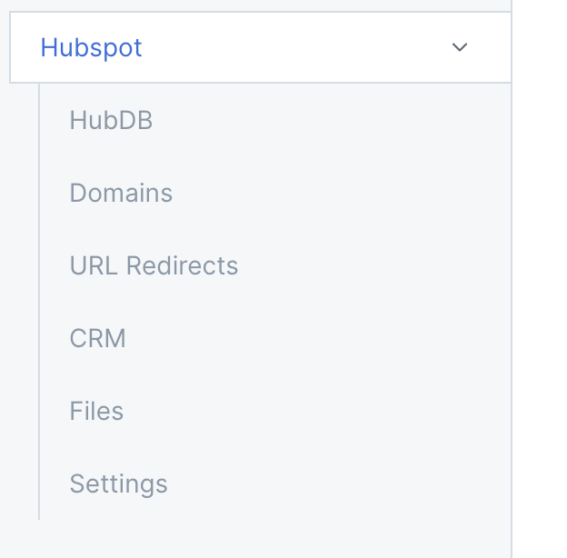

# Introduction

 * Hubspot  info

 * Elaborate on what Appsmith provides with this integration.

# Create HubSpot Datasource [H1]

Write down the steps for adding the HubSpot API

## Connection Settings

In this section, we will explain how users can connect their hubspot API.

* Authentication Type (H3)

* Getting the Bearer Token (H3)

# Create Queries(H1)

Explain different ways to create queries-

### **Datasource Page**
You can add queries to Hubspot datasource by selecting the New API + button available on the datasource page.

### **Query/JS page**
By navigating to Explorer >> Click plus sign (+) next to Queries/JS >> Select the Hubspot datasource.

## **Query(H2)**

Create a table of commands explaining a bit about it. **(List all 48 queries, and cross-link to sub-pages)**.

|                Query Name                |              Description              |
|:----------------------------------------:|:-------------------------------------:|
| HubDB - Get Published Tables             | Description and cross-link to subpage |
| HubDB - Create Table                     | Description and cross-link to subpage |
| HubDB - Get Details of a Published Table | Description and cross-link to subpage |
| HubDB - Archive Table                    | ...                                   |
| HubDB - Update Existing Table            | ...                                   |
| HubDB - Clone Table                      |     ...                                  |
| HubDB - Export Published Version Table   |      ...                                 |
| HubDB - Unpublish Table                  |      ...                                 |
| HubDB - Get Table Rows                   |      ...                                 |
| HubDB - Add New Table Row                |      ...                                 |
| HubDB - Get Table Row                    | ...                                      |
| HubDB - Update Existing Row              |  ...                                     |
| HubDB - Replace Existing Row             |   ...                                    |
| HubDB - Permanently Delete Row           |                                       |
| HubDB - Clone Row                        |    ...                                   |
| HubDB - Get Set Rows                     |                                       |
| HubDB - Permanently Delete Rows          |                                       |
| Domains - Get Current Domains            |                                       |
| Domains - Get Single Domain              |                                       |
| URL Redirects - Get Current Redirects    |                                       |
| URL Redirects - Create Redirect          |                                       |
| URL Redirects - Get Details Redirect     |                                       |
| URL Redirects - Update Redirect          |                                       |
| URL Redirects - Delete Redirect          |                                       |
| CRM - List Objects                       |                                       |
| CRM - Create Object                      |                                       |
| CRM - Read Object                        |                                       |
| CRM - Update Object                      |                                       |
| CRM - Archive Object                     |                                       |
| CRM - Search Object                      |                                       |
| CRM - GDPR Delete                        |                                       |
| Files - Import File                      |                                       |
| Files - Delete File                      |                                       |
| Files - Get File                         |                                       |
| Files - Create Folder                    |                                       |
| Files - Search File                      |                                       |
| Files - Search Folder                    |                                       |
| Files - Update Folder Properties         |                                       |
| Files - Check Folder Update Status       |                                       |
| Files - Get Folder                       |                                       |
| Files - Delete Folder                    |                                       |
| Settings - Retrieve List of Users        |                                       |
| Settings - Add User                      |                                       |
| Settings - Retrieve User                 |                                       |
| Settings - Modify User                   |                                       |
| Settings - Remove User                   |                                       |
| Settings - Retrieve Roles Account        |                                       |
| Settings - See Details Account's Teams   |                                       |

The sidebar will look something like this.

