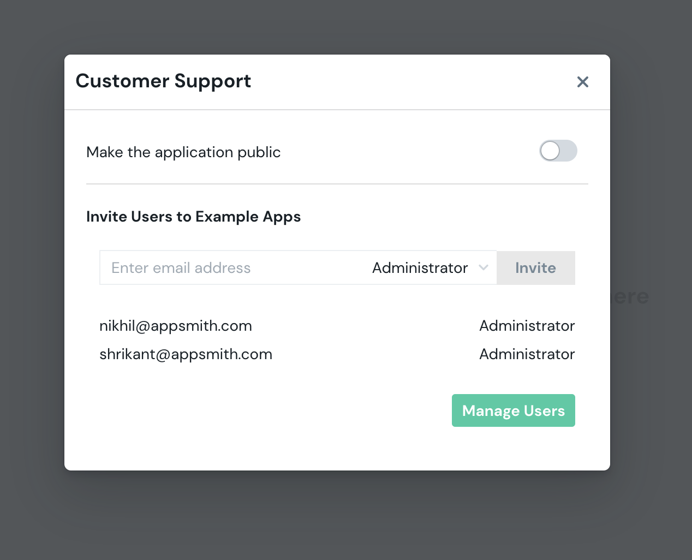

# Access Control

To invite users to your organization, click the **share button** on the application home page or from inside the application

Invite the email of the user you wish to share the application with and select an appropriate role for them

### Roles

* **Administrator:** This role can invite users to an organization, manage users in an organization, modify organization settings and edit applications within an organization
* **Developer:** This role can invite users to an organization and edit applications within an organization
* **App Viewer:** This role can only view & use the applications in an organization

### Public Apps

Applications can be made public and shared with external users not part of your organization as well. These applications will not require users to authenticate in order to use them. An app can be made public by clicking the share button from within the application and turning the public application switch on. To share the application, simply copy the link shown in the modal and share it with your users!

