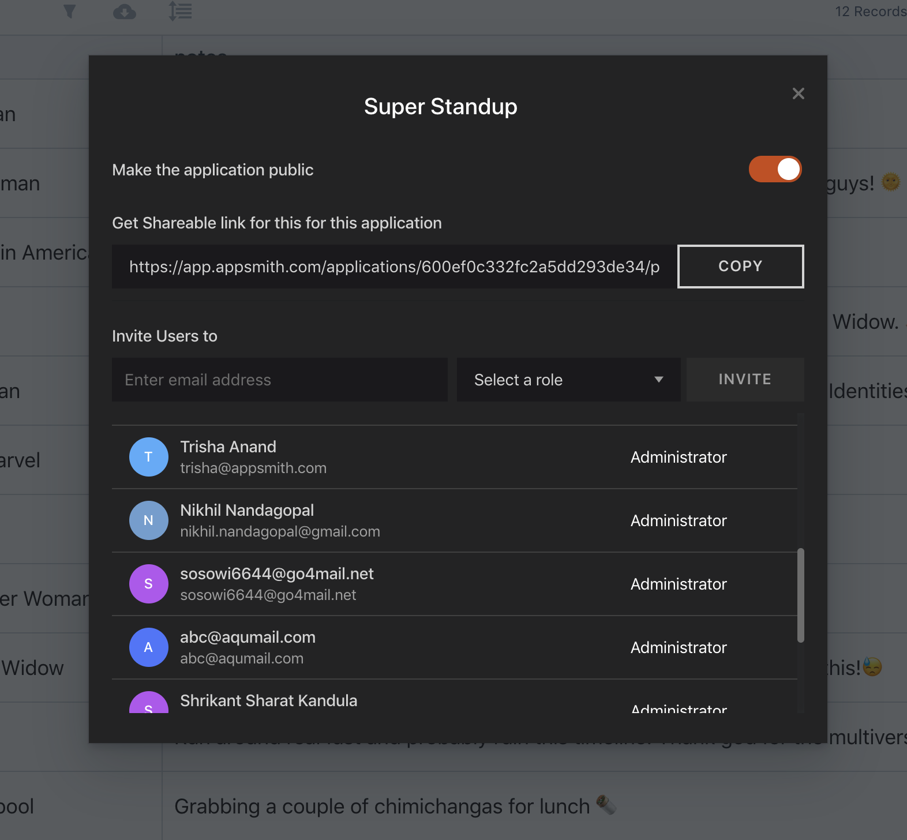

# Access Control

Invite users to your organization by clicking on the **share button** on the application home page or from inside the application

Invite the user's email you wish to share the application with and select an appropriate role for them.

Alternatively, you can copy and share the link of the app with other users. Note that if the the application is not public, this link will only work for the users who have been invited.

## Roles

Appsmith implements **RBAC** by assigning a set of permissions to different user roles. These permissions determine the actions users can take on the platform. Below is the permission mapping for each role

* **Administrator:** 
  * Create/Edit App
  * View App
  * Make App Public
  * Invite Users
  * Manage Users
* **Developer**
  * Create/Edit App
  * View App
  * Invite Users
* **App Viewer**
  * View App
  * Invite Users as App Viewers only

## Permissions

* **Create/Edit App:** This permission allows users to create and edit applications within an organization.
* **View App:** This permission allows users to view & use applications internal to the organization
* **Make App Public:** This permission allows users to mark applications as accessible outside the organization.
* **Invite Users:** This permission allows users to invite others with a role equal to or lower than theirs.
* **Manage Users.** This permission allows users to delete users from an organization.

## Public Apps

Applications can be made public and shared with external users not part of your organization as well. These applications will not require users to authenticate to use them. An app can be made public by clicking the share button from within the application and turning the public application switch on. To share the application, copy the link shown in the modal and share it with your users!


Only Administrators can make applications public.


