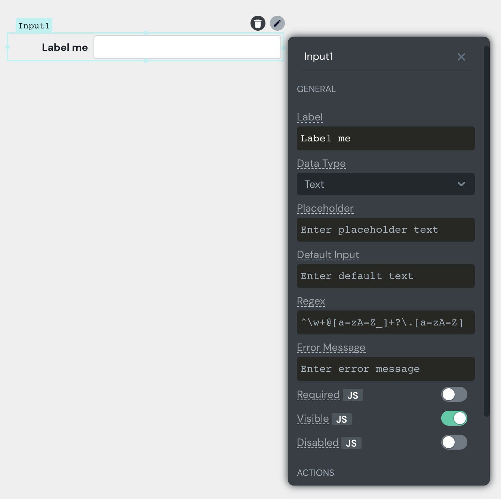

# Building The UI

## Adding UI Elements

Appsmith has a collection of widgets that can be used to build the UI. Widgets can be dragged from the widget pane and be positioned on the canvas. They can also be resized to fit the data they need to display.

## Widgets List

* [Button](../../widget-reference/button/)
* [Chart](../../widget-reference/chart.md)
* [Checkbox](../../widget-reference/checkbox.md)
* [Container](../../widget-reference/container.md)
* [Datepicker](../../widget-reference/datepicker.md)
* [Dropdown](../../widget-reference/dropdown.md)
* [Filepicker](../../widget-reference/filepicker.md)
* [Form](../../widget-reference/form.md)
* [Image](../../widget-reference/image.md)
* [Input](../../widget-reference/input.md)
* [Maps](../../widget-reference/maps.md)
* [Radio](../../widget-reference/radio.md)
* [Rich Text Editor](../../widget-reference/rich-text-editor.md)
* [Tabs](../../widget-reference/tabs.md)
* [Table](../../widget-reference/table.md)
* [Text](../../widget-reference/text.md)
* [Video](../../widget-reference/video.md)

## Naming Widgets

Widgets have default names generated for them. You can rename a widget by clicking on its name in the property pane.


Widget names are important while adding logic, so name your widgets well!


## Editing widget properties

Widget properties can be edited via the property pane which is opened using the top-right icon \(Edit Widget Properties\). Widget properties can affect the widget data, styling, and actions.

**Widget properties don't have to be static!** To make it dynamic, type**`{{ }}`**inside the widget property and bind it to an API/Query/Widget. You can learn more about working with widgets and APIs here

* [Displaying API / Query Data](displaying-api-data.md)
* [Talking to other widgets](talking-to-other-widgets.md)

