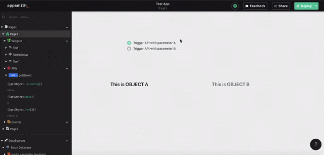

# Controlling the visibility of widgets

## Controlling widget visibility from another widget
The condition for visibility of a particular widget can be set by clicking on the JS mode for the Visible option. The option takes in a boolean object to determine the visibility of that widget.

In the example below the radio buttons have true and false as their values for the labels "Visible" and "Invisible" respectively. The target widget is a Text widget whose visible option's JS field looks like this.

```text
{{RadioGroup1.selectedOptionValue}}
```


## Controlling widget visibility with an API/Query

We can use the value obtained from an API/Query to dynamically set the visibility of a widget using the JS mode for the visible option. 



In the example shown above the value of the radio buttons is sent as a parameter to the API named "getObject". The API response is then used to dynamically change the visibility of a widget using a condition. 

The condition below is used in object A

```text
{{getObject.value == "A"}}
```

The condition below is used in object B

```text
{{getObject.value == "B"}}
```

## Dynamic Forms

Dynamic form views are one such use case where another widget controls the visibility of the form flow.


In the above example the tab widget is used to switch between the Login and Register screen. 
