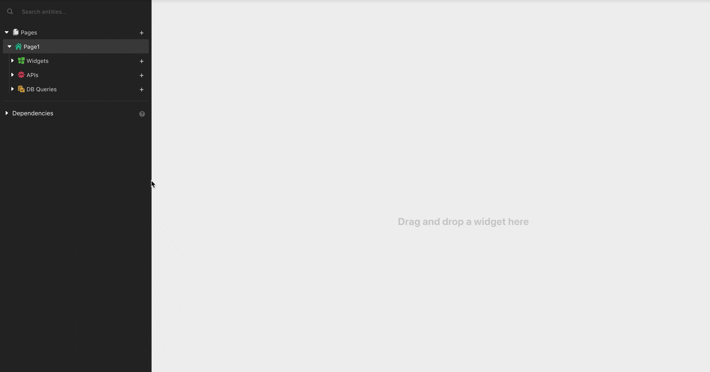

# Connecting to Data Sources

Rich applications require real data to build intuitive UI, perform data transformations & write business correct logic. Appsmith can talk to your data in the following ways

* [Query your database directly](./)
* [~~Hit a REST API~~](connect-to-apis/)~~~~

## Security

Appsmith safely encrypts all your data source credentials and stores them securely. Appsmith also does not store any data returned from your data sources and acts only as a proxy layer to orchestrate the API / Query calls. Since Appsmith is an open-source framework, you can [deploy it on-premise](../../setting-up/), and audit it to ensure none of your data leaves your VPC.

## Mock Data

If you would like to play around with the platform before connecting your data, we provide mock data sources that you can use.

### Mock DB

Every personal organization comes with a Mock database for you to query. The data in the mock database gets reset every 24 hours and is common for all users so it may contain some unexpected values.



### Mock API

You can import the below CURL commands to execute these APIs

#### Fetch Users

```bash
curl --location --request GET 'https://mock-api.appsmith.com/users?page=1'
```

#### Update Users

```bash
curl --location --request PUT 'https://mock-api.appsmith.com/users/1' \
--header 'Content-Type: application/json' \
--data-raw '{
	"status" : "Approved"
}'
```

