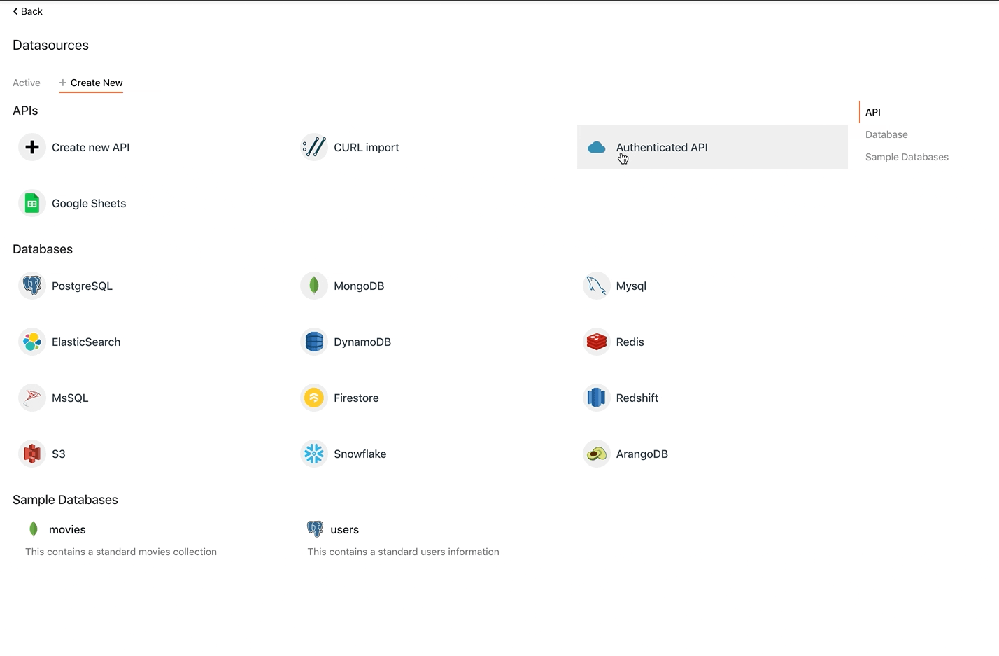

# Connecting to APIs

If your APIs are protected by an authentication mechanism, that requires a standard set of headers or parameters that need to be sent with every request, you can save these in a common data source to be reused with every request.

1. Click on **+** next to **Datasources**
2. You’ll see a list of Datasources that Appsmith can connect to
3. Select the Authenticated API
4. Configure one of the below authentication modes and save it
   1. [Basic](basic-authentication.md)
   2. [OAuth 2.0](oauth2-authentication.md)

## Security

Appsmith safely encrypts all your authentication credentials and stores them securely. Appsmith also does not store any data returned from your data sources and acts only as a proxy layer to orchestrate the API / Query calls. Since Appsmith is an open-source framework, you can [deploy it on-premise](../../../setup/), and audit it to ensure none of your data leaves your VPC.

