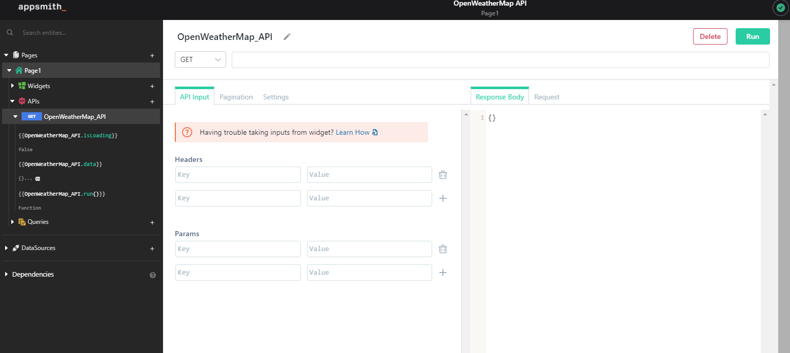
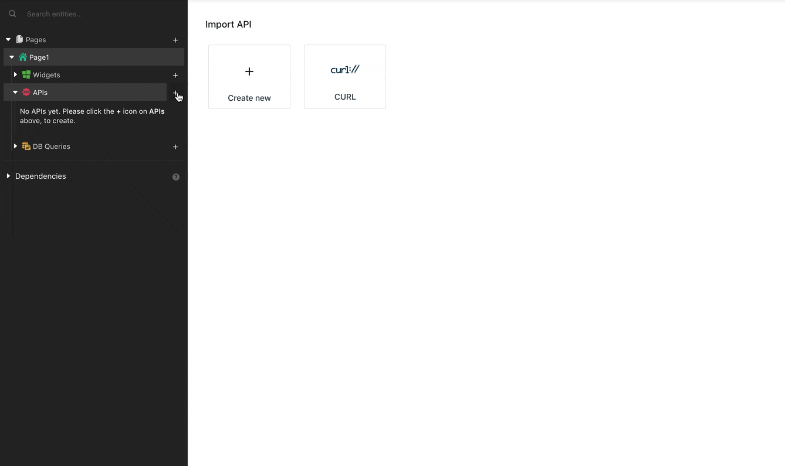

# Connect to APIs


If your API is not available on the public internet, you must expose it via a service such as [https://ngrok.com/](https://ngrok.com/)


## API Editor

The API pane is a REST interface that allows you to create and modify your existing APIs. All REST HTTP methods are supported and API values can be configured in the headers, params, and body fields

## Importing CURL Commands

Appsmith makes it easy to import your APIs into your application using CURL commands.

## Authentication

In case the APIs that you wish to connect to are protected by an authentication mechanism, you can set up the requisite configuration at the data source level. Appsmith currently supports the following authentication mechanisms:

- [Basic](basic-authentication.md)
- [OAuth 2.0](oauth2-authentication.md)
