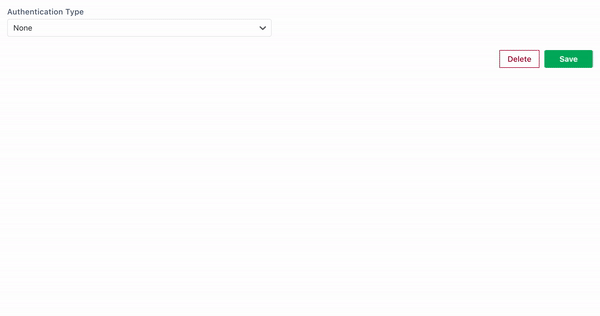

# OAuth 2.0 Authentication

Appsmith supports the OAuth 2.0 specification with two of its grant types: [authorization code](https://tools.ietf.org/html/rfc6749#section-1.3.1) and [client credentials](https://tools.ietf.org/html/rfc6749#section-1.3.4). Here we demonstrate a couple of quick start examples to use these grant types along with a detailed explanation of the variations that are supported.


In case you feel like there may have been a data breach in your infrastructure, you can simply invalidate your client credentials at the authorization server to immediately revoke Appsmith's access to your resources.


## Authorization Code

The authorization code grant is used for 3 legged authentication flows where the resource owner grants consent to share their credentials with the authorization server. In Appsmith, since most APIs will need to run in the background, we enforce the authorization process before the datasource can be used in an API. Once the authorization process is complete, the Appsmith server takes care of re-authentication for expired tokens.

You need to fill in the following details to use the authorization code flow:

- **Add Access Token To:** This field describes how the acess token information will be sent in the API request, as a query parameter in the URL or as an `Authorization` Header in the request. In case of the latter, the Header Prefix to be used is configured as `Bearer` by default.

- **Header Prefix:** In case of sending the access token as an Authorization header, you can configure the prefix to be used using this field. If left empty, the default of `Bearer` will be used.

- **Access Token URL:** This should be a `POST` endpoint on the authorization server that Appsmith can hit to retrieve the Access Token using the client credentials information for this data source.

- **Client ID:** The identifier for the credentials you have configured at the authorization server

- **Client Secret:** The secret associated to this set of crecentials. Once configured, this field will be encrypted and stored in the Appsmith database. To avoid any security threats over the network, Appsmith does not allow users to view the client secret after they have configured it (hence the blank field in the video above). This field is used while requesting for a new access token using the refresh token.

- **Scope(s):** Some authorization servers allows users to configure a confined set of resources that a set of credentials grant access to. In case you wish to set this field, make sure you separate individual scopes with commas.

- **Authorization URL:** This is the URL that the Appsmith server must redirect you to so that you may grant the requisite authorization to Appsmith to access your resources. This URL must expect query parameters according to the authorization code request [specification](https://tools.ietf.org/html/rfc6749#section-4.1.1) and respond with the corresponding [response](https://tools.ietf.org/html/rfc6749#section-4.1.2) for success and error states.

- **Custom Authentication Parameters:** These optional parameters may be configured if your authorization server expects certain extra values to enable refreshing tokens without user intervention. Appsmith uses these as query parameters in the redirection to the authorization code URL.

- **Client Authentication:** Choose between a JSON object in the request body and a _Base64 encoded_ Basic `Authorization` request header to send your client credentials while retrieving the access token.


You must add the Appsmith callback URL to your list of allowed `redirect_uri` in the authorization server while using this grant type. This URL is in the form `<your-domain-origin>/api/v1/datasources/authorize`. For example, while using Appsmith cloud, you will need to add `https://aap.appsmith.com/api/v1/datasources/authorize` as a valid redirect URL.



The authorization server _must_ return the access token request with a `refresh_token` that can be used to create a new access token once the `access_token` that was received with the original request expires.


## Client Credentials

The client credentials grant is typically used for server-to-server communication. This means that this type of datasource will not require intervention from the user once configured. Appsmith safely encrypts your credentials and reuses these credentials for all the API requests made using this data source.

The fields relevant to this grant type are as follows:

- **Add Access Token To:** This field describes how the acess token information will be sent in the API request, as a query parameter in the URL or as an `Authorization` Header in the request. In case of the latter, the Header Prefix to be used is configured as `Bearer` by default.

- **Access Token URL:** This should be a `POST` endpoint on the authorization server that Appsmith can hit to retrieve the Access Token using the client credentials information for this data source.

- **Client ID:** The identifier for the credentials you have configured at the authorization server

- **Client Secret:** The secret associated to this set of crecentials. Once configured, this field will be encrypted and stored in the Appsmith database. To avoid any security threats over the network, Appsmith does not allow users to view the client secret after they have configured it (hence the blank field in the video above).

- **Scope(s):** Some authorization servers allows users to configure a confined set of resources that a set of credentials grant access to. In case you wish to set this field, make sure you separate individual scopes with commas.
