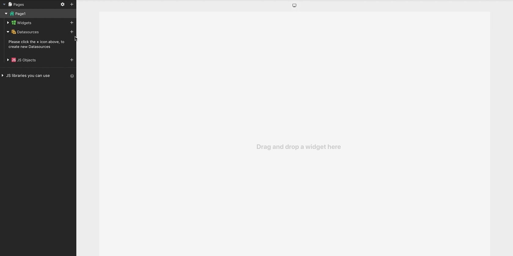

# Connect to Databases

## Supported Databases

* [Amazon S3 \(also Upcloud, Digital Ocean Spaces, Wasabi, DreamObjects\)](../../datasource-reference/querying-amazon-s3.md)
* [ArangoDB](../../datasource-reference/querying-arango-db.md)
* [DynamoDB](../../datasource-reference/querying-dynamodb.md)
* [ElasticSearch](../../datasource-reference/querying-elasticsearch.md)
* [Firestore](../../datasource-reference/querying-firestore.md)
* [MongoDB](../../datasource-reference/querying-mongodb/)
* [MS SQL](../../datasource-reference/querying-mssql.md)
* [MySQL](../../datasource-reference/querying-mysql.md)
* [PostgreSQL](../../datasource-reference/querying-postgres.md)
* [Redis](../../datasource-reference/querying-redis.md)
* [Redshift](../../datasource-reference/querying-redshift.md)
* [Snowflake](../../datasource-reference/querying-snowflake-db.md)

## Security

Appsmith safely encrypts all your database credentials and stores them securely. Appsmith also does not store any data returned from your data sources and acts only as a proxy layer to orchestrate the API / Query calls. Since Appsmith is an open-source framework, you can [deploy it on-premise](../../setup/), and audit it to ensure none of your data leaves your VPC.

## Connecting to a Database


Before connecting to a data source, you may need to whitelist the IP address of the Appsmith deployment on your database instance or VPC.

**18.223.74.85** and **3.131.104.27** are the IP addresses of the Appsmith cloud instances that need to be whitelisted.

Once the appsmith instance has been [whitelisted](../../how-to-guides/aws-whitelist.md):

1. Click on **+** next to **Datasources**
2. You’ll see a list of Datasources that Appsmith can connect to
3. Choose a Database from the [supported list](connecting-to-databases.md#supported-databases)
4. Provide the configuration details required to connect to your database. You may need to contact your database admin to [whitelist appsmith cloud](../../how-to-guides/aws-whitelist.md)
5. Click on **Test** to verify that Appsmith is able to connect to your database using the details provided by you
6. **Save** your **Datasources**

> Databases configured within one page of an app can be accessed by developers anywhere within the organization

## General Notes

Appsmith creates a new connection pool with the database server when you first connect the database server to your app. All subsequent queries executed by Appsmith against your database then re-use this connection to ensure that at run-time your queries are executed quickly. In the case that an idle connection is closed by the database server, Appsmith creates a new connection while executing the next query.

For certain plugins like PostgreSQL, and MySQL, Appsmith creates and maintains a connection pool because multiple queries cannot be executed against a single connection.

### Concurrent queries

Appsmith limits maximum queries that can run concurrently on a database to be 5. If the application attempts to make more queries concurrently, you'll see an error saying `Connection not available`.

