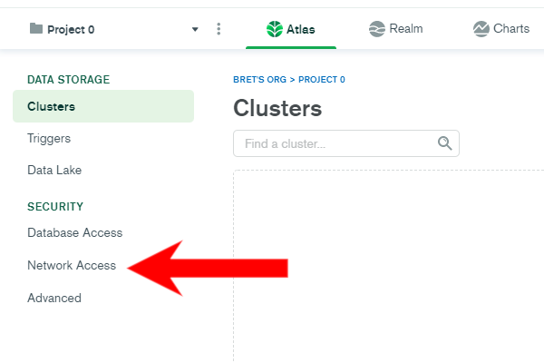

# Whitelist Appsmith

Whitelist the appsmith IP address with the following steps:

**1. Sign in to the MongoDB Cloud** [**dashboard**](https://account.mongodb.com/account/login)

**2. Navigate to the Network Access screen**

