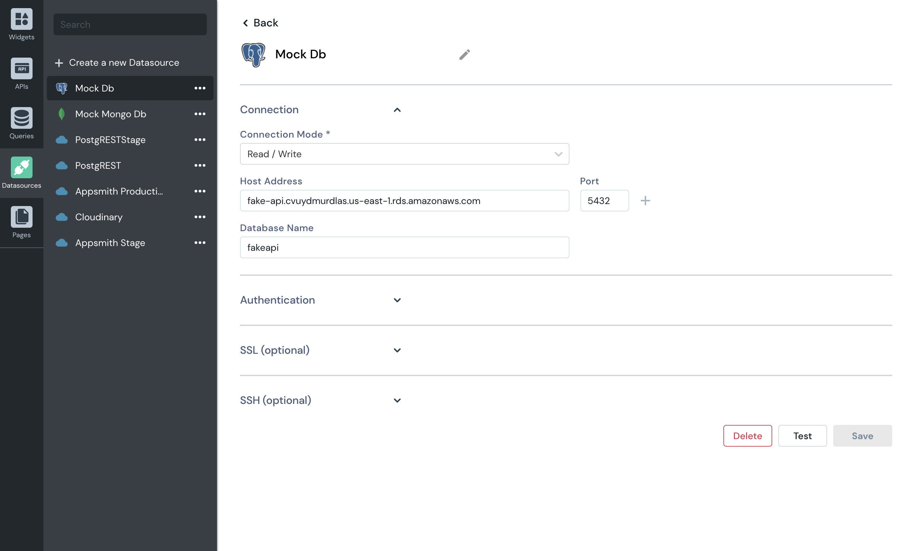

# Connecting to Databases

## Supported Databases

Appsmith supports the following databases:

* [PostgreSQL](querying-postgres.md) 
*  [MongoDB](querying-mongodb/)
* [Redshift](querying-redshift.md)
* [MySQL](querying-mysql.md)
* ElasticSearch
* DynamoDB
* Redis
* Ms SQL 
* Firestore

## General Notes

Each saved database connection is referred to as a Datasource in Appsmith. You can connect to one or more datasources from your app. 

### Connection management

\[Appsmith to fill this - Only sample info ahead\] Appsmith app opens a connection to a datasource when it first makes a query. It keeps this connection open, and re-uses in subsequent requests. &lt;More details on how the request is made, when a connection is closed, maximum connections - idle + active, what happens when requests lead to an error\]

### Encoding

\[Appsmith to fill this - Expected encoding of databases?\]

### Security

Appsmith safely encrypts all your database credentials and stores them securely. Appsmith also does not store any data returned from your data sources and acts only as a proxy layer to orchestrate the API / Query calls. Since Appsmith is an open-source framework, you can deploy it on-premise, and audit it to ensure none of your data leaves your VPC.

## Setting up a Datasource

#### Steps to set up a datasource

1. Go to the page in your app that will connect to this datasource
   .
2. Go to **DB Queries** of that page.
3. Click on **+** next to **DB Queries**
   .
4. You’ll see a list of existing Datasources that this page can connect to
   .
5. Click on **+ New Datasource
   .**
6. Choose a Datasource type from the list of supported types
   .
7. Provide the required configuration details of your database. You might need to contact your database admin for the connection credentials that are required to configure the database. 
8. Click on **Test** to verify that Appsmith is able to connect to your database using the details provided by you
   .
9. **Save** your datasource
   .


If you are hosting Appsmith, you must whitelist the IP address of the Appsmith deployment. Whitelist 18.223.74.85 to connect to your database from our cloud-hosted version. 

A step-by-step guide to do this on AWS is available [here](aws-whitelist.md).


### Scope of a datasource

Datasources configured within one page of an app can be accessed from:

* Other pages of the same app
* Other apps of the same organization

### Naming a datasource

Each datasource must be given a name. Since the scope of the datasource is that of its parent organization, the name of a datasource must be unique within its parent organization. Names are case sensitive. 

## Deleting a datasource

You can delete a datasource only if no queries have been set up on it. 


To delete a datasource:

1. Go to any app that has access to the datasource
   .
2. Go to any page within the app
   .
3. Go to **DB Queries** within that page.
4. Click on **+** next to DB Queries
   .
5. You’ll see a list of Datasources. 
6. Look for the Datasource that you want to delete.
7. Click on **Edit Datasource**.
8. You’ll see a page to edit the datasource’s configuration.
9. Click on **Delete** button at the bottom of the page
   .

## Querying a database

You can write queries to fetch from and update data  of a datasource using the query editor interface provided by Appsmith for each database type. 

### **Setting up a query**

To set up a query:

1. Go to the page that needs to run this query.
2. Go to DB **Queries → +**.
3. Choose the required datasource type.
4. Click on **New Query**.
5. You will be taken to the query editor to write the query.
6. Note that the query is created with a default name. It’s recommended that you rename it for readability.
7. Write your query in the syntax that is valid for your datasource type. For example, if your datasource is a MySQL database, your query needs to be a valid MySQL query.

### **Using JavaScript in a query**

In addition to allowing you to write a valid query for your datasource, Appsmith allows you to write JavaScript in your query. This comes in handy when you want to take an input\(s\) from a widget. For example, you can use JavaScript in your query to return data of a specific user that is [selected](https://docs.appsmith.com/widget-reference/dropdown#properties) in your [dropdown widget](https://docs.appsmith.com/widget-reference/dropdown).

To write JavaScript in the query, enclose your code within the mustache template `{{ }}`. 

### **Saving a query**

Queries are auto-saved. This means that -

1. As soon as you click on **New Query**, the query is saved with the default name, even though you haven’t written the query yet.
2. All changes to the query that you write are auto-saved in real-time. This ensures that you never lose your work. 


Though changes to a query are saved in real-time, these changes will be reflected in your live application only after you deploy.


### **Scope of a query**

A query and its results can be accessed from only within widgets of the page that it is part of. That is, its scope is limited to its parent page.  
****

### **Naming a query**

A query must have a name. The name is its unique identifier. It is used to access the query results. In that sense, a query’s name is like a variable’s name in your programming language. You can access the various properties of the query results object using the query’s name.  

Since the scope of a query is its parent page, all queries within a page must have unique names. Query names are case-sensitive.  
****

### **Testing your query**

Click on the Run button to see if query execution succeeds. If the query execution succeeds then a success message will pop up on the screen in the top right corner.

### **Running a query**

Manually running a query only helps you test the query. Whereas, when you build an application, you’ll need the app to trigger the query to run when an event. Appsmith allows you to trigger this on a widget’s events, such as onClick of Button widget, onRowSelected for table widget, etc. You can bind an event to run a query in two ways:

* Using GUI: 
  1. Go to the event name in the widget’s property pane
  2. Choose the option **Execute DB Query** from the dropdown that lists actions
  3. Choose the name of the query that you want to run
* Using JavaScript

  1. Click on the **JS** icon next to the event name to enable JavaScript in the specific event of the widget to which you want to bind the query
  2. Type `{{ queryName.run() }}`


If you are an Appsmith beginner, we recommend that you use GUI instead of JavaScript, so that you can build apps quickly without hurdles. Once you have configured it correctly using the GUI, we recommend that you click on the JS icon next to your event. This will show you the JavaScript equivalent of your configuration. This helps you learn to use JavaScript to configure event behavior from next time onwards!


### **Accessing query results**

A query’s results are stored in an object that is identified by the query’s name. You can access the query’s results in the data property of the object. For example, if the query’s name is `sampleQuery`, to access its results you’ll write `{{ sampleQuery.data }}`. 

#### Query results object

All queries return an array of objects where each object is a row returned by the query and each property in the object is a column. This object is immutable. So, any transformation you run on the query’s results will not change the data the transformation runs on, but only return new data. 

#### Scope of query results

A query’s results can be accessed only from a widget belonging to the same parent page as that of the query, but can’t be accessed from any widget belonging to another page. The results also can’t be accessed from other queries, or APIs belonging to the same parent page as that of the query.  
  
 

You can read more about querying your specific database below

* [Querying Postgres](querying-postgres.md)
* [Querying MongoDB](querying-mongodb/)

