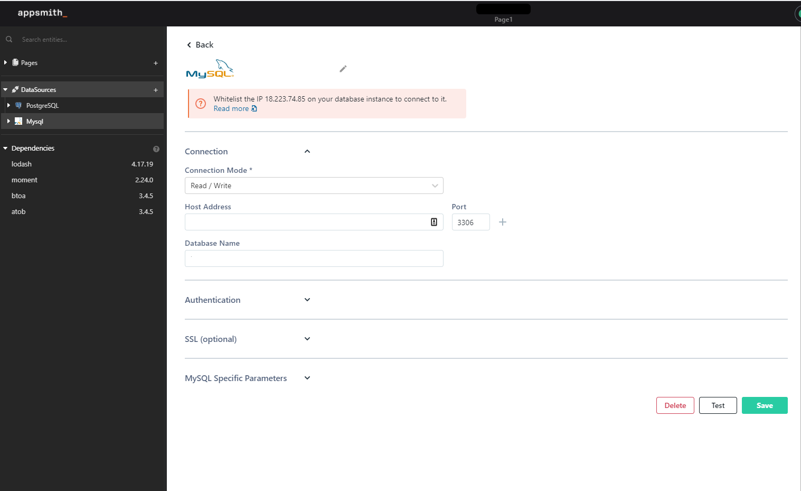

# Connecting to Databases

## Database Connections

Connections to databases can be created in the datasource pane. Contact your database admin for the connection credentials and configure them in the data source section. If you are hosting Appsmith, you must whitelist the ip address of the Appsmith deployment

Whitelist 18.223.74.85 to connect to your database from our cloud hosted version. A step-by-step guide to do this on AWS is available [here](aws-whitelist.md) 

## Querying a database

Data can be fetched and updated using queries. Appsmith provides a query interface for each database type. All queries return an array of objects where each object is a row returned by the query and each property in the object is a column. You can read more about querying your specific database below

* [Querying Postgres](querying-postgres.md)
* [Querying MongoDB](querying-mongodb/)

