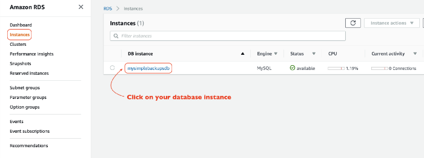
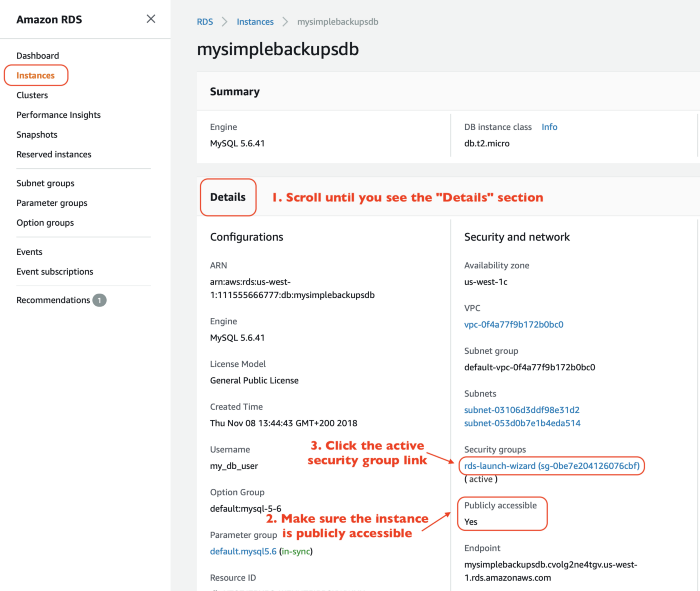
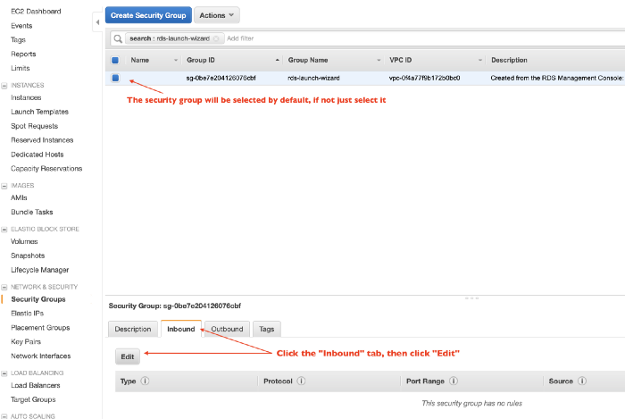
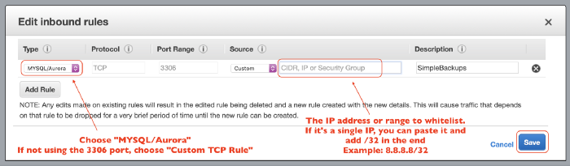

# Whitelisting database IP on AWS

To connect the database to your virtual machine, whitelist the database IP address with the following steps:

**1. Log in to the AWS** [**console**](https://aws.amazon.com/console/)

**2. Navigate to the RDS Console**

**3. Choose RDS database from the list of instances**

**4. Select the security group linked to your RDS\(Make sure RDS instance is publicly accessible\)**

**5. Click on “Inbound” at the bottom and then click “Edit”**

**6. Select the port to whitelist. If you are using the default MySQL port then selecting the “MYSQL/Aurora” option works**

**7. Set** _**Source**_ **to** _**Custom**_ **and enter the database IP address 18.223.74.85/32**

**8. Click** _**Save**_

Your database should now be accessible from your EC2 instance. Read more about [security group rules](https://docs.aws.amazon.com/AmazonRDS/latest/UserGuide/USER_WorkingWithSecurityGroups.html).

