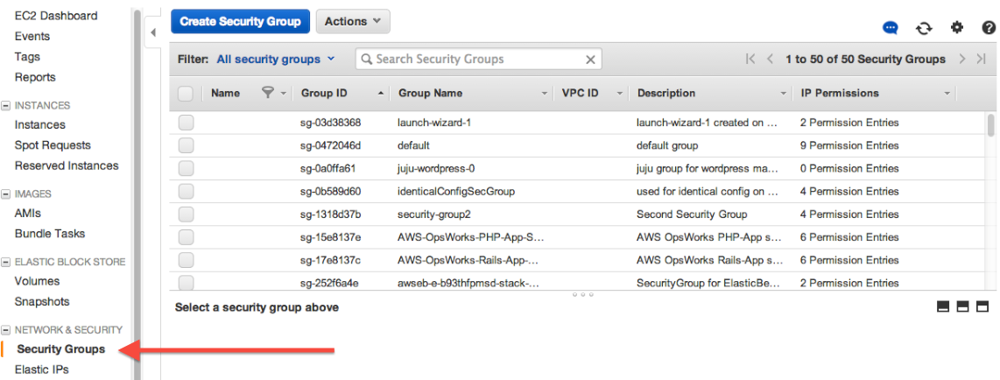
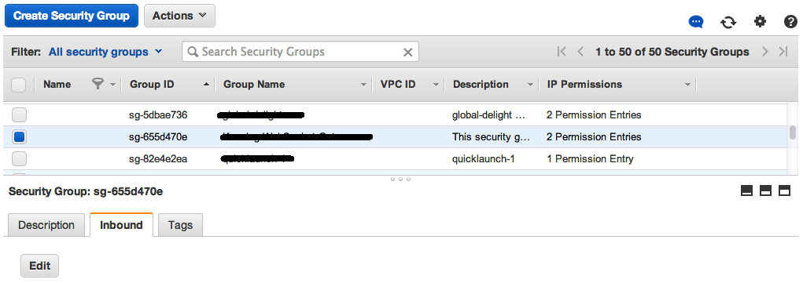
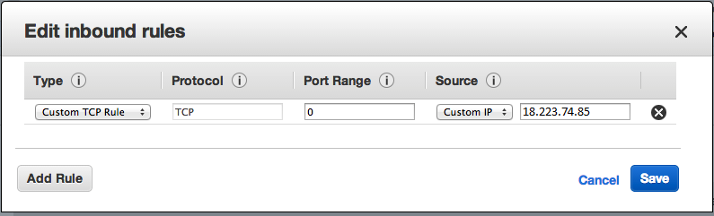

# Whitelist DB IP on AWS

To connect the database to your virtual machine, whitelist the database IP address with the following steps:

**1. Log in to the AWS [console](https://aws.amazon.com/console/)**

**2. Navigate to the EC2 Console**

**3. Select _Security Groups_ from the _NETWORK & SECURITY_ section**

**4. Select the security group linked to your EC2 instance, then click the _Inbound_ tab and Click _Edit_**

**5. In _Type_ select _Custom TCP Rule_**

**6. In _Port Range_, enter the port number you wish to expose**

**7. Set _Source_ to _Custom_ and enter the database IP address**

**8. Click _Save_**

Your database should now be accessible from your EC2 instance. Read more about [security group rules](https://docs.aws.amazon.com/vpc/latest/userguide/VPC_SecurityGroups.html).
