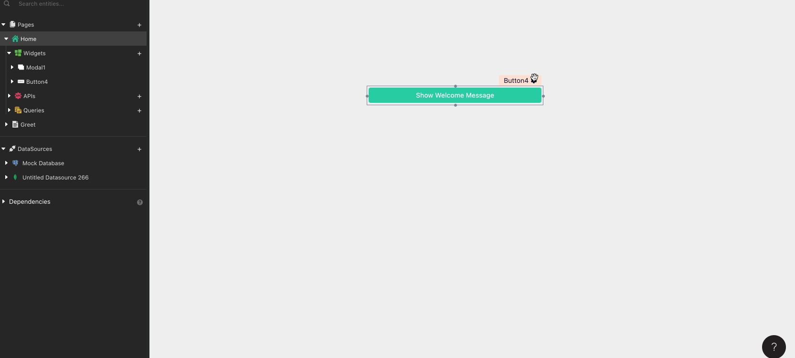
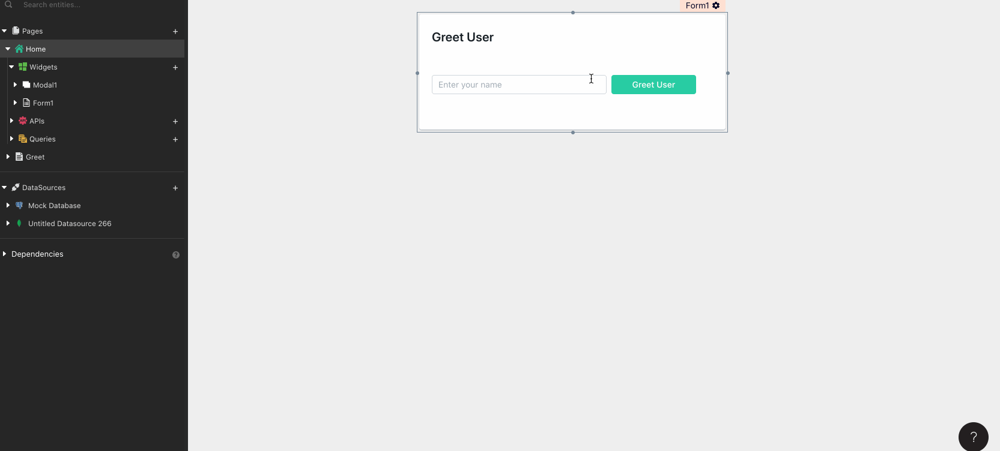

# Sharing Data Across Pages

## Sharing data via query params

Query params can be passed by adding the query params object to [NavigateTo action](../../function-reference/navigateto.md). To do this click on the JS mode for Action and update it as follows.

```text
{{navigateTo("PageName", {"param": "value"})}}
```

These can be consumed on the destination page with `appsmith.URL.queryParams.param`.



## Sharing data via local storage

Key value pairs can be stored within the local storage with the help of [StoreValue action](../../function-reference/store-value.md). To do so pick the StoreValue action and provide the desired key and values. These can be consumed on the destination page with `appsmith.store.key`



