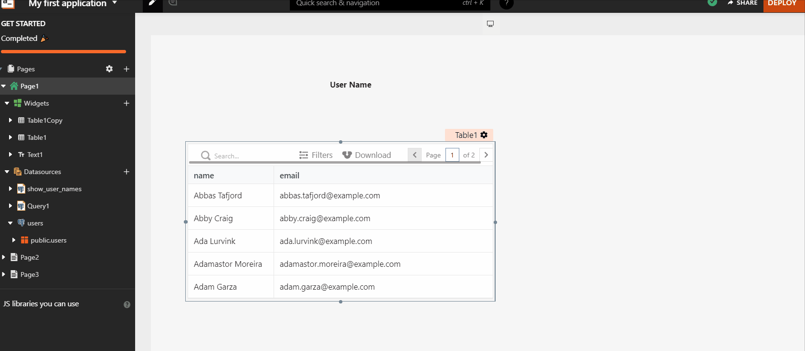

# Displaying Data (Read)

This document presumes you have successfully [connected to a data source](../../connecting-to-data-sources/) and have a Query that fetches data.

## Widgets

Appsmith has a collection of widgets that can be used to build the UI.

* [Button](../../../reference/widgets/button/)
* [Chart](../../../reference/widgets/chart.md)
* [Checkbox](../../../reference/widgets/checkbox.md)
* [Container](../../../reference/widgets/container.md)
* [Datepicker](../../../reference/widgets/datepicker.md)
* [Select](../../../reference/widgets/dropdown-1.md)
* [Filepicker](../../../reference/widgets/filepicker.md)
* [Form](../../../reference/widgets/form.md)
* [Image](../../../reference/widgets/image.md)
* [Input](../../../reference/widgets/input.md)
* [Maps](../../../reference/widgets/maps.md)
* [Modal](../../../reference/widgets/modal.md)
* [Radio Group](../../../reference/widgets/radio-group.md)
* [Rich Text Editor](../../../reference/widgets/rich-text-editor.md)
* [Switch](../../../reference/widgets/switch.md)
* [Tabs](../../../reference/widgets/tabs.md)
* [Table](../../../reference/widgets/table.md)
* [Text](../../../reference/widgets/text.md)
* [Video](../../../reference/widgets/video.md)

Widgets can be dragged from the widget pane, positioned on the canvas, and resized to fit the data they need to display. They also come with properties that can be visually edited to set their data, change their styles, and trigger actions from them.


### Naming a Widget

A widget must have a unique name that acts as an identifier on the page. It is used to access the properties of the widget everywhere in the application. In that sense, a name is like a variable in a programming language.


Note that [JavaScript keywords](https://www.w3schools.com/js/js\_reserved.asp) and [the window object methods and properties](https://www.w3schools.com/jsref/obj\_window.asp) are not valid as widget names.


You can access the various properties of the widget using the widget's name.

```javascript
{{ Table1.selectedRow.id }}
```

### Grouping Widgets

Appsmith supports the grouping of widgets. When you group widgets, they are put in a container and can be moved together. To do this -

* Select multiple widgets with Ctrl + Left Click
* Now click on the dotted square icon or press Ctrl + G



## Displaying Data in a widget

Widget properties can be edited via the property pane which is opened using the top-right icon (Edit Widget Properties). Data from a [Query](../querying-a-database/) can be set in a widget property by referencing the name (unique identifier) of the Query.


Appsmith is **Reactive** so the widgets are automatically updated whenever the data in the Query changes


For example, you can bind the results of the Query as below

```javascript
{{ fetch_users.data.users }}
```

 (4) (8) (1).gif>)


Each widget property has a specific data type that it validates its value against. If the data type mismatches, it will throw an error. This can be fixed using javascript to transform the value of the property


## Transforming Data

You can use Javascript inside to transform Query data when binding it to a property. Let us take an example of a Query that returns an array of objects that need to be populated in a [dropdown](../../../reference/widgets/dropdown-1.md). Directly binding the data will lead to an error as shown below

A [dropdown](../../../reference/widgets/dropdown-1.md) needs an Array\<label, value> in its option field, so to connect this data to a dropdown, we need to transform the data in the [dropdown options property.](../../../reference/widgets/dropdown-1.md#widget-properties)

**Example Query Data**

```javascript
[
  {
    "id": 1,
    "name": "test",
    "status": "APPROVED",
    "gender": "",
    "avatar": "https://robohash.org/sednecessitatibuset.png?size=100x100&set=set1",
    "email": "barty.crouch@gmail.com",
    "address": "St Petersberg #911 4th main",
    "createdAt": "2020-03-16T18:00:05.000Z",
    "updatedAt": "2020-08-12T17:29:31.980Z"
  },
  {
    "id": 2,
    "name": "Jenelle Kibbys",
    "status": "APPROVED",
    "gender": "Female",
    "avatar": "https://robohash.org/quiaasperiorespariatur.bmp?size=100x100&set=set1",
    "email": "jkibby1@hp.com",
    "address": "85 Tennessee Plaza",
    "createdAt": "2019-10-04T03:22:23.000Z",
    "updatedAt": "2019-09-11T20:18:38.000Z"
  },
  {
    "id": 3,
    "name": "Demetre",
    "status": "APPROVED",
    "gender": "Male",
    "avatar": "https://robohash.org/iustooptiocum.jpg?size=100x100&set=set1",
    "email": "aaaa@bbb.com",
    "address": "262 Saint Paul Park",
    "createdAt": "2020-05-01T17:30:50.000Z",
    "updatedAt": "2019-10-08T14:55:53.000Z"
  }
]
```

**Transformation Code**

The following example iterates over a data set and returns data in an `Array<label, value>` format

```javascript
{{
  QueryName.data.map((row) => {
      return { label: row.name, value: row.id };
  });
}}
```
