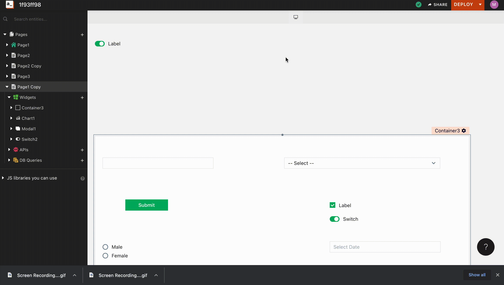

# Application Layout

## Application Layout

The Application layout can be selected to match the Application size to the device it is intended for. Desktop layout is set by default for an application.

## How it works

For application layout that has a Min-Max width limit, The application fills the browser's width untill the browser width is not Greater than the maxium width of the layout chosen. When it exceeds the maximum width of the layout, the additional width is filled by whitespaces.
The application will not squeeze below the minimum width of the layout chosen and would show scrolls if the browser width is less than minimum width of the layout chosen.

In case of `Fluid`, The application fills the browser's width.

At any point of time to change the application layout, click on the Layout control present on the top of the canvas and select a layout to use.

* **Note**: Changing layout for an application will change the layout of all pages of the application.

**Supported Layouts**

* Desktop (Application width would resize in between 1280px - 1160px)
* Tablet L (Application width would resize in between 1080px - 960px)
* Tablet (Application width would resize in between 800px - 650px)
* Mobile Device (Application width would resize in between 450px - 350px)
* Fluid (Application fills upto the Browser Width)
