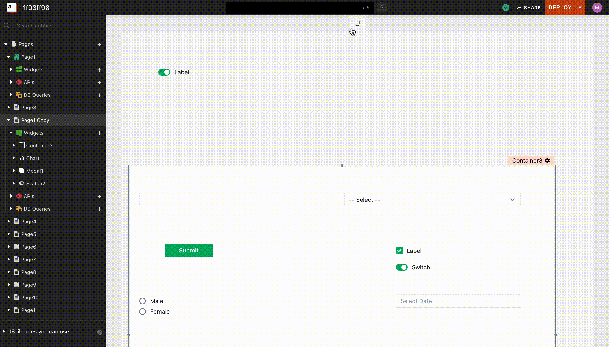

# Application Layout

The Application layout can be selected to match the Application size to the device it is intended for. Desktop layout is set by default for an application.

# How it works

For application layout that has a maximum width limit, The application fills the browser's width untill the browser width is not gretaer than the maxium width of the layout chosen.
When it exceeds the maximum width of the layout, the additional width is filled by whitespaces.
In case of `Fluid`, The application fills the browser's width.

At any point of time to change the application layout, click on the Layout control present on the top of the canvas and select a layout to use.

* **Note**: Changing layout for an application will change the layout of all pages of the application.

**Supported Layouts**

* Desktop (Application fills upto 1224px or Browser Width whichever is less)
* Tablet (Application fills upto 1024px or Browser Width whichever is less)
* Mobile Device (Application fills upto 720px or Browser Width whichever is less)
* Fluid (Application fills upto the Browser Width)
