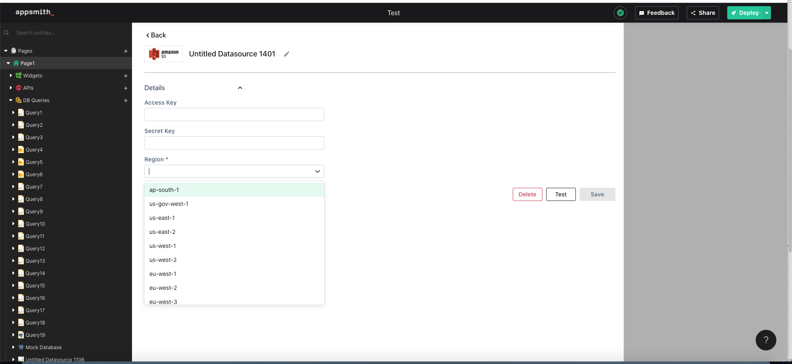
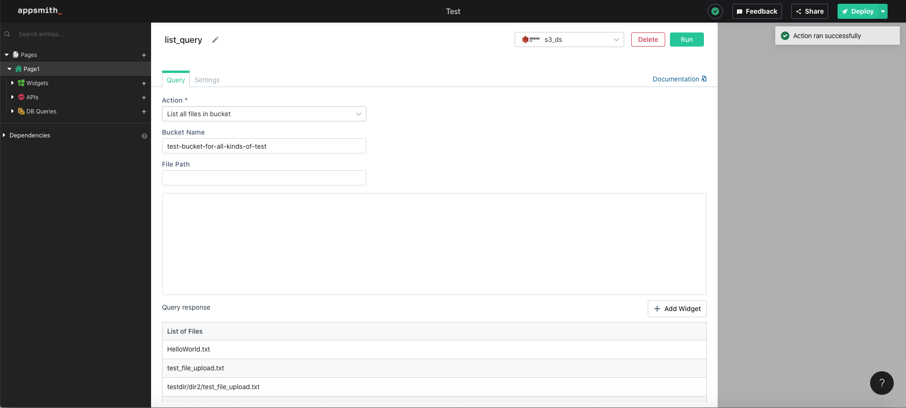
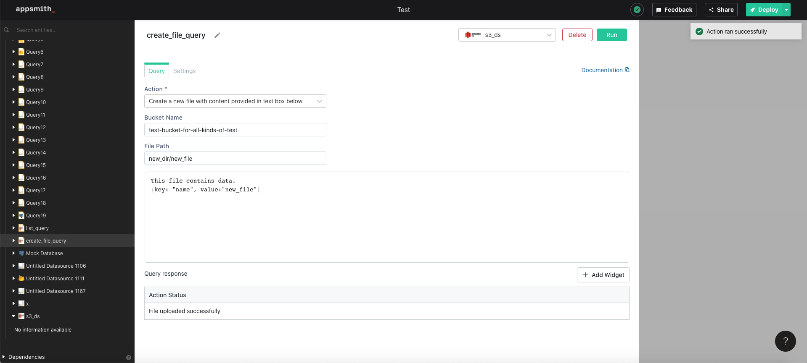
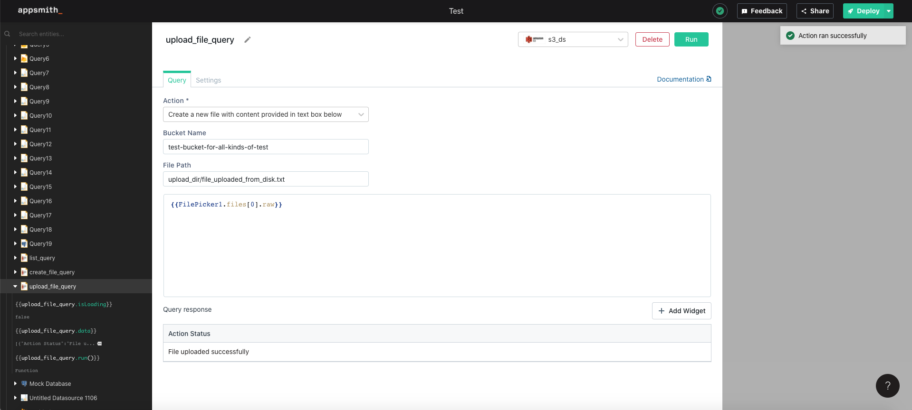
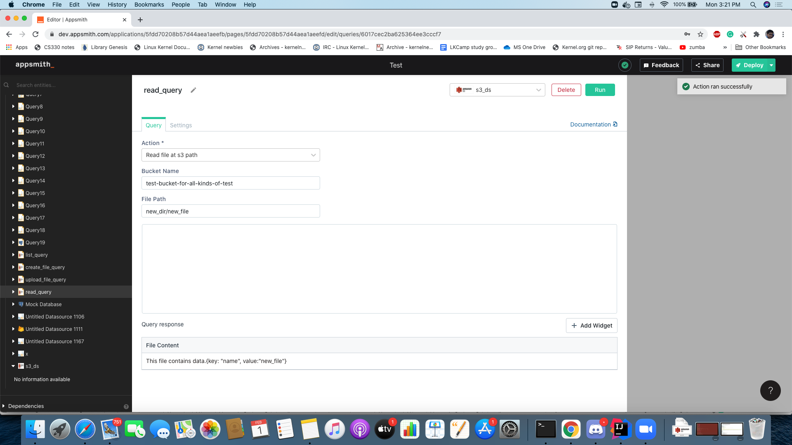
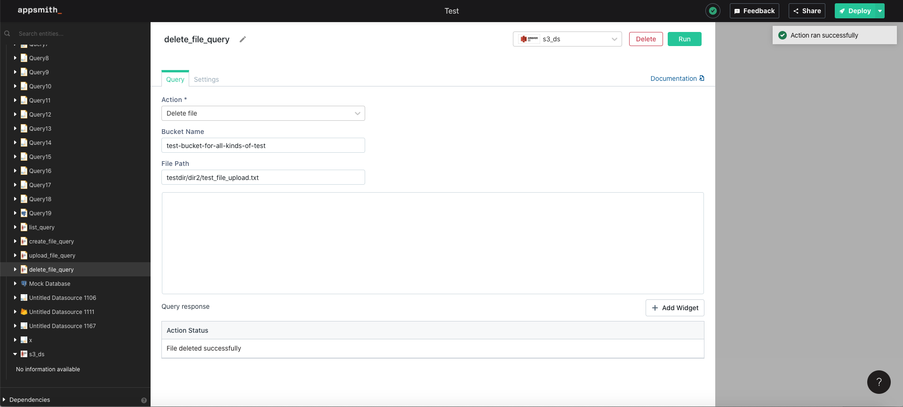

# [Beta] Querying Amazon S3
The S3 plugin can connect to an Amazon S3 instance and execute a set of [actions](#supported-actions) supported by 
Appsmith. In order to do so, you need to
1. Create an Amazon S3 datasource to connect to your Amazon S3 instance.
2. Create a query on the Amazon S3 datasource.

## Create an Amazon S3 datasource
In order to connect to an Amazon S3 instance, you need to fill out the following datasource configuration form:


There are three mandatory fields that are required to be filled: 
1. Amazon Access Key
2. Amazon Secret Key
3. Region

All the above three details can be fetched from your Amazon account:
1. [How to get Amazon access key ?](https://Amazon.amazon.com/premiumsupport/knowledge-center/create-access-key/)
2. [How to get Amazon secret key ?](https://Amazon.amazon.com/blogs/security/wheres-my-secret-access-key/#:~:text=Secret%20access%20keys%20are%E2%80%94as,key%20after%20its%20initial%20creation.)
3. [Amazon S3 regions/endpoints](https://docs.Amazon.amazon.com/general/latest/gr/rande.html)

## Supported Actions
In order to execute an action on an Amazon S3 instance, you need to create a query on an [Amazon S3 datasource](#create-an-s3-datasource). 
Query form has four fields:
1. **Action** - action that you want to execute
2. **Bucket Name** - bucket name on which to run the action. 
3. **File Path** - file path in case the action is to create a file or read a file.
4. **Content**  - file content in case the action is to create a file.

Appsmith supports the following actions on any Amazon S3 instance:
1. List all files in a bucket.
2. Create a new file.
3. Upload file.   
4. Read file.
5. Delete file.

### List all files in a bucket
1. Set the 'Action' field to 'List all files in a bucket'
2. Set the 'Bucket Name' field to the name of the bucket whose files you want to list.


### Create a new file
1. Set the 'Action' field to 'Create a new file'.
2. Set the 'Bucket Name' field to the name of the bucket where you want to add the new file.
3. Set the 'File Path' field to the path of the new file relative to the bucket.
4. Set the 'Content' field to the content that you want to write into the file.

   
### Upload file
1. Set the 'Action' field to 'Create a new file'.
2. Set the 'Bucket Name' field to the name of the bucket where you want to add the new file.
3. Set the 'File Path' field to the path of the new file relative to the bucket.
4. Use the [Filepicker widget](https://docs.appsmith.com/widget-reference/filepicker) to upload a file into Appsmith's 
   context.
5. Use [mustache expression](#taking-inputs-from-widgets) inside the 'Content' field to get the contents of the file 
   uploaded via 
   the [Filepicker 
   widget](https://docs.appsmith.com/widget-reference/filepicker)
 
   
### Read file
1. Set the 'Action' field to 'Read file'.
2. Set the 'Bucket Name' field to the name of the bucket where the file is located.
3. Set the 'File Path' field to the path of the file relative to the bucket name.

   
### Delete file
1. Set the 'Action' field to 'Delete file'.
2. Set the 'Bucket Name' field to the name of the bucket where the file is located.
3. Set the 'File Path' field to the path of the file relative to the bucket name.


## Taking Inputs from Widgets

All querying/modifying methods discussed above can take inputs from widgets using our Mustache-like syntax, for example **`{{ searchInput.text }}`** where **searchInput** is the name of the widget and **text** is the property of the widget.


Remember to wrap your params with double quotes to produce valid JSON.


```javascript
{
    "File content": "{{ FilePicker1.files[0].raw }}"
}
```

## Displaying Query Data

Query data can be displayed in a table or chart using the Mustache-like syntax **`{{ queryName.data }}`**. You can read more about displaying query data below.


The widgets are automatically refreshed when the data is changed.



