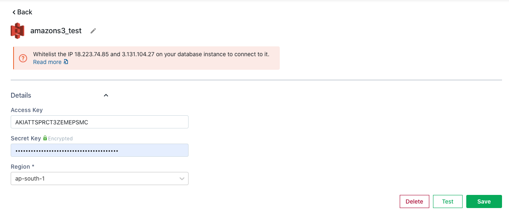
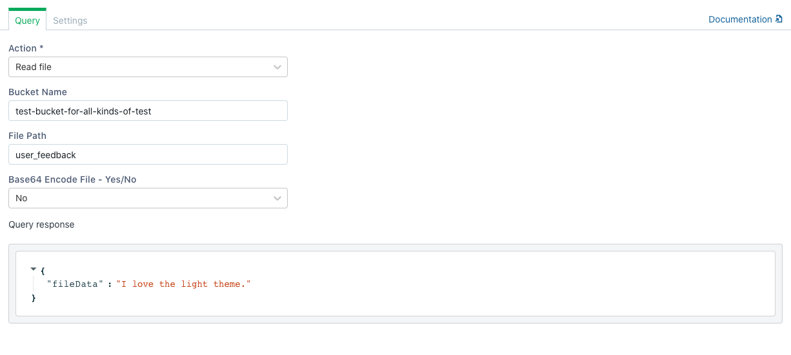

# Amazon S3 \(Coming Soon\)


The following document assumes that you understand the [basics of connecting to databases on Appsmith](../core-concepts/connecting-to-data-sources/connecting-to-databases/). If not, please go over them before reading further.


The Amazon S3 plugin can connect to an Amazon S3 instance and execute a set of [actions](querying-amazon-s3.md#supported-actions) supported by Appsmith.

## Connection Settings

The Amazon S3 Datasource requires the following information to establish a connection

1. Amazon Access Key ID
2. Amazon Secret Key
3. Region: [AWS service region](https://docs.aws.amazon.com/general/latest/gr/rande.html).

The Access Key & Secret can be fetched using the following guide: [Generate AWS access key & secret](https://docs.aws.amazon.com/general/latest/gr/aws-sec-cred-types.html#access-keys-and-secret-access-keys)

## List Files

This action lists all the files in a bucket. The bucket name is the bucket from which all the files are fetched. This action returns an array of file paths relative to the bucket. **ex.** `/dir/fileName.txt`

## Create File

This action creates a new file at the location specified by the file path \(including file name\). The action returns a message`File Uploaded Successfully`


If a file already exists on the file path, it will be replaced with the new file. 


## Read File

This action fetches a file in the Bucket Name specified with a file path relative to the bucket. The raw content of the file is returned in the data field of the query.

## Delete File

This action deletes a file at the file path relative to the Bucket Name specified. Files deleted cannot be restored so ensure your files have been backed up.


Enable the confirmation setting in this query to avoid accidental file deletes


## Using Queries in applications

Once you have successfully run a Query, you can use it in your application to

* [Display Data](../core-concepts/displaying-data-read/)
* [Capture Data](../core-concepts/capturing-data-write/)

