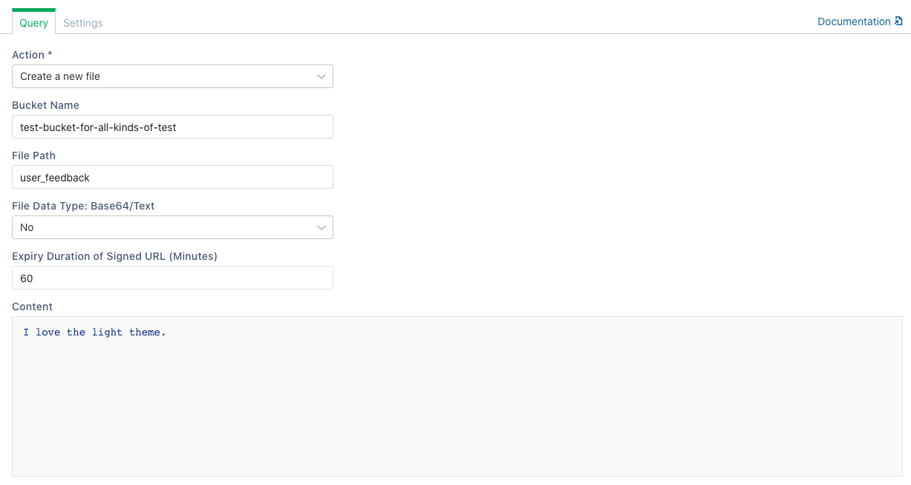
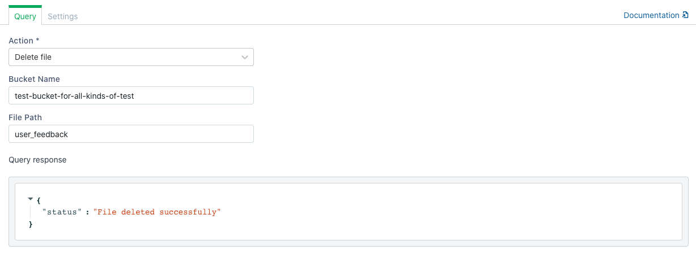

# Amazon / Generic S3


The following document assumes that you understand the [basics of connecting to databases on Appsmith](../core-concepts/connecting-to-data-sources/connecting-to-databases/). If not, please go over them before reading further.


The S3 plugin can connect to an Amazon S3, Upcloud, Digital Ocean Spaces, Wasabi, DreamObjects and any other provider that supports S3 to execute a set of [actions](querying-amazon-s3.md#supported-actions) supported by Appsmith.

## Connection Settings

The S3 Datasource requires the following information to establish a connection

1. Amazon Access Key ID
2. Amazon Secret Key
3. Region: [AWS service region](https://docs.aws.amazon.com/general/latest/gr/rande.html).

The Access Key & Secret can be fetched using the following guide: [Generate AWS access key & secret](https://docs.aws.amazon.com/general/latest/gr/aws-sec-cred-types.html#access-keys-and-secret-access-keys)

## List Files

This action lists all the files in a bucket. The bucket name is the bucket from which all the files are fetched. This action returns an array of file paths relative to the bucket. **ex.** `/dir/fileName.txt`.

You can also choose to generate a signed URL for each listed file by selecting `Yes` in the `Generate Signed URL` dropdown. An expiry duration can be set for the generated signed URLs by editing the `Expiry Duration of Signed URL` field. In this case, the output returns two other fields:

* `signedUrl`: It contains the signed url for the file.
* `urlExpiryDate`: It contains the timestmap at which the signed url will expire. 

## Create File

This action creates a new file at the location specified by the file path \(including file name\). The action returns the following two fields:

* `signedUrl`: It contains the signed url for the file.
* `urlExpiryDate`: It contains the timestmap at which the signed url will expire.

An expiry duration can be set for the generated signed URLs by editing the `Expiry Duration of Signed URL` field.


If a file already exists on the file path, it will be replaced with the new file.


## Read File

This action fetches a file in the Bucket Name specified with a file path relative to the bucket. By default, the raw content of the file is returned in the `fileData` field of response. File content can also be Base64 encoded by selecting `Yes` in the `Base64 Encode File - Yes/No` dropdown field.


When reading multimedia file or formatted text, please encode the file data using the Base64 Encode dropdown field. Once the data has been received, it can be decoded using the atob\(\) method in javascript.


## Delete File

This action deletes a file at the file path relative to the Bucket Name specified. Files deleted cannot be restored so ensure your files have been backed up.


Enable the confirmation setting in this query to avoid accidental file deletes


## Using Queries in applications

Once you have successfully run a Query, you can use it in your application to

* [Display Data](../core-concepts/displaying-data-read/)
* [Capture Data](../core-concepts/capturing-data-write/)
* [Upload files](https://docs.appsmith.com/how-to-guides/how-to-upload-to-s3)
* [Download files](https://docs.appsmith.com/how-to-guides/how-to-upload-to-s3#downloading-files)

