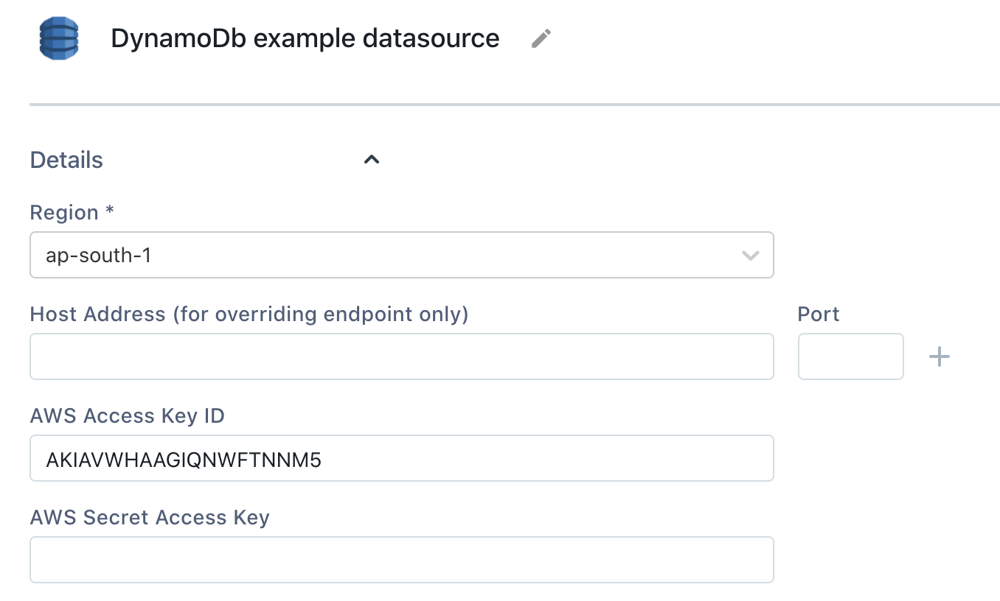

# DynamoDB


The following document assumes that you understand the [basics of connecting to databases on Appsmith](https://github.com/appsmithorg/appsmith-docs/tree/6fa43542f2b4d68916c05db37bba4a9d504c65a1/core-concepts/connecting-to-databases/README.md). If not, please go over them before reading further.


## Connection Settings

Appsmith needs the following parameters for connecting to a DynamoDB instance:




All required fields are suffixed with an asterisk \(\*\).


* **Region\*:** Select the region where your DynamoDB instance exists
* **Host Address / Port\*:** Fill in the database host’s address and port. You only need to fill these fields in case you wish to override the default endpoint chosen by AWS
* **AWS Access Key Id\*:** The identifier for your AWS Access key that is configured to have access to this database
* **AWS Secret Access Key\*:** The secret key for this identifier

All the above three details can be fetched from your AWS account:

1. [How to get AWS access key?](https://aws.amazon.com/premiumsupport/knowledge-center/create-access-key/)
2. [How to get AWS secret key?](https://aws.amazon.com/blogs/security/wheres-my-secret-access-key/#:~:text=Secret%20access%20keys%20are%E2%80%94as,key%20after%20its%20initial%20creation.)
3. [AWS DynamoDB regions/endpoints](https://docs.aws.amazon.com/general/latest/gr/rande.html)

## Querying DynamoDB

DynamoDB databases can be queried using any of the operations that are [officially supported](https://docs.aws.amazon.com/amazondynamodb/latest/APIReference/API_Operations_Amazon_DynamoDB.html). The request body expects a JSON object that represents a map of parameters to query the database. Here we have listed some of the most basic operations to get started with using a DynamoDB API.

### ListTables

The [ListTables](https://docs.aws.amazon.com/amazondynamodb/latest/APIReference/API_ListTables.html) command can be used to retrieve all the tables available at the current endpoint. This request can be run without a body.

### DescribeTable

The [DescribeTable](https://docs.aws.amazon.com/amazondynamodb/latest/APIReference/API_DescribeTable.html) command returns metadata about the table that is queried using the JSON body. A sample request might have the following body:

```javascript
{
    "TableName" : "four"
}
```

### GetItem

The [GetItem](https://docs.aws.amazon.com/amazondynamodb/latest/APIReference/API_GetItem.html) command retrieves a single item on the basis of its primary key. This primary key can be configured in any of DynamoDB's supported [types](https://docs.aws.amazon.com/amazondynamodb/latest/APIReference/API_AttributeValue.html) for attribute values. The request would use this specified type in the JSON body. In the following example, the primary key is called "pkey" and is of type `String` or `S` and hase a value of `a`.

```javascript
{
    "TableName" : "four",
    "Key": {
        "pkey" : {
            "S" : "a"
        }
    }
}
```

### PutItem

The [PutItem](https://docs.aws.amazon.com/amazondynamodb/latest/APIReference/API_PutItem.html) command is used to insert or replace an entire item object. This request can be configured to return with the inserted/updated item using the `ReturnValues` parameter. Here, we use the PutItem command for a simple insert.

```javascript
{
    "TableName" : "four",
    "Item" : {
        "pkey" : {
            "S" : "a"
        },
        "name": {
            "S" : "Irene"
        },
        "friends": {
            "SS" : ["Sherlock"]
        }
    }
}
```

### UpdateItem

The [UpdateItem](https://docs.aws.amazon.com/amazondynamodb/latest/APIReference/API_UpdateItem.html) can be used for conditionally updating parts of an item. This request also supports `ReturnValues` as well as new inserts.

```javascript
{
    "TableName" : "four",
    "Key" : {
        "pkey" : {
            "S" : "a"
        }
    },
    "UpdateExpression" : "set friends = :new_friends",
    "ExpressionAttributeValues" : {
        ":new_friends" : {
            "SS" : ["Mycroft", "Watson", "Irene"]
        }
    },
    "ReturnValues" : "ALL_NEW"
}
```

## Using Queries in applications

Once you have successfully run a Query, you can use it in your application to

* [Display Data](../core-concepts/displaying-data-read/)
* [Capture Data](../core-concepts/capturing-data-write/)

