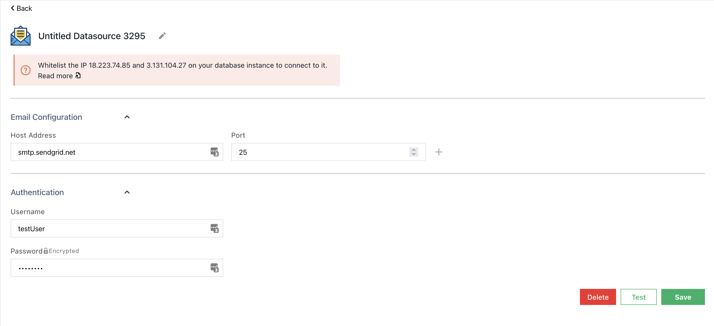
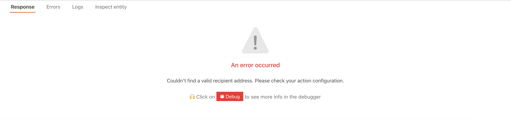

# SMTP


The following document assumes that you understand the [basics of connecting to a datasource on Appsmith](../core-concepts/connecting-to-data-sources/connecting-to-databases.md). If not, please go over them before reading further.


The SMTP plugin can connect to an SMTP server to send dynamic email(s) to a list of recipients.

## Connection Settings

The SMTP datasource requires the following information to establish a connection. All fields are mandatory.



1. Host address: This is the host address of the SMTP server.
2. Port: The port over which you will communicate with the SMTP server. Typically this is 25 or 587.
3. Username: The username of the SMTP server.
4. Password: The password of the SMTP server. Please note that if you have multi-factor authentication setup for your SMTP server, your normal password may not work. You may have to generate a separate password from your provider which will work without the multi-factor authentication. 

## Send Email

This action sends an email with dynamic subject and body to a list of recipient(s). You can also optionally attach files along with this email.

| Property Name      | Description                                                                                           | Type      |
| :----------------- | :---------------------------------------------------------------------------------------------------- | --------- |
| From email         | This is the email address that the email will be sent from.                                           | Mandatory |
| Set Reply To Email | Toggle to set if the reply to email ID needs to be set                                                | Optional  |
| Reply to email     | This is the email address that responses to your email will be sent to.                               | Optional  |
| To email(s)        | This is the email address(es) of the recipients. Multiple email IDs must be comma separated.          | Mandatory |
| CC email(s)        | List of email adderess(es) of the recipients to be CC'd. Multiple email IDs must be comma separated.  | Optional  |
| BCC email(s)       | List of email adderess(es) of the recipients to be BCC'd. Multiple email IDs must be comma separated. | Optional  |
| Subject            | The subject of the email                                                                              | Optional  |
| Body               | The body of the email                                                                                 | Optional  |
| Attachment(s)      | List of file paths of the attachments to be attached to the email.                                    | Optional  |

### Response Format

If the email has been sent successfully, the response will be a JSON object with the following structure:

```
{
  "success": true,
  "message": "Email sent successfully"
}
```

On the other hand, if Appsmith encounters an error while sending the email, an error will be displayed on the screen. An example is shown below:


## Using Queries in applications

Once you have successfully run a Query, you can use it in your application to

- [Display Data](../core-concepts/displaying-data-read/)
- [Capture Data](../core-concepts/capturing-data-write/)
- [Upload files](https://docs.appsmith.com/how-to-guides/how-to-upload-to-s3)
- [Download files](https://docs.appsmith.com/how-to-guides/how-to-upload-to-s3#downloading-files)
