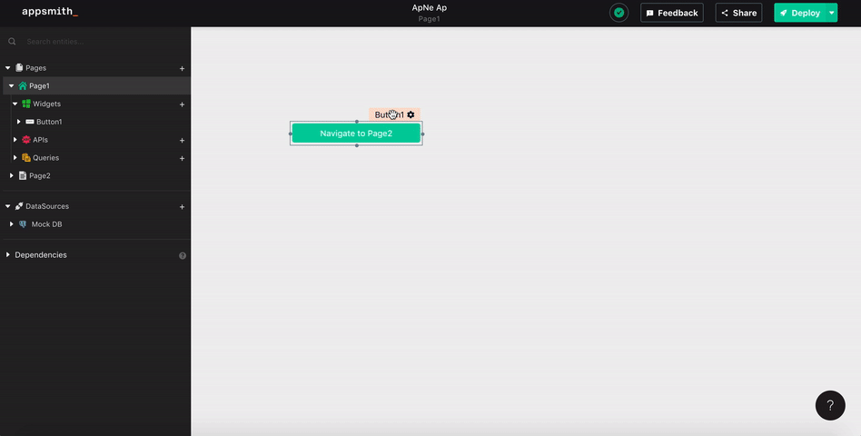

# Navigate To


## Signature

```javascript
navigateTo(pageName: string, params?: {}, target: "SAME_WINDOW" | "NEW_WINDOW") -> void
```

### Arguments

| **Argument Name** | **Description** |
| :--- | :--- |
| **pageNameOrUrl** | Page name or URL to which we would like to be transported. PageName is case sensitive. |
| **params** \(optional\) | Query parameters passed via the URL. Used to share information with destination page. |
| **target** \(optional\) | Option to configure where to open the url. Default: "SAME\_WINDOW" |



