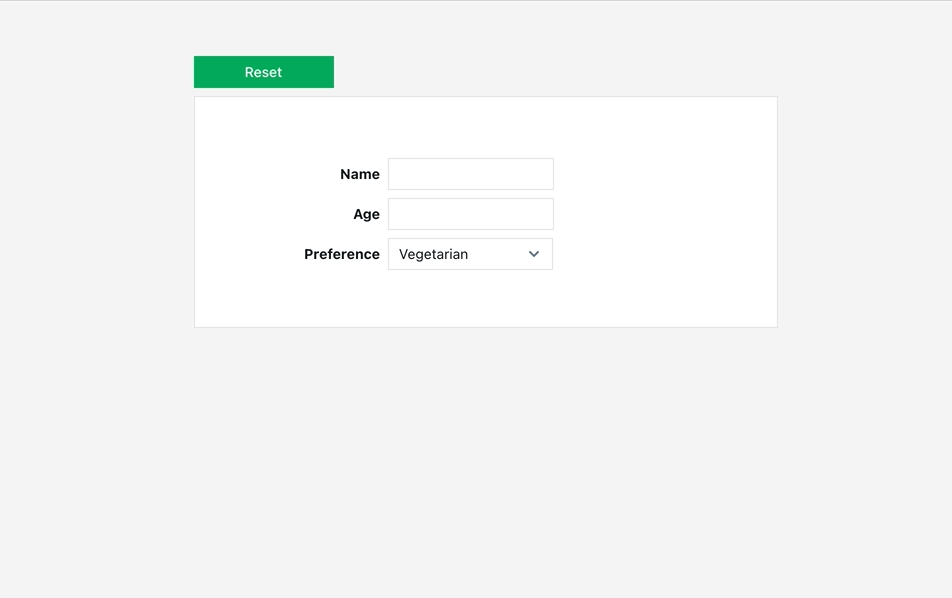

# Reset Widget

## Signature

```text
resetWidget(widgetName: string, resetChildren?: boolean) -> void
```

### Arguments

| **Argument Name** | **Description** |
| :--- | :--- |
| **widgetName** | The name of the widget that needs to be reset |
| **resetChildren** \(optional\) | Should all children be reset as well |



