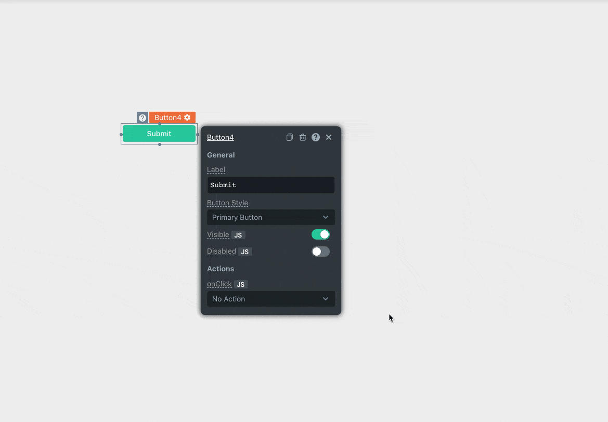

# Show Modal



> Remember to create a new modal before calling this action


## Signature

```javascript
showModal(modalName: string): void
```

### Arguments

| Argument Name | Description |
| :--- | :--- |
| **Modal Name** | Name of the modal to be displayed |

