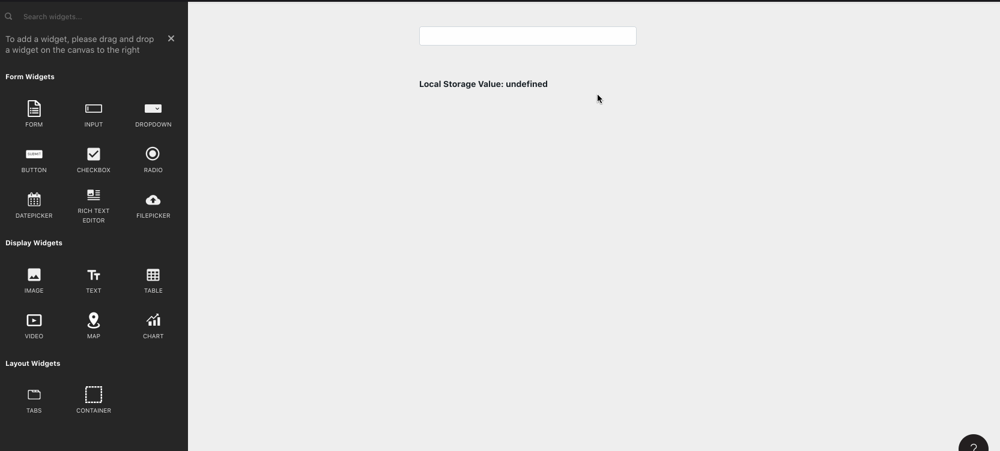

# Store Value



## Signature

```text
storeValue(key: string, value: any, persist? = true): void
```

### Arguments

| Argument Name | Description |
| :--- | :--- |
| **key** | Name of the key to store the value against |
| **value** | Value to give the key you are creating/updating |
| **persist** | Should this key value get persisted in the browser local storage to use between sessions. Defaults to true |

## Reading values

You can read values from the store by referencing the key inside the appsmith.store object

```text
{{ appsmith.store.key }}
```

## Usage

* Persisted state is cleared out when a user logs out
* Transient state \(persist=false\) is only available till the user exits the app or refreshes a page
* If a same key is available in transient and persisted state, the transient value gets preference
* Store value is sync. Unlike other appsmith functions, you can read the effect of store value in the next line itself

  ```text
  {{
  storeValue("userID", 42);  
  console.log(appsmith.store.userID); /* 42 */
  }}
  ```

