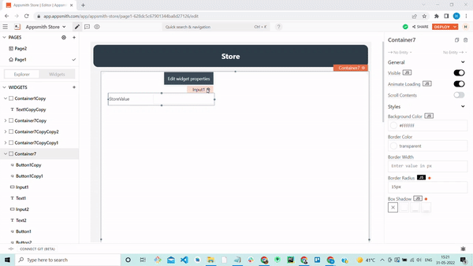
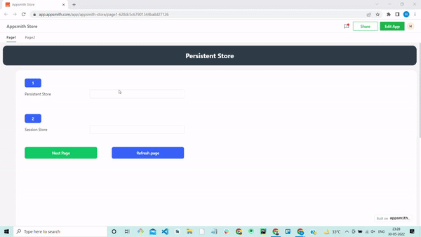

# Store Value



## Signature

```javascript
storeValue(key: string, value: any, persist? = true): Promise
```

### Arguments

| Argument Name | Description                                                                                            |
| ------------- | ------------------------------------------------------------------------------------------------------ |
| **key**       | Name of the key to store the value against                                                             |
| **value**     | Value to give the key you are creating/updating                                                        |
| **persist**   | This key value gets persisted in the browser's local storage to use between sessions. Defaults to true |

## Reading values

You can read values from the store by referencing the key inside the appsmith.store object

```javascript
{{ appsmith.store.key }}
```

## Usage

In Appsmith, there are two types of storeValue. The first is a persistent store, and the second is a session store.&#x20;

#### Persistent Store

If you store a value in the persistent store, it will remain in the store across different sessions/pages. For example, if you store a value in a persistent store, the value will be saved even if the page is reloaded.

You can set a persistent value by simply calling the store value with two parameters: one is the `property name` and the other is the `value of the text`. Let's see how it works:

* Drag and drop the _**input widget**_ to the canvas.&#x20;
* Now, go to the widget properties.
* Next, in the `ontextchanged` action, toggle `JS` option.
* Now copy and paste the code below, adjusting the value as needed.

```
{{storeValue('one',Input1.text)}}
```


* By default persist will be true, if you want to use session store you have to define persist=false.&#x20;
* The persisted state is cleared out when a user logs out.


#### Session Store

If you want to store value only for a session and have it cleared when you reload the page or close the window, you can use the session store. Let's see how it works:

* Drag and drop another **input widget** to the canvas.&#x20;
* Now, go to the widget properties.
* Next, in the `ontextchanged` action, toggle the `JS` option.
* Now copy and paste the following code, adjusting the value as needed.

```
{{storeValue('two',Input2.text, false)}}
```

The GIF below demonstrates how both functions work.




* Session store (persist=false) is only available till the user exits the app or refreshes a page.
* If the same key is available in the session and persisted states, the session value gets a preference.
* Store value is asynchronous and thus, you cannot read the effect of store value in the next line itself.


## Clear store value

To clear the value in the store, you can set its value to **undefined**.

```
{{
  storeValue("userID", undefined);
}}
```

**Clear Persistent store value**

If you want a clear persistent store value, you must define two parameters as follows:

```
{{
storeValue('one', ''); 
}}
```

**Clear Session store value**

If you want to clear the session store value, you must define three parameters as follows:

```
{{
storeValue('two', '', false);
}}
```

### What's Next

Check out this [app ](https://app.appsmith.com/app/appsmith-store/page1-627b8afe0b47255c28137dca)to learn more about persistent and session stores.[ ](https://app.appsmith.com/app/appsmith-store/page1-627b8afe0b47255c28137dca)You can fork this app to have a better understanding of it.
