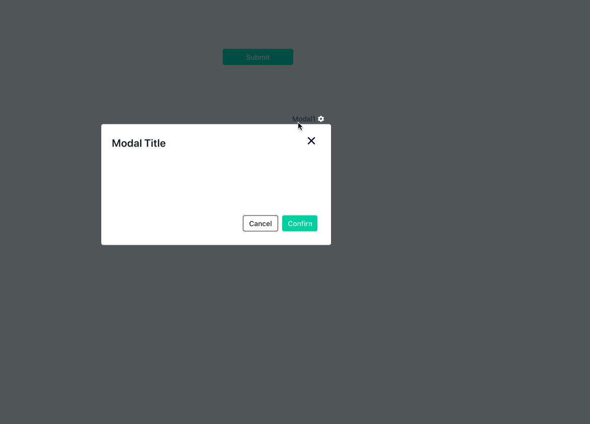

# Show Modal

## Signature

```text
closeModal(modalName: string) -> void
```

#### Arguments

| **Argument Name** | **Description** |
| :--- | :--- |
| **Modal Name** |  Name of the modal to be closed |



