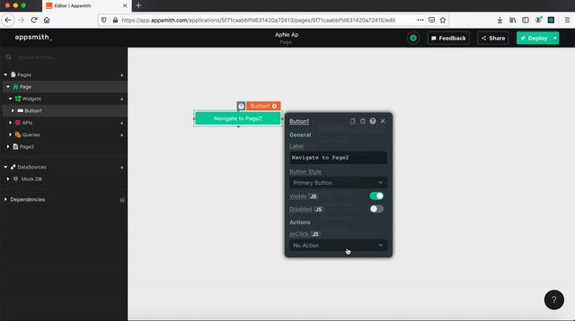

# Navigate Page

## Signature

```text
navigateTo(pageName: string, params?: {}) -> void
```

### Arguments

| **Argument Name** | **Description** |
| :--- | :--- |
| **pageNameOrUrl** | Page name or URL to which we would like to be transported. PageName is case sensitive. |
| **params** \(optional\) | Query parameters passed via the URL. Used to share information with destination page. |



