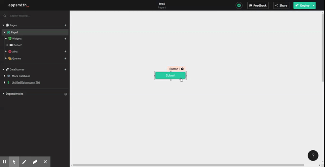

# showAlert

## Signature

```text
showAlert(message, style) -> void
    
```

#### Arguments

| **Argument Name** | **Description** |
| :--- | :--- |
| **Message** | string |
| **Style** | string |


