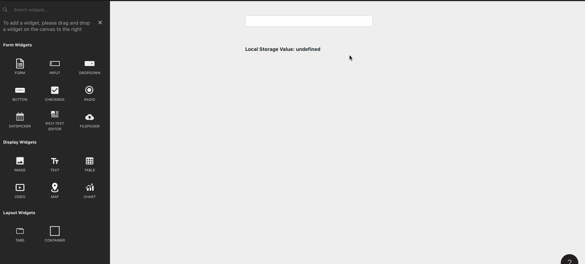

# Store Value

## Signature

```text
storeValue(key: string, value: any) -> void
```

### Arguments

| Argument Name | Description |
| :--- | :--- |
| **key** | Name of the key to create/update |
| **value** | Value to give the key you are creating/updating |



