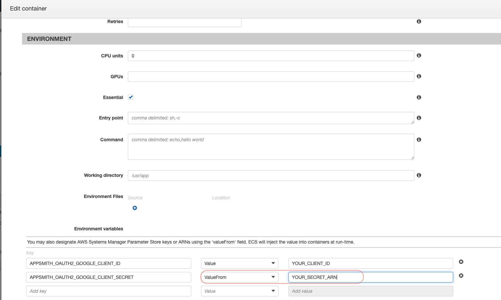
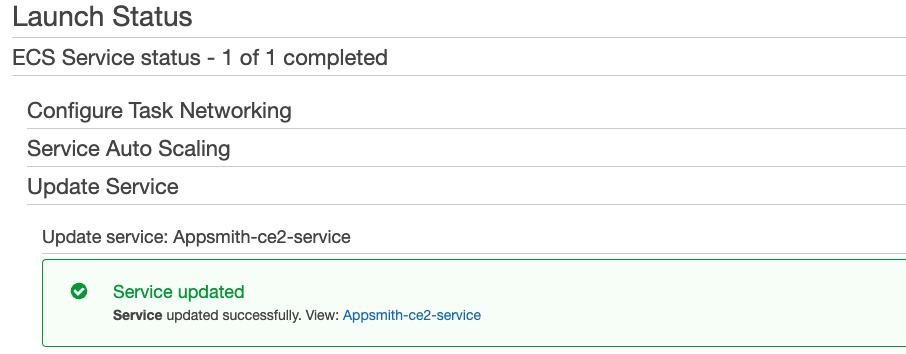

# Instance Configuration

## Configuring Docker Installations

To configure a docker installation, simply open the folder of your installation and edit the **`stacks/configuration/docker.env`** file with the environment variables for the service.

Remove # before the variables to ensure they are not commented

```bash
// Example variable configuration format
APPSMITH_GOOGLE_MAPS_API_KEY=YOUR_API_KEY
```

After making any changes, **remember to restart the docker containers** for the changes to take affect.

```bash
// To restart Appsmith using docker
docker restart appsmith

// To restart Appsmith using docker compose
docker-compose restart appsmith
```

## Configuring Kubernetes Installations

To configure a k8s installation, simply open the folder of your installation and edit the **`config-template/appsmith-configmap.yaml`** file.

Remove # before the variables to ensure they are not commented

```
// Example variable configuration format
APPSMITH_GOOGLE_MAPS_API_KEY: "YOUR_API_KEY"
```

After making any changes, **remember to restart the pods** for the changes to take affect

```
// commands to restart k8s pods
kubectl apply -f appsmith-configmap.yaml
kubectl scale deployment appsmith-internal-server --replicas=0
kubectl scale deployment appsmith-internal-server --replicas=1
```

## Configuring ECS Installations

To configure a ECS installation, follow these steps:

1. Navigate to the **ECS console** and select **Task Definitions** on the side bar.
2. Click on the Task Definition used by your ECS instance, and hit **Create new revision**.
3. On the Task Definition config page click on the Appsmith **container definition** to edit it. In the **Environment Section**, enter the environment configuration as **key value pairs** as show below. 

For sensitive information we recommend using **AWS Secrets**, please follow the steps [**detailed here**](https://docs.aws.amazon.com/secretsmanager/latest/userguide/manage\_create-basic-secret.html) to create a secret. Use the **ARN** of the secret as the Environment value and set the option to **ValueFrom**.

1. Hit the **Update** button, and hit **Create** to make a new task definition.
2. Navigate back to the **ECS console** and select you cluster. Click on your service to open the **service details**.
3. Click on **Update**, and select the **latest revision** of the Task Definition.
4. Hit **Skip** to **review** and then Update Service. A screen showing the status will show up. 

It may take a minute for the new ECS Task to start running.

## Available Configurations

* [Email](email/)
* [Custom Domain](custom-domain/)
* [Signup Restrictions](disable-user-signup.md)
* [Google Maps](google-maps.md)
* [Disable Intercom](disable-intercom.md)
* [Single Sign-On (SSO)](broken-reference)
* [Frame Ancestors](frame-ancestors.md)
