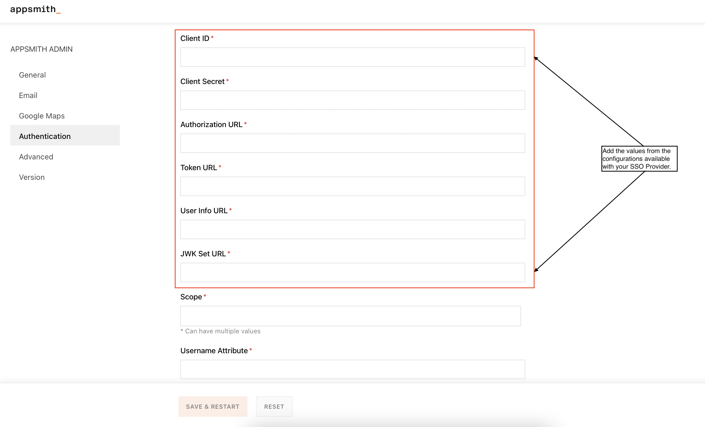
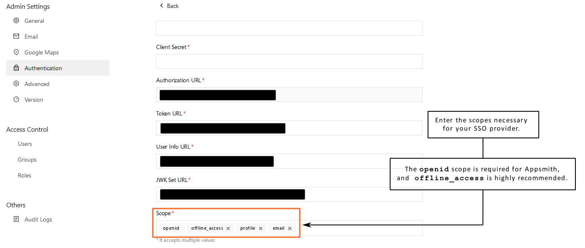

# Active Directory

Azure Active Directory (Azure AD) is a cloud-based identity and access management service. This service helps your employees access external resources\*\*,\*\* such as **Microsoft 365,** the **Azure portal,** and thousands of other **SaaS** applications.


OpenID Connect is available only in the [**enterprise edition**](https://www.appsmith.com/pricing) for **self-hosted instances,** and only the **Superuser** of your **Appsmith Instance** can set up OIDC.


To configure OpenID Connect(OIDC) within Appsmith using Active Directory as an OIDC provider, follow these steps:

### Create an Application


Creating an application in Active Directory


1. Log in to your [Azure](https://portal.azure.com/#allservices) account and click on **More services**.
2. Click on Azure Active Directory and hit “**+Add**.” From the "+Add" dropdown, select “**App Registration**.”
3. Under App Registration:
   1. **Name**: Give your App a meaningful name.
   2. **Supported account types**: Select “Accounts in this organizational directory only (Default Directory only - Single tenant)."
   3. **Redirect URL**: select the application type as Web for Platform and add the redirect URL (Copied from the [OIDC window in Appsmith’s Admin Settings](./#capture-redirect-url-for-sso-configuration)).
4. Click on Register to create the application.

### Configure Active directory with Appsmith

On the application homepage, go to the overview tab and perform the following actions under the essentials dropdown:

* Copy the **Application (client) ID** and paste it under the **Client ID** in the OIDC configurations in Appsmith.
* For Client secret, click on “Client credentials: Add a certificate or secret.”
  * In the “Certificates and Secrets window,” go to the **Client secret** tab and click on “New client secret.”
  * Add the key's description and expiration time in the “**Add a client secret**” pop-up. Click on Save.
  * Copy the value of the new Client secret and add it under **Client secret** in the OIDC configurations in Appsmith.


Creating a new Client secret in Active Directory


* Click the **Endpoints** tab under App overview and copy the **OpenID Connect metadata document** URL.



* Open the metadata URL in a browser window and copy the following configurations from the above link and add them to OIDC Configurations on Appsmith:

| **Azure Active Directory Configuration** | **OIDC configuration field in Appsmith** |
| ---------------------------------------- | ---------------------------------------- |
| authorization\_endpoint                  | Authorization URL                        |
| token\_endpoint                          | Token URL                                |
| userinfo\_endpoint                       | User Info URL                            |
| jwks\_uri                                | JWK Set URL                              |

### Configure Scopes

The scope defines the OpenID Connect (OIDC) scopes that allow you to authorize the access of user details ( after a user is successfully authenticated) like name, email, profile picture, and more. Each scope maps to a set of user attributes and returns its value. You'll see the Scope field below the **JSON Web Key Set**:

<figure><figcaption>
Configure Scope(s) at Appsmith
</figcaption></figure>

#### What does Appsmith need as part of Scopes?

Appsmith needs **openid** as a mandatory scope. It's also highly recommended to use the **offline\_access** scope to avoid errors related to expired access tokens and excessive re-login requests.


Enabling the `offline_access` scope enables your app to receive refresh tokens that extend the duration that your users have access to their resources. To read more, see the [Active Directory documentation](https://learn.microsoft.com/en-us/azure/active-directory/develop/v2-permissions-and-consent#offline\_access).


You can add more scopes if you wish, provided that they're available via Active Directory.

### Configure Scopes in Active Directory


Configuring Scopes in Active Directory


To configure scopes/permissions on Active Directory, follow the steps below:

1. Go to API permissions on the left panel.
2. Click on Add a permission button.
3. Under Request API permissions, Select Microsoft Graph and click on Delegated permissions.
4. Select the following permissions:
   1. Under **OpenID** permissions-
      1. email
      2. openid
      3. Profile
   2. Under **User** permissions-
      1. User.Read
5. Once complete, these scopes will get added to the Active Directory application.
6. Click on **Grant admin consent for Default Directory** on the top of the table, next to Add a permission button.

### Configure Username Attributes for Active Directory

The username attributes define the attributes used as usernames for authentication. You can add the attribute to this field that you consider for logging.

<figure><figcaption>
Appsmith Username Attribute
</figcaption></figure>

#### What does Appsmith need as a Username Attribute?

For Active Directory, Appsmith considers **"sub"** address as username. Please ensure that you have added "**sub**" as an attribute in the Username Attribute field.

### Complete OIDC Setup

* Save the changes and restart your application by clicking `SAVE & RESTART` button.

* You’ll see the **SIGN IN WITH OIDC SSO** on the Appsmith’s login screen.

