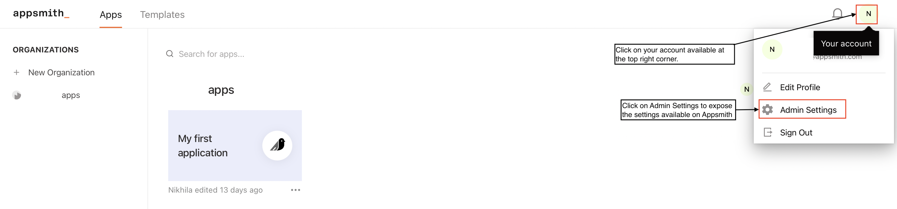
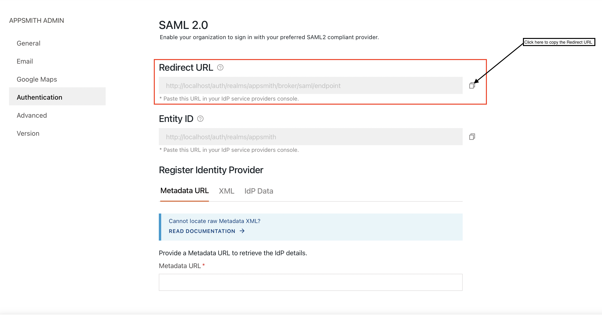
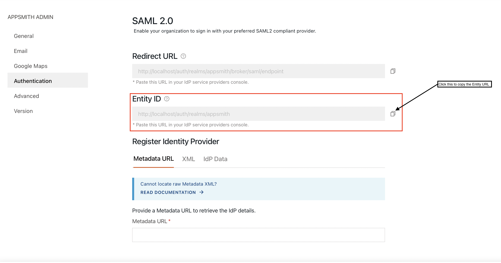
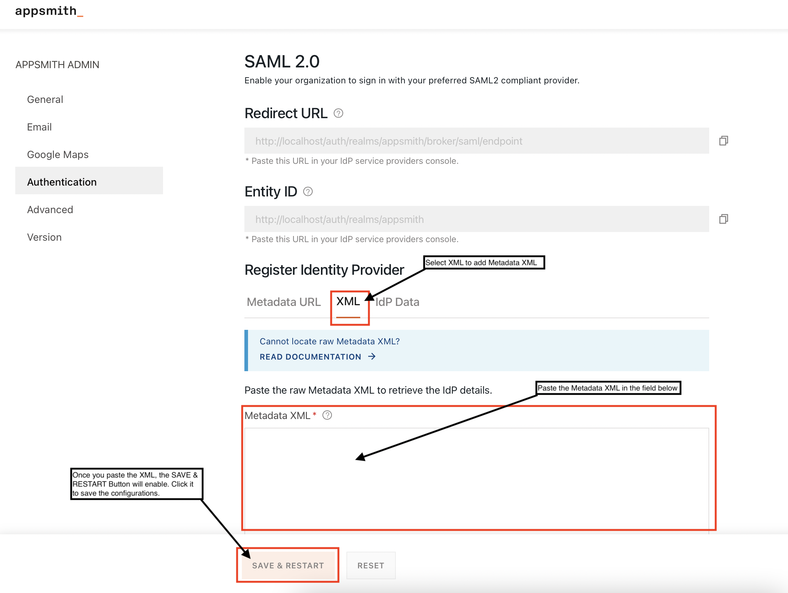
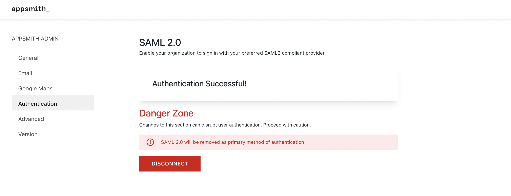

# SAML SSO

Security Assertion Markup Language (SAML) is an XML-based open standard for exchanging identity data between parties: an Identity provider(IdP) and a service provider.

The identity provider(IdP) is responsible for authentication and shares the user’s identity and authorization level with a service provider on successful authentication.

Upon successful authentication by the identity provider, the service provider authorizes the user to access resources.


Security Assertion Markup Language (SAML) is available only in the [enterprise edition](https://www.appsmith.com/pricing) for **self-hosted** instances, and only the **Superuser** of your **Appsmith Instance** can set up **SAML**.


## **Capture Redirect & Entity URL**

Follow the below steps to configure your SAML Provider’s settings. These steps are irrespective of the SAML provider that you choose.

* On Appsmith, navigate to **Profile** –->**Admin Settings.**

* Navigate to **Authentication** and open the available options for authentication on Appsmith.

.png>)

* You’ll see several options available, select **SAML** and click **Enable**.

### Redirect URL

* Copy the **Redirect URL**, and keep it safe as you’ll need this to add to your IdP’s settings.


Save the **Redirect URL** as you’ll need it to configure these in the

**SAML provider’s settings**.


### Entity URL

* Copy the **Entity URL**, and keep it safe as you’ll need this to add to your IdP’s settings.


Save the **Entity URL** as you’ll need it to configure these in the SAML provider’s settings.


## SAML Providers

Appsmith integrates with popular SAML providers that you can choose from. Click the below available providers and follow the instructions to configure them for SAML integration:


[auth0.md](auth0.md)



[ping-identity.md](ping-identity.md)



[okta.md](okta.md)



[active-directory.md](active-directory.md)


### **Generic SAML Configuration**

You can also use configurations available on Appsmith to configure your SAML providers, which are not listed here. You can follow the steps listed below to configure the details:

#### Configurations at the Identity Provider

You’ll need a **Redirect URL** and an **Entity URL** to configure **SAML** integration for an identity provider. Follow the below steps to capture the redirect and the entity URL available on Appsmith.

* On Appsmith, navigate to **Profile** >> **Admin Settings.**

* Navigate to Authentication, and open the available options for authentication on Appsmith.

.png>)

* You’ll see several options available, select **SAML** and click **Enable**.

#### Redirect URL

* Copy the **Redirect URL**, and keep it safe as you’ll need this to add to your IdP’s settings.


Add the **Redirect URL** to the SAML Configuration to fields like the Callback URL.


**Entity URL**

* Copy the **Entity URL**, and keep it safe as you’ll need this to add to your IdP’s settings.


Add the **Entity URL** to the Entity URL available for the SAML settings.


#### Configurations at Appsmith

You can register your identity provider with Appsmith in one of the following available ways and complete SAML integration.

**Metadata URL**

The metadata XML document is usually hosted and available remotely to integrate with. You can use the URL to configure SAML on Appsmith. Copy the URL where the metadata XML is available and paste it into the Metadata URL field as shown in the screenshot below .

**XML**

In case the Metadata URL is unavailable, but you have a raw SAML metadata XML locally available, you can click on the XML tab and add the raw Metadata XML into the Metadata XML field as shown in the below screenshot.

**IdP Data**

You can also configure SAML by manually adding the IdP details. If you choose to do so, you’ll need the below details:

* **Entity URL** - The entity URL available for the Identity Provider
* **Single Sign-on URL** - The SSO URL for the identity provider
* **X509 Public Certificate** - A certificate that defines the public-key formats.
* **Email** - The name format used for an email address.

#### Complete the Configuration

Once you have added the required details click on Save & Restart. On server restart, you’ll see an **Authentication Successful!** message as shown in the screenshot below.

You can now see a SIGN IN WITH SAML SSO available on the Login screen and can use it to log into Appsmith using SAML.

