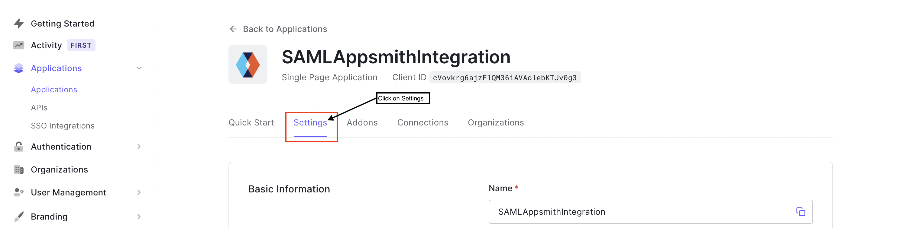

# Auth0

Auth0 is an authentication & authorization provider. It provides Security Assertion Markup Language (SAML) integration that you can use to integrate with Appsmith. Follow these steps to configure SAML integration:


Security Assertion Markup Language (SAML) is available only in the [enterprise edition](https://www.appsmith.com/pricing) for **self-hosted** instances, and only the **Superuser** of your **Appsmith Instance** can set up **SAML**.


## Create Application

* Log in to your [Auth0](https://auth0.com/) account and go to **Applications -->** select the subhead **Applications -->** Click **Create Application**. (Please create an account if you don’t have one on [Auth0](https://auth0.com/)).

From the available options, select **Regular Web Applications**.


The default name of the application is **My App**. You can change it to give a suitable name to the application.


* Your application will be created, and you’ll be navigated to the Application details page. Go to the **Settings** tab.

* Scroll down to the **Application URIs** section. Add the **Redirect URL (**[Copied from Appsmith SAML Configuration Redirect URL Field](./#redirect-url)**)** to the **Allowed Callback URLs** field.

Click **Save Changes**

## Configure Auth0 SAML Fields in Appsmith

To complete the SAML configuration, you’ll have to register the identity provider on Appsmith.

### Register Identity Provider

Appsmith provides the below options using which you can register the identity provider on Appsmith and complete the SAML Configuration. Follow the one that best suits you:

#### Metadata URL

SAML metadata is an XML document that provides information required for interaction with a SAML-enabled identity or service provider. The Metadata URL is the URL metadata for SAML configuration hosted on a remote server.


Metadata URL is the **quickest** and **most recommended way** to set up **SAML**.


* To obtain the **Metadata URL**, navigate to the **Settings** tab, scroll down and expand the **Advanced Settings.**

* Click on the **Endpoints**, scroll down to the **SAML** config fields, and copy the SAML Metadata URL.

* Navigate to Appsmith, add the Metadata URL and click `SAVE & RESTART` button to save the configuration.

#### XML

If you don’t have a Metadata URL but have a raw SAML metadata XML document, you can choose XML to configure SAML.

* Navigate to Appsmith, click XML, add the raw XML in the `Metadata XML` field and click the `SAVE & RESTART` button to save the configuration.

#### IdP Data

You can also configure SAML by providing the identity provider(IdP) data.

If you have Identity provider’s data like `X509 Public Certificate`, `Email`, and more, you can choose this option to configure SAML.

* Navigate to Appsmith, and click **IdP Data**. You can get the information from `Metadata XML` and add the content of the tags as per the below mapping table:

| **Appsmith Field Name** | **Metadata XML Tag**                                                                          |
| ----------------------- | --------------------------------------------------------------------------------------------- |
| Entity ID               | ` <EntityDescriptor`` `` `**`entityID`**`="urn:dev-ux0tussx.us.auth0.com" /`>                 |
| Single Sign-On URL      | `<SingleSignOnService/>`                                                                      |
| X509 Public Certificate | `<X509Certificate/>`                                                                          |
| Email                   | `<NameIDFormat>urn:oasis:names:tc:SAML:1.1:nameid-format:`**`emailAddress`**`</NameIDFormat>` |

Once you have supplied the details, click the `SAVE & RESTART` button to save the configuration.

## Complete the SAML Configuration

Once the server restarts with new configurations, you will see a screen showing the message ‘**Authentication Successful!’**.

You’ll see a login screen with the button `SIGN IN WITH SAML SSO`.

