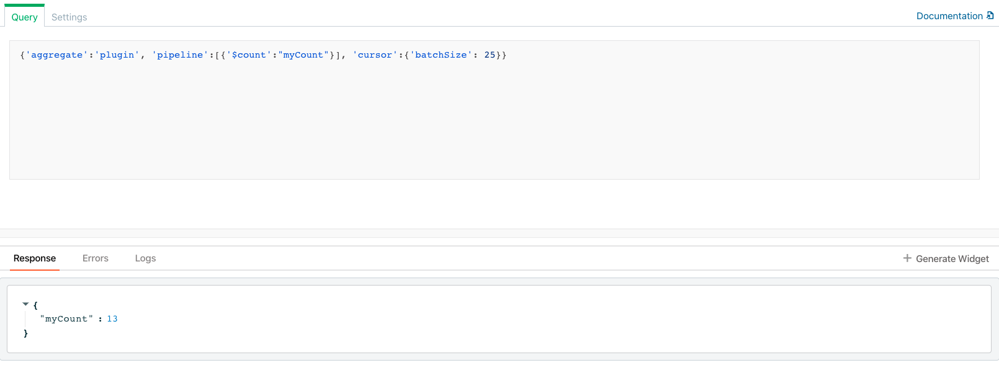

# Get count of mongo documents without fetching them

- When the number of documents in collection are too many then counting the documents after fetching them does not 
  seem like a good idea as it would incur significant delay. In such scenarios we can get a count of documents using 
  the following mongo plugin query: 

```text
{'aggregate':'<collectionName>', 'pipeline':[{'$count':"myCount"}], 'cursor':{'batchSize': <max number of documents>}}
```

- Please replace `<collectionName>` and `<max number of documents>` with the name of the collection whose documents 
  you wish to count and the maximum number of documents respectively.

