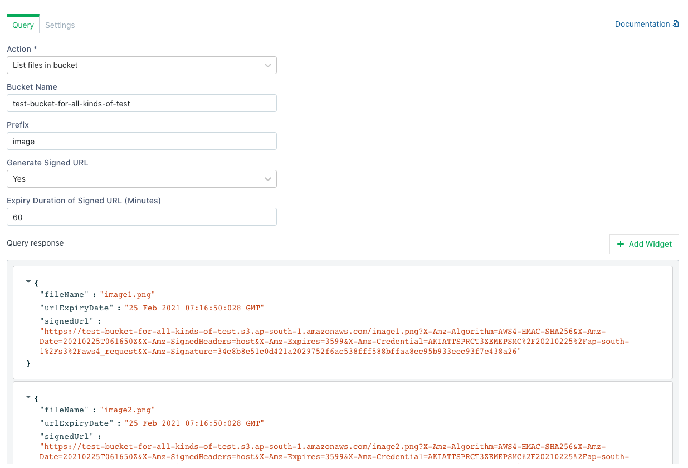
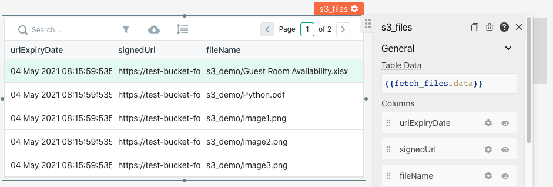

# Upload / Download Files from S3

Files can be uploaded to Amazon S3 using the S3 plugin and FilePicker Widget. This document presumes you have successfully [connected to your S3 instance](../datasource-reference/querying-amazon-s3.md)

## Uploading a File

To upload a file

1. Drag a [Filepicker widget](../widget-reference/filepicker.md) onto the canvas
2. Create a new S3 query named upload\_file to be run onFileSelected

1. Select the [Create File Action](../datasource-reference/querying-amazon-s3.md#create-file) option for the query.
2. The action should be configured with the bucket name and relative path of the location you want to store the file. `ex. images/`any intermediate folders not existing will be automatically created.
3. The name of the file should be configured in the file path field. This value can be picked from the Filepicker using javascript`images/{{ Filepicker1.files[0].name }}`
4. The content can be configured using the data property of the Filepicker. `{{Filepicker1.files[0].data}}`
5. Select a file from the file picker and hit upload

## Downloading Files

To download a file

1. Drag a Table onto the canvas and name it **S3\_Files**
2. Create a new S3 query named **fetch\_files** to fetch all the files in your bucket
3. Configure the [List Files](../datasource-reference/querying-amazon-s3.md#list-files-in-bucket) action for the query
4. Set the bucket name from where to fetch the files and run the query

   

5. Bind the response of the query to the Table using javascript in the Table Data Property `{{fetch_files.data}}`

6. Create a new S3 query to read file data named **fetch\_file**
7. Configure the **fetch\_file** query with the [Read File](../datasource-reference/querying-amazon-s3.md#read-file) 
   action.
8. Configure the bucket name in the query
9. Pass the file path selected in the table to the query using javascript `{{S3_Files.selectedRow.fileName}}`

11. Next, configure to download the file read by the above query by clicking on the `JS` button next to 
    `onRowSelected` action in the table property pane and fill in the following mustache expression: `{{fetch_file.run(
    ()=>{download(atob(fetch_file.data.fileData),Table1.selectedRow.fileName.split("/").pop())})}}`. 
    Please replace the query name and the tabel name in the previous expression with your query name and table name.

    

12. Click any row to download any file in your S3 bucket.

