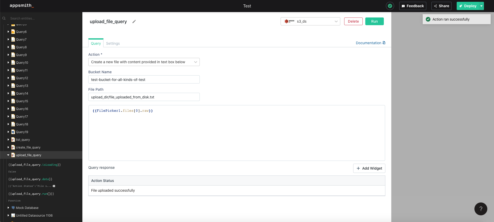
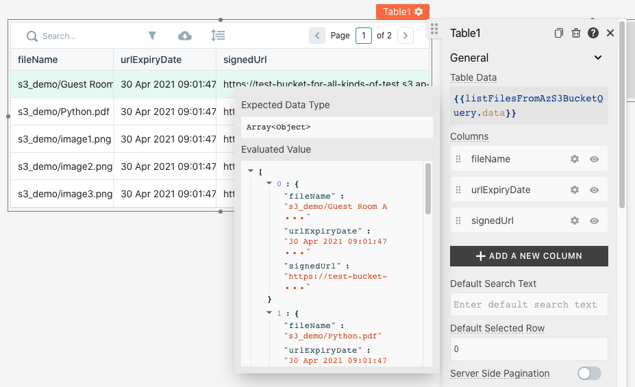
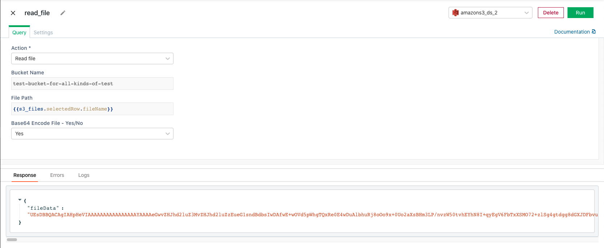
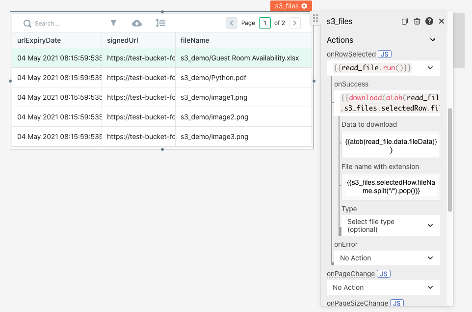

# Upload / Download Files from S3

Files can be uploaded to Amazon S3 using the S3 plugin and FilePicker Widget. This document presumes you have successfully [connected to your S3 instance](../datasource-reference/querying-amazon-s3.md)

## Uploading a File

To upload a file

1. Drag a [Filepicker widget](../widget-reference/filepicker.md) onto the canvas
2. Create a new S3 query named upload\_file to be run onFileSelected


1. Select the [Create File Action](../datasource-reference/querying-amazon-s3.md#create-file) option for the query.
2. The action should be configured with the bucket name and relative path of the location you want to store the file. `ex. images/`any intermediate folders not existing will be automatically created.
3. The name of the file should be configured in the file path field. This value can be picked from the Filepicker using javascript`images/{{ Filepicker1.files[0].name }}`
4. The content can be configured using the data property of the Filepicker. `{{Filepicker1.files[0].data}}`
5. Select a file from the file picker and hit upload



## Downloading Files

To download a file

1. Drag a Table onto the canvas and name it **s3\_files**
2. Create a new S3 query named **fetch\_files** to fetch all the files in your bucket. 
   - configure it with the [List 
   Files](../datasource-reference/querying-amazon-s3.md#list-files-in-bucket) action. 
   - set the bucket name from where to fetch the files and run the query
   - bind the response of the query to the Table using javascript in the Table Data Property `{{fetch_files.data}}`. 
     Now your table should list all the files present in your S3 bucket.



3. Create a new S3 query named **read\_file** to read file data from S3 bucket.
   - configure it with the [Read File](../datasource-reference/querying-amazon-s3.md#read-file)
   action.
   - set the bucket name from where to fetch the file
   - set `path` to the file path selected in the table using the [javascript expression](writing-javascript-in-appsmith.md) `{{s3_files.selectedRow.fileName}}`
   


4. To download the file selected in the table
   - click on the `JS` button next to `onRowSelected` Action and write the 
   following javascript query:

   ```text
   {{read_file.run(
   ()=>{download(atob(read_file.data.fileData),s3_files.selectedRow.fileName.split("/").pop())})}}
   ```
   
   - Click any row in table `s3_files` to download the corresponding file from your S3 bucket.


<!---
Commenting out the below lines till https://github.com/appsmithorg/appsmith/issues/4262 is closed

1. Create a new S3 query for the `onRowSelected` action named **read\_file**


1. Configure the **read\_file** query with the [Read File](../datasource-reference/querying-amazon-s3.md#read-file) 

   action.

2. Configure the bucket name in the query
3. Pass the file path selected in the table to the query using the [javascript expression](writing-javascript-in-appsmith.md) `{{s3_files.selectedRow.file}}`


1. Configure the `onSuccess` action of the `onRowSelected` Action in the Table to `Download`.
2. Configure the download function with
   1. **Data to Download:** `{{atob(read_file.data.fileData)}}`
   2. File name with extension:`{{s3_files.selectedRow.fileName.split("/").pop()}}`



-->

