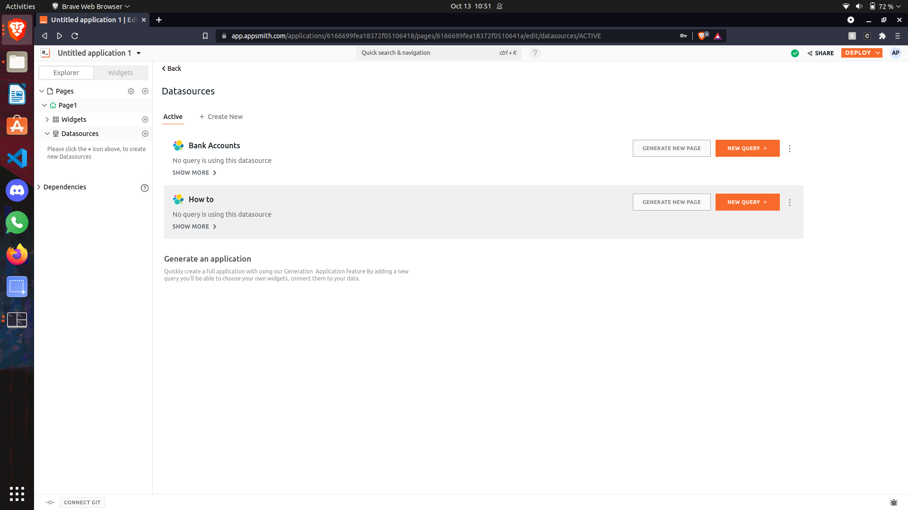
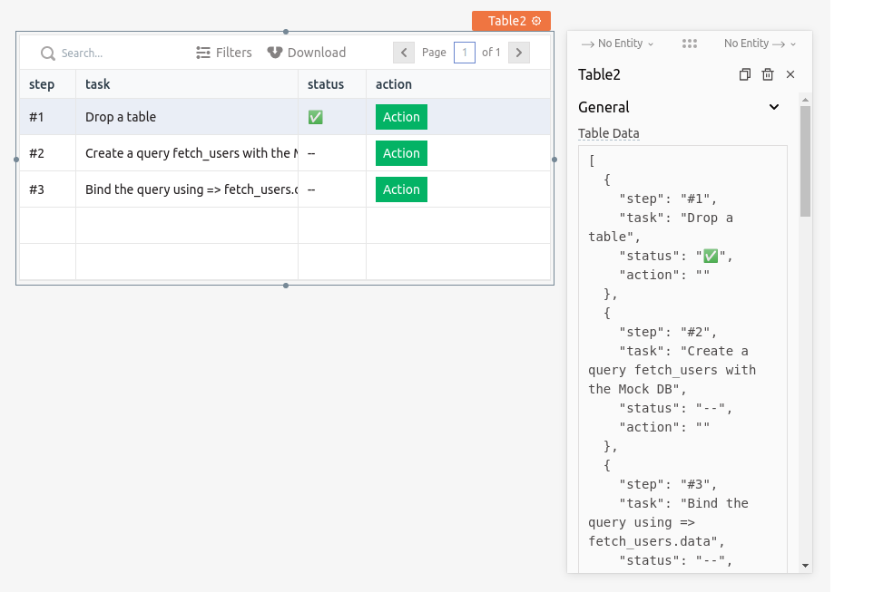

# How to use ElasticSearch as a data source on Appsmith

This guide assumes you have basic familiarity with [Appsmith](https://www.appsmith.com). I suggest creating an account and trying it out If you don't. I assure you that it is straightforward to get acquainted with quickly.

## Elasticsearch

Elasticsearch is a distributed, free and open search and analytics engine for all types of data, including textual, numerical, geospatial, structured, and unstructured. Known for its simple REST APIs, distributed nature, speed, and scalability, Elasticsearch is the central component of the Elastic Stack, a set of free and open tools for data ingestion, enrichment, storage, analysis, and visualization.

In this guide, you will learn how you can use Elasticseach as a data source for your Appsmith application.

## What to build

We will use accounts.json that has sample data of bank customers and their account balance. This guide will display all the defaulters (account balance less than 20000) with their account info. We will also make a button that will update the balance of the selected person.

## Initial setup

Let's quickly first see how you can integrate Elasticsearch in Appsmith. Just head to Appsmith, and let's say for the scope of this guide, you're building a new application which you want to get data from your Elasticsearch server.

Click on the `New` button to create a new application. Then click on `Generate from a Data table` option. You should be prompted with a screen that would ask you to connect the database of your choice. It should look something like this:


Click on `Connect new Datasource` and find `ElasticSearch` from all the available database options.

Now you will be greeted with a page to fill in the credentials of your ElasticSearch server. Please fill in the host/port login credentials. The unfilled screen for this would look something like this:


If you are hosting Elasticsearch on a local server, consider using ngrok to expose the public address. You can see how to use ngrok and other local APIs with appsmith here: https://docs.appsmith.com/how-to-guides/how-to-work-with-local-apis-on-appsmith

Once you fill in all the details, you can click Test from the options below to test your connection. It will let you know if Appsmith can successfully connect to your database or not.

If the test is successful, click on "Save" to save your connection on Appsmith.

## Querying the database

So, now that you're done with setting up a connection to your database server, you should be able to see a screen like this:



You can change the name of Datasource by clicking on it. I will use the How To datasource here. From here, let's try writing a query for our application. For our database, I have already added the accouts.json data file.

Querying in Appsmith is very simple; click on the New Query button from above and select which kind of query operation you're going to have. For our use case, we're just trying to get data from our database, so I would go ahead and use the default GET method.

Mention the path in the text field. For our case, we will write `/bank/_search/?size=50` . This will take the first 50 lists which satisfy the query. You can include more data by increasing the value of size. The default value is 10

In the body, we will write our query.

```
{
  "query": {
    "range": {
      "balance": {
        "lte": 20000
      }
    }
  }
}
```

It will look something like this.

.png>)

I will name this query Defaulter. Now for your convenience, Appsmith does all the input sanitization and helps you query your database without worrying about any malicious data. In our case, we're just reading from the database, so our query will also be straightforward.

## Displaying the data

Now that we have a query to fetch data from the database. It's time to display the data. Let's start with a simple way to go on to this.

Data is stored as a JSON format in Elasticsearch, and we will use a table to display it.

Click on the `Widgets` ribbon and select the `Table` widget.

.png>)

Drag and drop it on the canvas. It should be like this.



So let's try displaying our query data in the table. Now click on the settings icon, and all you have to do is replace the table data value with your query data. In this case, the identifier of my query is Query1, so I will just put `Defaulters.data.hits.hits` inside \{{\}}. Remember Defaulters is the name of the query.

We will hide unwanted columns like \_index, \_type \_score, and \_soruce.

After that, we will add our custom columns named `Firstname, Lastname, Balance, Email`

Now we have to fill the data with the required key names from the JSON. For the Firstname column, use this query to add all the values from the database.

```
{{currentRow._source["firstname"]}}
```

You will see it will automatically fill the column with the data. Similarly, we will fill in the data for all the columns. i.e., change the value in `_source` with the required key you want.

Finally, you can see your table looking like this.


You can also use the filter command in the table widget. Let's say you want to find the people who have a balance less than 10000 and are in a critical red zone. You can click the filter tag and fill the fields with the objective in mind. For this instance, we can select Where -> Balance -> is less than or equal to -> 10000


It's very self-explanatory and easy to use. Also, remember to change the type of balance column to Number by going into column settings and selecting the type in Column type.

## Let's try to make a button and update data on ElasticSearch using Appsmith

Now that we know how to read data via ElasticSearch, let's make a function that will ask you to add a new value to the selected id's balance column. We will now execute a query to update the new balance to our accounts.json data.

Create a new column next to balance by clicking on the table and selecting the `ADD A NEW COLUMN` button. I am going to name the column as Balance Update. Click the settings icon on the column name to modify it. In column type, select `Button` and you will see all the rows in the Update Balance column will have a button. I am going to name the button as Update. Your configuration should look like this.


On clicking the button, we should get a prompt on the screen with a textbox to write our new balance and update it. To accomplish this, we are going to use another widget call `Modal`. Click the `+` icon next to Widgets and drag the modal widget to the canvas.


Let's configure our modal widget. I am going to name it New Balance and two more widgets into it, `Text` and `Input`. Write New Balance in the text and select the size of the text you desire. I am going to take Heading3 for this guide. Now it's time for the input widget. Select data type as currency and the type of currency as USD - US Dollar as our data also has amounts in Dollar. Leave all the settings as it is and come down. Check the Required button to ensure the user has to write data into it if he wants to execute the query. Your configurations should look something like this-

 

Let's work on the Confirm Button now. Click on it to configure it. You should see a `onClick` section under the Actions tag. What we want here is after the user presses that button, two queries should execute. The first query should update the data with the new balance entered and the second query will re-populate the table with the updated data.

After clicking on the `onClick` section, choose `Execute an Query` and then `+ Create New Query`.

Click on the `New Query` button of the datasource you want to make query in. Name your query with a proper name for better understanding and write the query. For updating the data we will use `POST` Method.

In path write `/bank/_update/{{Table1.selectedRow._id}}` Table1 is the table we have populated before and .selectRow\_id will take the id of the row from where we pressed the button.

In the body use the following command to update the data

```
{ "script": "ctx._source.balance = {{new_balance.text}} " }
```

`new_balance` is the input widget where the user writes the new balance. It should look like this -


Now go back to the modal widget and click on the settings of Confirm button.

Go on `onClick => Execute a query => Cleared_Query (the new query we just made)`

You can see that there are two more new options, onSuccess and onError. We will use this to re-populate the table with the updated data. In the onSuccess section select `Execute a query => Defaulters (the previous query which we used to read data)`

Voila! You have now made a function to update the data. We also need to close the modal after updating the balance. Click on the close button settings, and in its onClick method, select `close modal` and in the Modal section select the `Balance_Modal` or the name of the modal you have given.

In the end, your modal should look like this -


Our final step is to configure our Update button to set an onClick method which will open our modal Go to table => select Balance Update column settings => onClick => Open Modal => select the modal name Balance\_Update


Your application is now ready and can be easily deployed by clicking the Deploy button on the top right corner. You can also share your application with others by clicking the share button. You can also invite others to this app via email and even assign roles to them.


Let's update one of the values to check if our application is working.


All the queries have executed properly. Let's check the value of id 6 to see if it's appropriately updated. I'll use Kibana to check the value.


We can see the new balance is now 78000. Our update query was successful.

Now you know how to update data using ElasticSearch as well.
