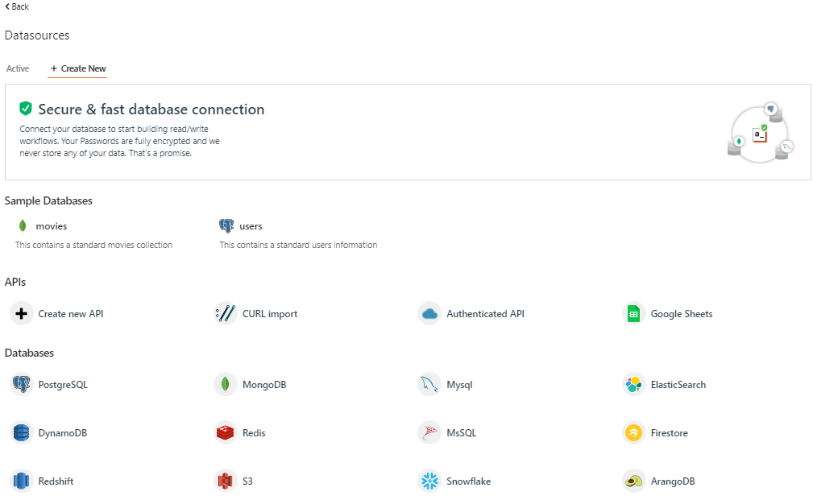

# How to use Snowflake as a data source on Appsmith

This guide assumes you have basic familiarity with [Appsmith](https://www.appsmith.com/). If you don't have much understanding, I would suggest creating an account and trying it out. I assure you that it is straightforward to get acquainted with quickly.

## Snowflake

Snowflake is a cloud-based Data Warehouse solution provided as a Saas (Software-as-a-Service) with full support for ANSI SQL. It also has a unique architecture that enables users to just create tables and start querying data with very less administration or DBA activities needed.

In this guide, you will learn how you can use Snowflake as a data source for your Appsmith application.

## What to build

We are going to use an Snowflake Data Warehouse and `TPCDS_SF100TCL` Dataset and get all the Items of Category Electronics from the Item table of the Dataset.

## Initial setup

Let's quickly first see how you can integrate Snowflake in Appsmith. There are not many steps or any complicated ones. Just head to [Appsmith](https://app.appsmith.com/applications), and let's say for the scope of this guide, you're building a new application which you want to get data from your Snowflake server.

Step1- So,  click on the `New` button to create a new application. Then click on `Generate from a Data table` option. You should be prompted with a screen that would ask you to connect the database of your choice. It should look something like this:<br/>

<!--  -->


Step2- Click on the `Snowflake` option. Once you click on it, a screen similar to image below will appear-: 

<!--  -->


Step3- Fill in the Required Details in Connection Section-:

(a) `Account Name` - Your Snowflake URL looks like ` https://<id>.<zone>.<service_provider>.snowflakecomputing.com/ `. Copy everything after (https://) and before (.snowflakecomputing.com). That is something similar to `<id>.<zone>.<service_provider>`. Eg. `xxxxxxx.us-central1.gcp`

(b) `Warehouse` - Enter the name of the Warejouse of the Snowflake server. (Just check the warehouse is not in suspended state)

(c) `Database name` - Enter `SNOWFLAKE_SAMPLE_DATA`

(d) `Default Schema` - Enter ` TPCDS_SF100TCL `

(e) `Role` - Keep it PUBLIC.

<!--  -->
<br/>

Step4- Once the above entries are done, click on the down arrow beside Authentication Section. Enter the Username and Passowrd of your Snowflake server and click on Test button in the bottom right. It should return an successful alert. If you get successful alert click on Save button on Appsmith Dashboard to save the connection with the server.

## Querying the database
So, now that you're done with setting up a connection to your database server, you should be able to see a screen like this:

<!--  -->


Step1- Querying in Appsmith is very simple, click on the `New Query` button. It opens up a window with a Query Section. In the Query add SQL Query -:
```code 
SELECT * FROM TPCDS_SF100TCL.ITEM WHERE I_CATEGORY='Electronics' LIMIT 200;
```
Click on the RUN button on the top right. You will get the results of Query in response section as shown below-:

<!-- -->


## Displaying the data
Now that we have connected our query and database to our Appsmith application, it's time to display the data. Let's start with a simple way to go on to this.

Data is stored as a table format in Snowflake tables and we will use a table to display it.

Step1- Click on the `Widgets` ribbon and select the `Table` widget.

<!--  -->


Step2- Drag and drop it on the Editor.
It should like this.

<!--  -->


Step3- Now to Link the Data to the Table widget there are two ways-:

(a) Click on the Explorer Section, and click on the query where you performed the Query. On the right side window there is an option to Connect Widget, select the `SELECT WIDGET` button. This directs you to the canvas with Table we created in previous step present there. Click on the Table and on the top-left of table we will see a `Bind to Table` option, click on it.  

(b) Click on top right corner of the table to open up it's setting section and in Table Data Section Paste `{{<Name_of_the_Query>.data}}` as you can see in the image below.

Now the data of the Query response will be populated in Table widget. And we will can see that all items of Category as Electronics is shown in image below-:

<!--  -->


Step4- Now we can play around with widget. Like we can click the eye icon beside column names, and the corresponding column is hidden. As shown in the image the `I_CATEGORY_ID` column is hidden and it was visible initially.

<!--  -->


Now you can play around with the widget, like you can click the filter section and set custom filter with different column and parameters and click apply to modify the data as shown below. It's very self explanatory and easy to use.

<!--  -->


This concludes the tutorial for using Snowflake as a data source in Appsmith.
