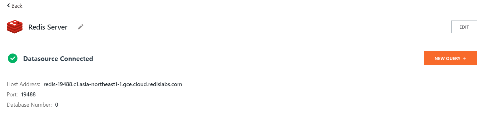
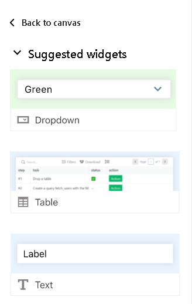
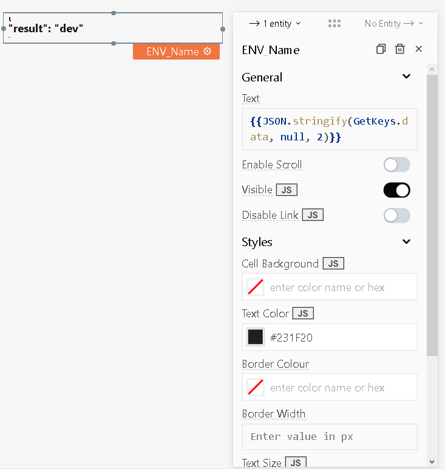
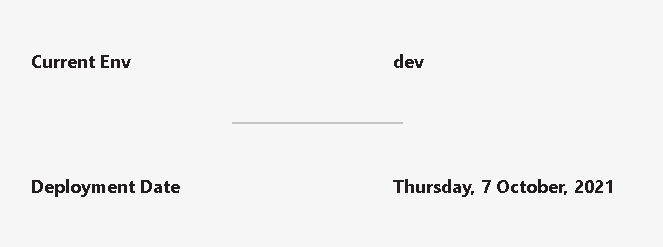

## Integrating the Redis datasource into Appsmith

To connect your Redis Database instance to Appsmith as a datasources

1. Open [Applications Page](https://app.appsmith.com/applications/), select the application to want to configure and click on **Edit**.
2. On the navigation panel to the left side, Click on **+** next to **Datasources** Tab.
3. (Optional) Now click on **+ Create New**, if you already have connected a Datasource previously.
4. Under **Databases**, Select **Redis** 
5. Enter a name to your Redis datasource (e.g. *My Redis Database*)
6. Enter your Redis Database configurations inside the *Connection* section.
   * Enter "0" as *Database Number*, if you are connecting to the database for the first time.

    

7. Enter your username and password to your Redis Database under *Authentication* section.
8. Once done, click on **Save** and then click on **Test**.
9. If the Pop up notifies you that *My Redis Database datasource is valid*, that means your Redis Database's configuration is correct and is to ready to connect to your *Appsmith Application*. If it Pop up notifies you about any other error, please check your Redis configuration.

> Refer to [Redis Datasource](../datasource-reference/querying-redis.md) documentation for more information.

## Using Redis as a Datasource

### Create keys

Lets create some keys in your Redis Database.

1. After you have added your Datasource, click on **New Query +**.



2. Edit your Query name, from **Query1** to **CreatingKeys**
3. From the *Query* field, create some keys *(Enter one by one)*.

    ```text
    SET DEVELOPER "me"
    ```
    ```test
    SET ENV "DEV"
    ```
    ```text
    SET DATE "Thursday, 7 October, 2021"
    ```


4. Done. We successfully created some keys.

### Fetching Keys

To fetch keys from Redis Database, lets run queries.

1. Again create a new query, and name it as **GetKeys**
2. From the *Query* field, lets fetch our existing keys.
   
    ```text
    GET DEVELOPER
    ```
    Response : me

    ```test
    GET ENV
    ```
    Response : dev

    ```text
    GET DATE
    ```
    Response : Thursday, 7 October, 2021

3. Once you fetch all keys successfully,then you are ready to proceed further.

### Binding the data to a widget

1. After running each query, select your desired **Widget** Type, and click to *Add to canvas*



2. Now, change the widget name, and its attributes, according to your needs. 



3. Done, not that hard right?

## Demo Canvas



Thats all, now you know how to use Redis as a data source for your Appsmith application. GG!