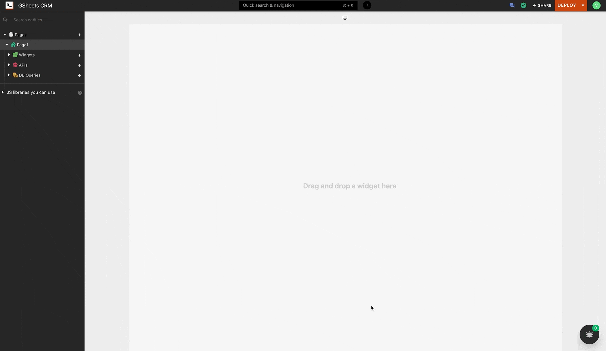

# How to work with Google Sheets on Appsmith

With Appsmith's inbuilt Google Sheet Integration Plugin, you can use any Google Sheet as a data source or a backend to build powerful applications. In this tutorial, we'll build a CRUD app that allows us to store and update investor contact information on top of Google Sheet with Appsmith.

### Setting Up Google Sheets and Appsmith

 Follow the below steps to use Google Sheets with Appsmith:

* Create a new account on [Appsmith](https://www.appsmith.com/?utm_source=blog&utm_medium=direct&utm_content=google_sheets_crm&utm_campaign=weeklyblog&utm_term=google_sheets_crm) \(it’s free!\), if you are already an existing login to your Appsmith account.
* Create a new application by clicking on the `Create New` button under the Appsmith dashboard.
* We’ll now see a new Appsmith app with an empty canvas and a sidebar with Widgets, APIs and DB Queries.
* Click on the `+` icon next to the APIs section and choose the `Google Sheets` option. Next, click on the `New Datasource` button and set the scope to `Read and Write` and click Authorise.
* This will ask us to log in from our Google Account, choose the account we want to access Google Sheets with and log in. After successful authorisation, this will redirect back to your Appsmith account.
* Now, you’ll find your Google Sheets Datasource under your APIs, and you can create the necessary queries by choosing this data source.



Awesome! Now that our Google Sheets Plugin is set up, let’s create a new Google Sheet and add the necessary fields required for Investor CRM.

Following are the fields we’ll be considering:

* Investment Fund
* Location
* Name of Investor
* Designation
* Interesting Portfolio Companies
* Size of Fund

To make this more precise, we’ve made a sample Google Sheet with some mock data [here](https://docs.google.com/spreadsheets/d/1f5lw-SO2NOCUhFKmDFPcXgI7qhA_VIwJXhOm8JmhEBA/edit?usp=sharing). We’ll be using the same Sheet throughout this guide, and you can either follow with this or create your own based on our requirements.

### Fetch Data from Google Sheet to Appsmith

Now that we are connected to our Google Sheets data source, let’s connect to our Google Sheet and query all the data onto a table widget in Appsmith. To do this, navigate to the created data source under the APIs section and click on the `New API` button on the top right. Next, follow the below steps:

* After clicking the `New API` button, you’ll be redirected to a new query tab, name your API to `getInvestorDetails` by double-clicking on the existing one.
* Now set the method to `Fetch Sheets Row`, this method will query the data that’s present in the given Google Sheet.
* In the SpreadSheet URL property, paste the URL of your Google Sheet, in this tutorial we’ll be following with the following URL:

`https://docs.google.com/spreadsheets/d/19ewbxuiNwfD5etHpb__jMzFYjVdYaeLSviC951htlsI/edit#gid=333192`

* Next, in the Sheet name, add the name of our first sheet which is `Investor Details`
* The Table Heading Row Index property takes in the row number that basically has our column heading, we’ll set this to `1`.
* Next, we’ll set the `Row Offset` to `1` and `Row limit` to `100`, this will query only the first 100 rows of our Google Sheet.
* Lastly, click on the `Run` button on the top right, we should see the sheet information in JSON format in the response pane at the bottom. Below is the GIF showing the same:


Awesome, now that we have our data from the Google Sheet, let’s put this in a table; drag and drop a new table widget and paste the following in the Table Data property:

```text
{{ getInvestorDetails.data }}
```


#### Pagination when Working with Large Data

When working with large data on Google Sheets Sheets from APIs, browsers cannot load all the data present in our sheets. For such cases, you can enable server-side pagination, on API calls. To paginate the data, follow the below steps:

1. Enable the server-side pagination property in the table
2. Call the API/Query `onPageChange`
3. Toggle pagination in the API under Pagination Tab


### Insert Data/Rows to Google Sheet from Appsmith

Let’s start by adding a button and showing a modal that has a form to add all the details of the new investors. Follow the below steps:

* Drag and drop a button widget on to the canvas and next open the property pane of the button by clicking on the cog icon on the top right of the button when selected.
* Open the `onClick` property and select the `Open Modal` option and click on `New Modal`, this should open a new modal.
* Now add the necessary form fields by dragging the Input widgets onto the Modal. In our case of Investor CRM, we will add the following fields:
  * Investment Fund
  * Location
  * Name of Investor
  * Designation
  * Interesting Portfolio Companies
  * Size of Fund
* Name the input widgets to follow to easily use them for other operations for our CRM.
  * Investment Fund: `addFund`
  * Location: `addLocation`
  * Name of Investor: `addInvestorInput`
  * Designation: `addDesignation`
  * Interesting Portfolio Companies: `addPortifolio`
  * Size of Fund: `addFundSize`

This is how the form should look like:


Now that we have our form ready, let's write the logic to push the values from the form to the Google Sheet whenever submitted. Follow the below steps:

* Create a new API from the existing Google Sheets data source and set the query method to `Insert Sheet Row`. This query method helps us insert new data to the Google Sheet from Appsmith.
* Name the query as `addNewInvestor`
* Next, in the SpreadSheet URL property, add the link to our Google Sheet.
* The Sheet Name will be `Investor Details` as named in our Google Sheet.
* The Table Heading Row Index will be the row where the names of the columns are listed; in our case, this will be `1`,
* Lastly, the Row Object takes a JSON object with keys set to the column names associated with the desired values. In our case, below is how the Row Object should look like:

```text
{
  "Investment Fund": "{{addFund.text}}",
  "Location": "{{addLocation.text}}",
  "Name of Investor": "{{addInvestorInput.text}}",
  "Designation": "{{addDesignation.text}}",
  "Interesting Portfolio Companies": "{{addPortifolio.text}}",
  "Size of Fund": "{{addFundSize.text}}",
}
```

Here, the key's are the column names in the Google Sheet, and the values associated with them are the names of the input widgets. The `.text` method is used to pick the text that's written in the input widgets.

Lastly, in the form below for the submit button, set the on click property to `Call an API` and call the `addNewInvestor` API from the options. With this, we should be able to add new rows to Google Sheet from Appsmith. 

### Updating Data on Google Sheet from Appsmith

Let's add a feature to display this data and able to update them using the input widget. Drag and drop a container and add necessary input widgets to display the Investor Details. In this case, we’ll be adding the following:

* Investment Fund: `editFund`
* Location: `editLocation`
* Name of Investor: `editInvestorInput`
* Designation: `editDesignation`
* Interesting Portfolio Companies: `editPortifolio`
* Size of Fund: `editFundSize`

The left side text will be the default text in the text widget of the form, and on the right, we have the names of the input widgets corresponding to them. Below is a screenshot of how the form looks like:


Set the following to the Default text of input widgets in the investor details container:

* Investment Fund Input Widget: `{{Table1.selectedRow.Investment_Fund}}`
* Name of Investor Widget: `{{Table1.selectedRow.Name_of_Investor}}`
* Location Input Widget: `{{Table1.selectedRow.Location}}`

Similarly, add the default text to the other widgets. Now, when a row is selected in the table you should have all the details of the selected investor in the investor detail container.

Now, whenever we made changes in the input widgets and hit update details, the associated investor details should be updated in the Google Sheet. For this, let’s write a new update API that’ll help us update the values in the selected row of the Google Sheet. Follow the below steps:

* Create a new API from the existing Google Sheets data source and set the query method to `Update Sheet Row`. This query method helps us update row data in the Google Sheet from Appsmith.
* Name the API to `editInvestorDetail`
* Next, in the SpreadSheet URL property, add the link to our Google Sheet.
* The Sheet Name will be `Investor Details` as named in our Google Sheet.
* The Table Heading Row Index will be the row where the names of the columns are listed; in our case, this will be `1`,
* Lastly, the Row Object takes a JSON object with keys set to the column names associated with the desired values. In our case, below is how the Row Object should look like:

```text
{
    "rowIndex":{{Table1.selectedRow.rowIndex}},
    "Investment Fund": "{{editFund.text}}",
    "Location": "{{editLocation.text}}",
    "Name of Investor": "{{editInvestorInput.text}}",
    "Designation": "{{editDesignation.text}}",
    "Interesting Portfolio Companies": "{{editPortifolio.text}}",
    "Size of Fund": "{{editFundSize.text}}",
}
```

Lastly, for the Update Details button, set the `onclick` property to Call an API and call the `editInvestorDetail` API. We should now be able to update the investor details by editing the necessary input widgets and clicking on the update button.

### Delete Data on Google Sheets from Appsmith

For the delete option, let's add a new column in the table and set the column to a button. Update the label as `Delete` so that we see a new delete button on each row in the table. Now let's go ahead and create a new Delete API on the Google Sheets data source. 

* Create a new API from the existing Google Sheets data source and set the query method to `Delete Row`. This query method helps us delete row data in the Google Sheet from Appsmith.
* Name the API to `deleteInvestorDetail`
* Next, in the SpreadSheet URL property, add the link to our Google Sheet.
* The Sheet Name will be `Investor Details` as named in our Google Sheet.
* The Table Heading Row Index will be the row where the names of the columns are listed; in our case, this will be `1`,
* Lastly, in the Row Index add the following code snippet:

```text
{{Table1.selectedRow.rowIndex}}
```

The `Delete row` method only takes in the `rowIndex`, hence we're passing this via the Table1 widget using the `selectedRow` property. 

With this, we were able to perform CRUD operations on Google Sheet using Appsmith. Do refer to the [docs](../datasource-reference/querying-google-sheets.md) for other query methods in the Google Sheets plugin. 

