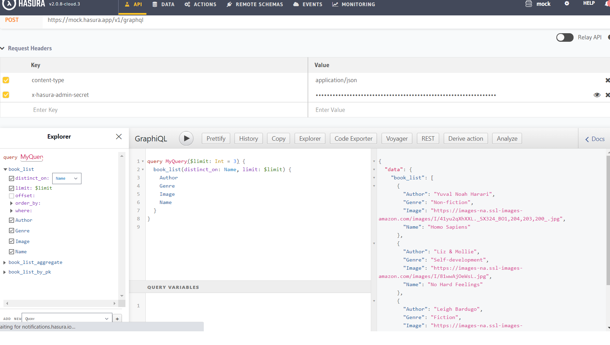
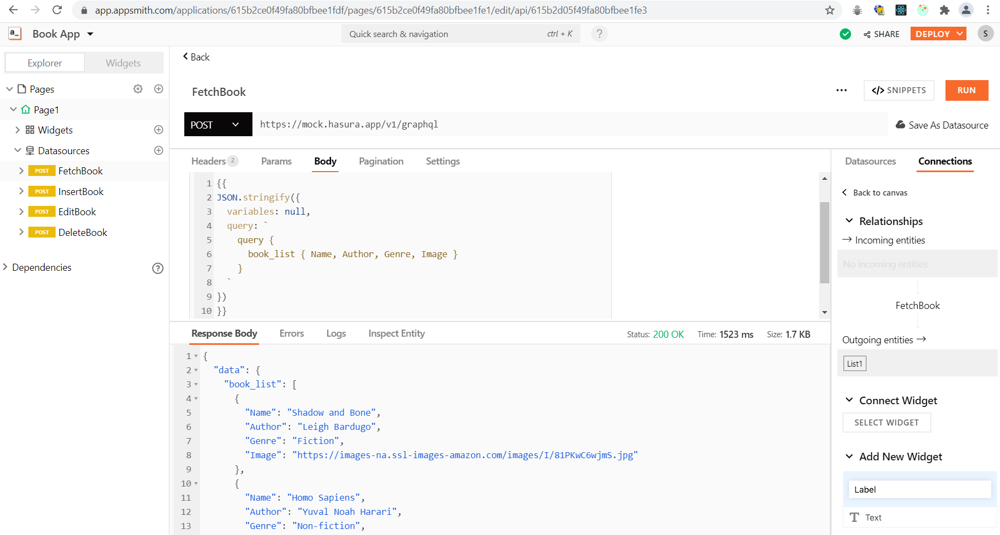
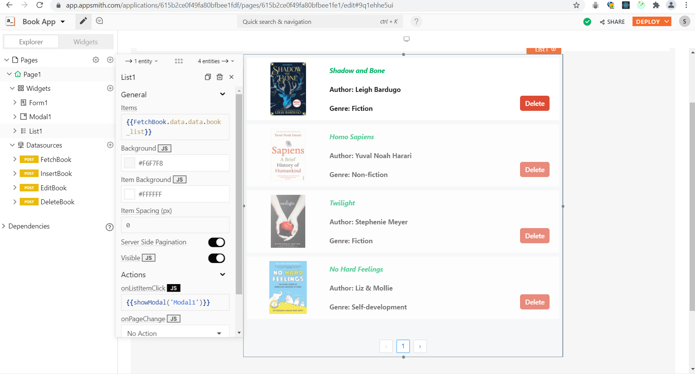
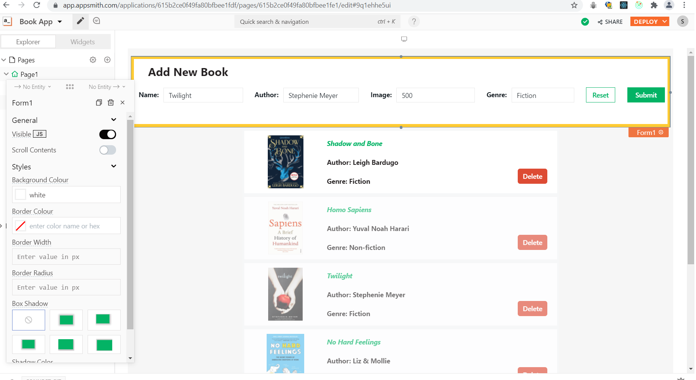
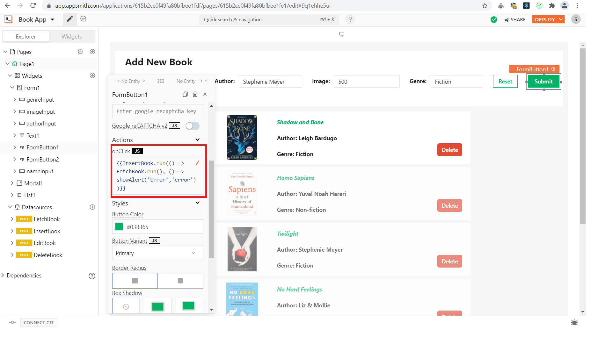
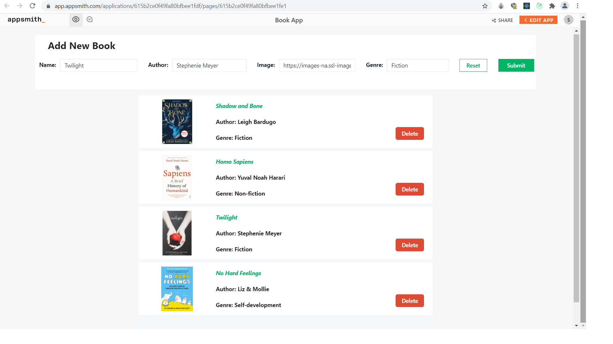

# How to work with GraphQL on Appsmith

## Getting started with Appsmith

Appsmith is opensource framework that helps us build CRUD apps, Dashboards, Admin Panels and many more much faster. We can also connect to Datasources and APIs to create complex workflows. You can learn more about Appsmith [here](https://docs.appsmith.com/).

## Building A Demo Application

In this how-to guide we will learn to integrate Appsmith with Graphql and also build our demo application. I've created a book database, hosted it on Hasura and exported it as GraphQL API. Below is an image showing some of the attributes of the dataset.



In the above screenshot we can see I have executed a Graphql query in the Hasura console and the response consists of a list of books in a JSON format. Next, we’ll use Appsmith to utilise this database and build a Book Search App by writing different GraphQL queries.

## Building a simple UI

To start building our application we need to signup to Appsmith(it's free!). In this tutorial, we'll create a Book Search application. To do this, follow the below steps:

1. Click on the **Create New** button under your organisation.This will redirect to the configuration page of the newly created app.
2. Note that the app is created with a default name _Untitled Application 1_. We'll rename it to **Book Search App** by double-clicking on the existing one.
3. On the sidebar to the left side drag and drop the List widget on the canvas. This list will be displaying all the books that we'll fetch from database.
4. Next add some Text widget on the List to display the book details. This Text widget has many styling properties like Text Color, Text Size etc. to choose from.

So our basic UI is done, now lets create our first API.

## Connecting to the Database and Fetching Data to Appsmith

To connect to our GraphQL backend server, follow these steps:

1. On the sidebar to the left side click on the **+** icon next to **Datasources**
2. You’ll see a list of Datasources that Appsmith can connect to. Click on **Create new API** under the **APIs** section
3. Now rename the API to **FetchBooks**. We can use this query name in UI to access the query results.
4. We'll create a **POST request** to fetch all books from the database
5. Next, enter the URL of your Graphql endpoint (e.g. https://mock.hasura.app/v1/graphql)
6. Inorder to access the database we need to set **content-type** and **x-hasura-admin-secret** headers.
7. In the request body we have to write Graphql query to list down all books from the database.

```
{{
JSON.stringify({
	variables: null,
	query: `
		query {
			book_list { Name, Author, Genre, Image }
		}
	`
})
}}
```

8. Click on the **Run button** or hit **cmd + enter** to execute a query. You'll see a list of books in JSON format in the Response tab.



9. Lets connect this query to our UI and fetch all books to our List widget. Click on the List's property pane to update the data with the query results.
10. Inside property pane, you'll find **List Items** property. Use the moustache syntax and add the below code snippet:

```
{{FetchBook.data.data.book_list}}
```

this will display our data in the form of a list.



We now have our list of books fetched from Graphql endpoint and displayed on our UI. Next, we’ll create a form where we can add new books to the database.

## Inserting new book to database from Appsmith

In this section, we'll see how we can insert a new book from our UI to the database. For this we'll create a simple form on Appsmith.

1. Drag and drop a form widget on to the canvas. In this form widget, we'll add input widgets that accept necessary fields to add new book.
2. Open property pane of input widgets and name the input fields so we can reference them in our Graphql query. Also select Data type for each input field according to the type of data to be stored in database. Below is how we’ll have to name the input widgets.
   - Name - nameInput
   - Author - authorInput
   - Image - imageInput
   - Genre - genreInput

Below is how the form will look like.



So now we have are UI ready; lets create API to add new book to database.

1. Click on the **Create new api** and rename api to **InsertBook**.
2. Copy the same **content-type** and **x-hasura-admin-secret** headers to access the database on Hasura from the previous FetchBook API.
3. Paste the below code snippet in the request body of Graphql query

```
{{
JSON.stringify({
	variables: {
		book: {
			Name: nameInput.text,
			Author: authorInput.text,
			Image: imageInput.text,
			Genre: genreInput.text
		}
	},
	query: `
		mutation ($book: book_list_insert_input!) {
  insert_book_list_one(object: $book) {
    Name
    Author
    Image
    Genre
  }
}
	`
})
}}
```

4. Here we have an object with query key that holds the Graphql query and a variable key with all the variables that need to be posted to the database.
5. To fetch the values from the input widgets, use the names of the input widgets and the **.text** method is used to pick the text that's written in the input widgets. (e.g. nameInput.text)
6. The insert_book_list_one in the mutation lets us add one book to the database.
7. Now that our api is ready, lets connect this to our UI so that whenever the Submit button on form is clicked we can add a book.



8. Go back to the form, open the property pane of Submit button and set the onClick action with the code snippet below.

```
{{
    InsertBook.run(
      () => FetchBook.run(),
      () => showAlert('Error','error'))
}}
```

9. Here we're calling the InsertBook API using .run() method that takes two arguments. On successfully running the API we call FetchBook.run() to display the updated list of books and on error shows an alert message.
   - onSuccess action - FetchBook.run()
   - onError action - showAlert('Error','error')

Awesome, now that we have our POST request ready, we can try adding a new book using the form we’ve created.

## Updating the book details on database

In this section, we'll learn how to update the book details from Appsmith and save the changes on database.
For this we'll create a simple modal that will open whenever user selects a list item.

1. Open the property pane of List widget, set the **onListItemClick** action to **Open Modal** and then click on **New Modal** to create a new modal.
2. Drag and drop all necessary input widgets to display the Book Details. We have to name all input widgets and also provide the default text based on item that is selected.
   - **Name Input** - editName & Default Text: {{List1.selectedItem.Name}}
   - **Author Input** - editAuthor & Default Text: {{List1.selectedItem.Author}}
   - **Image Input** - editImage & Default Text: {{List1.selectedItem.Image}}
   - **Genre Input** - editGenre & Default Text: {{List1.selectedItem.Genre}}

Now, whenever we made changes in the input widgets and hit update details button, the associated book details should be updated in the database. For this, let’s write a new update API that’ll help us update the values. Follow the below steps:

1. Click on + icon next to API, this will create a new API and rename it as **EditBook**.
2. Next, we'll be creating POST request and add the link to our database hosted on Hasura.
3. Copy the same **content-type** and **x-hasura-admin-secret** headers to access the database on Hasura from the previous FetchBook API.
4. Paste the below code snippet in the request body of Graphql query

```
{{
JSON.stringify({
	variables: {
		book: {
			Name: editName.text,
			Author: editAuthor.text,
			Image: editImage.text,
			Genre: editGenre.text
		}
	},
	query: `mutation ($book: book_list_set_input) { update_book_list_by_pk(_set: $book, pk_columns: {Name:"${List1.selectedItem.Name}"}) { Name, Author, Image, Genre} }
	`})
}}
```

5. Here we have an object with query key that holds the Graphql query and a variable key with all the variables that need to be posted to the database.
6. We use the **.text** to fetch data from input widgets of modal.
7. The **update_book_list_by_pk** in the mutation lets us update a book by providing primary key **Name**
8. Lastly, for the Update Details button, set the onclick property to Call the EditBook API. We should now be able to update the book details by editing the necessary input widgets and clicking on the update button.

Paste the below code in onclick property of update button in modal

```
{{
    EditBook.run(() => {
        FetchBook.run();
        closeModal('EditModal');
    })
}}
```

The closeModal('EditModal') method helps us to close the modal after successfully running the query.

## Deleting a book on database from Appsmith

For the delete option, let's add a new button and name it as Delete so that we see a new delete button on each List Item. Now let's go ahead and create a new Delete API.

1. Create a new API and name it as DeleteBook. This query method helps us delete a book in the database from Appsmith.
2. Copy the same **content-type** and **x-hasura-admin-secret** headers to access the database on Hasura from the previous FetchBook API.
3. Now we’ll have to write a GraphQL query inside the request body, paste the below code snippet inside the body:

```
{{
JSON.stringify({
	query: `mutation {delete_book_list_by_pk(Name: ${this.params.Name} ) { Author } }
	`})
}}
```

4. The query needs primary key Name to find the corresponding book and delete its entry from database.
5. We have to take this primary key of the selected List Item from the UI and access it in the request body using {{this.params.Name}}
6. When the user clicks on the delete button we want to delete the book and then call the FetchBook API to update the List Items. For this, we have to add custom JS in the button's onclick property:

```
{{
    DeleteBook.run(
      () => FetchBook.run(),
      () => {},
      {Name: `${List1.selectedItem.Name}`})
}}
```

7. Each query object has a run function that is used to execute the query. This function takes three arguments separated by comas:
   - onSuccess functions - In this case, its FetchBook.run()
   - onError function
   - params object - {Name: `${List1.selectedItem.Name}`}

And we done with our application. Below is the image of the final appliaction.



## Conclusion

So now you have seen how easy it is to create applications on Appsmith. In this how-to guide we have learned to create an application and connect it with Graphql, also to create, read, update, delete data. We have also seen how to work with widgets. I hope you enjoyed this how-to guide. For more such tutorials you can refer to [Appsmith docs](https://docs.appsmith.com/).
