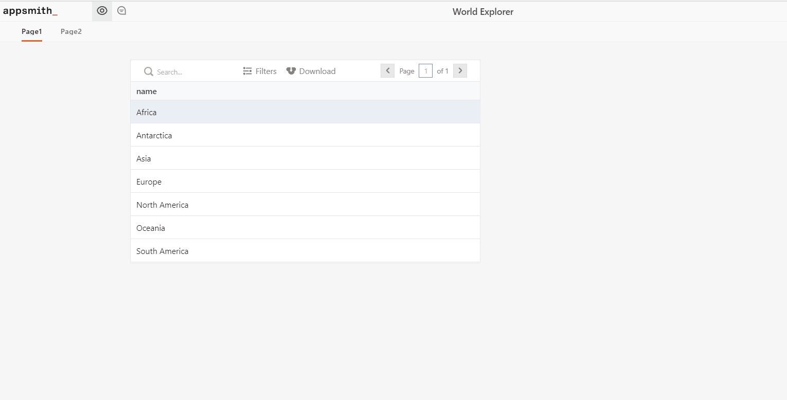
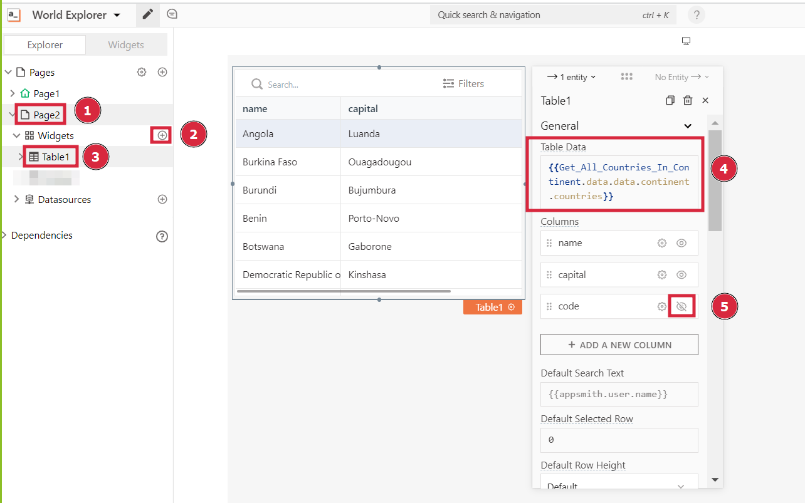
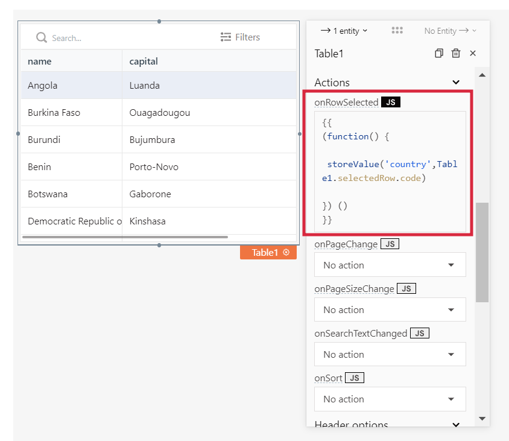
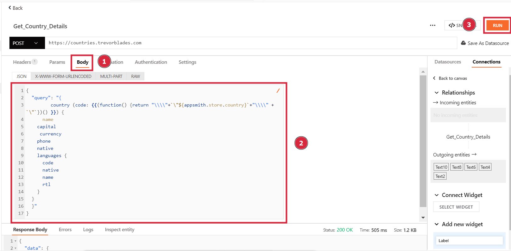
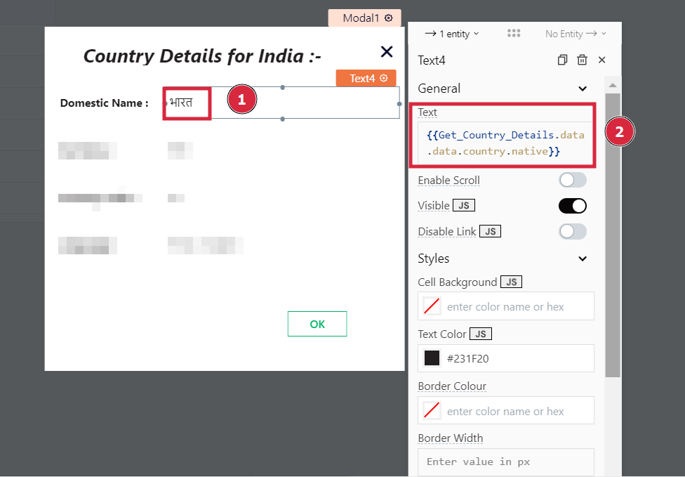
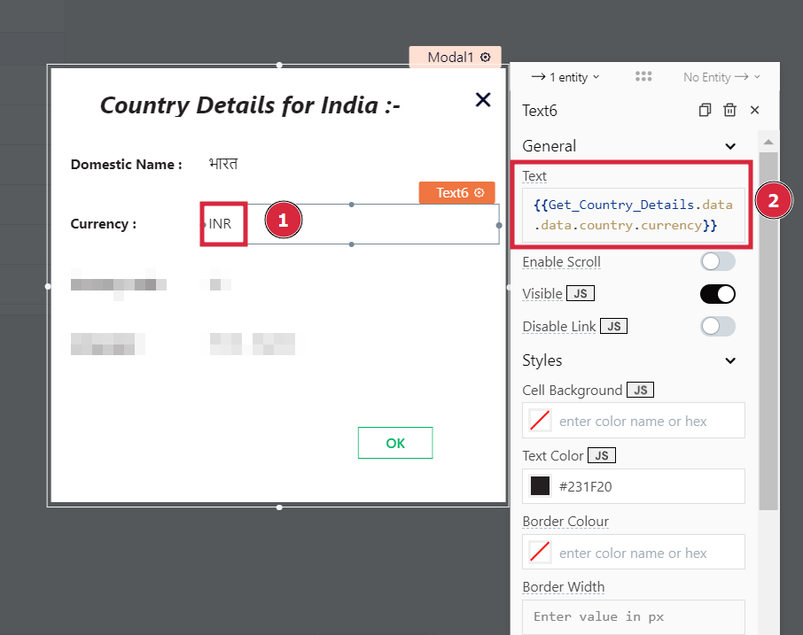
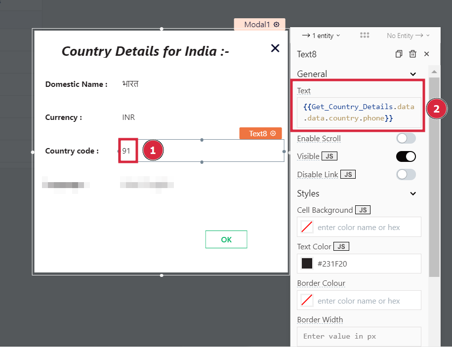
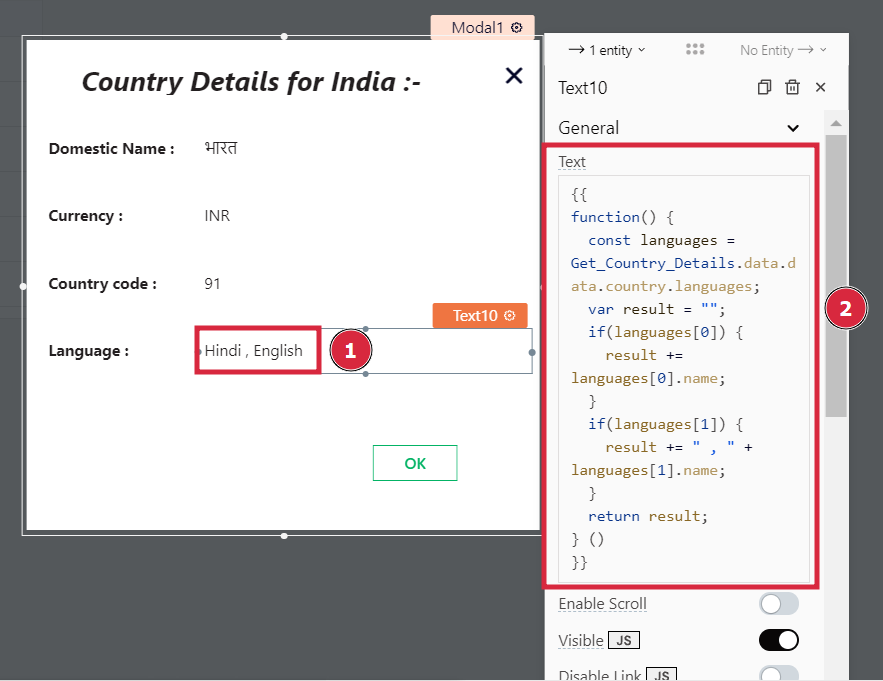
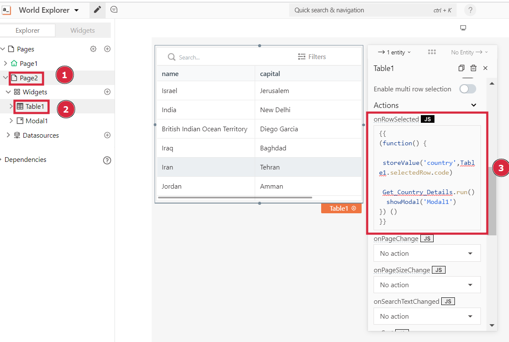

# How to work with GraphQL on Appsmith

In this tutorial, you'll see how to integrate a GraphQL API with Appsmith. Basic familiarity with GraphQL API queries and the Appsmith platform is assumed. You can learn more about GraphQL [here](https://graphql.org/learn/) and Appsmith [here](https://docs.appsmith.com).

The finished app will look like this:



### Setting Up GraphQL with Appsmith

We will be using a public GraphQL API from [here](https://countries.trevorblades.com). You can explore the SCHEMA and DOCS to know more about this API. It gives information about continents and countries.


#### Creating a new Appsmith application

* Please create a new account on Appsmith (it’s free!). If you are already an existing user, you can log in to your Appsmith account.
* Create a new application by clicking on the **NEW** button on your Appsmith dashboard.
* You will now see a new Appsmith app with an empty canvas and a sidebar with Widgets and Datasources.
* Click on your application name and rename it to "World Explorer" in the top left.


#### Creating Continents page

Let's start creating our first page, which will show all continents in a table.

* Click on the + icon next to the Datasources, then click on **Create New** button.
* Since we want to add a new GraphQL API, click on **Create new API**.&#x20;


* Rename the API to `Get_All_Continents` and change the request type to **POST**.
* The API request URL will be: `https://countries.trevorblades.com`.
* In the **Body** of the request, put the GraphQL query to get all continents.

```
{
  "query": "{
    continents {
      code
      name
    }
  }"
}
```

* You can **RUN** the API to see the response.&#x20;


Now that we have set up the datasource for our first page, it's time to display the API response in a table.

* Click on the + icon next to the **Widgets** and drag the **TABLE** widget to the canvas.
* Go to the table widget properties and change Table Data to:

```
{{Get_All_Continents.data.data.continents}}
```

* We don't need to display code columns to the user. It will just be used for our further GraphQL queries. To hide this column, click on the 👁 (eye) icon.&#x20;


You can see all the continents in the API response in a table.

#### Creating Countries page

We want users to see all countries in a continent by clicking on the continent name in the table.

* Click on the + icon next to the **Pages**. This will create a new page named Page2. Leave this page as of now. We will come back to it later.
* Now go back to Table1 of Page1 and click on table properties.
* We need to add logic for page change in our table's **onRowSelected** action. Click on the **JS** button to add below custom JS code which will get called whenever a row is clicked.

```
{{
(function() {
  storeValue('code', Table1.selectedRow.code)
  navigateTo('Page2', {})
}) ()
}}
```

The `storeValue()` function stores a value in localStorage. Here, we are storing the code of the selected country. `navigateTo()` function navigates to Page2.&#x20;


* Click on any row of the table, and you should be redirected to an empty Page2.

Now, it's time to go back to Page2 and add a new datasource for fetching countries in the selected continent.

* Add a new POST API named `Get_All_Countries_In_Continent` with URL `https://countries.trevorblades.com`.


* Go to settings and uncheck `Smart JSON Substitution` option.&#x20;
* Put the following query in the body of this API:

```
{
  "query": "{
         continent (code: {{(function() {return "\\\\"+`\"${appsmith.store.code}`+"\\\\" + `\"`})() }}) {
    countries {
      name
           capital
           code
    }
  }
  }"
}
```

Here, we are passing the selected continent code stored in localStorage to the GraphQL query through `${appsmith.store.code}`. This will fetch the details of the selected continent.

* You can **RUN** the API to see the response.


* Create a new table widget in Page2 and in **Table Data** property bind the response of `Get_All_Countries_In_Continent` like this:

```
{{Get_All_Countries_In_Continent.data.data.continent.countries}}
```



* Hide the code column by clicking on the 👁 (eye) icon.&#x20;
* To know which country the user clicked on, we will store its code in localStorage. Add the following **JS** code to **onRowSelected**.

```
{{
(function() {
  storeValue('country',Table1.selectedRow.code)
}) ()
}}
```




* Let's add a Datasource to fetch more details like currency, phone, the language of the selected country.
* Add a new POST API named `Get_Country_Details` with URL `https://countries.trevorblades.com`.


* Go to settings and uncheck `Smart JSON Substitution` option.&#x20;
* Put the following query in the body of this API:

```
{
  "query": "{
         country (code: {{(function() {return "\\\\"+`\"${appsmith.store.country}`+"\\\\" + `\"`})() }}) {
      name 
    capital
     currency
    phone
    native
    languages {
      code
      native
      name
      rtl
    }
  }
  }"
}
```

Here, we are passing the selected country code stored in localStorage to the GraphQL query through `${appsmith.store.country}`. This will fetch the details of the selected country.

* You can **RUN** the API to see the response.&#x20;




* Go to Page2 table's **onRowSelected** property. Call `Get_Country_Details` API when a user selects a country. This will fetch the country details of the selected country every time.

```
{{
(function() {
  storeValue('country',Table1.selectedRow.code)
  Get_Country_Details.run()
}) ()
}}
```


#### Creating Country Details Modal

We will show more details of the selected country when a user clicks on it. We will show these details in a **MODAL**.


* Click on the + icon next to the **Widgets** on Page2 and drag the **MODAL** widget to the canvas.&#x20;
* Drag **TEXT** widgets to the modal and bind them to different properties in our `Get_Country_Details` response.
* For each text widget, write the following JS code in the **Text** property.

```
Country Details for {{Get_Country_Details.data.data.country.name}} :-
```


Domestic Name Value

```
{{Get_Country_Details.data.data.country.native}}
```



Currency Value

```
{{Get_Country_Details.data.data.country.currency}}
```



Country code Value

```
{{Get_Country_Details.data.data.country.phone}}
```



Language Value

```
{{
function() {
  const languages = Get_Country_Details.data.data.country.languages;
  string result = "";
  if(languages[0]) {
    result += languages[0].name;
  }
  if(languages[1]) {
    result += " , " + languages[1].name;
  }
  return result;
} ()
}}
```



Our modal is ready, the only thing left is to show it.

* Go to Page2 table's **onRowSelected** property. Call `showModal('Modal1')` when the user selects a country.

```
{{
(function() {
  storeValue('country',Table1.selectedRow.code)
  Get_Country_Details.run()
  showModal('Modal1')
}) ()
}}
```



Congratulations! You have successfully integrated a GraphQL API with Appsmith. Explore the app and learn something new about a country!
