# How to use Redshift as a Data Source on Appsmith

The guide presumes that you are familiar with the basic core concepts of [Appsmith](https://www.appsmith.com/) and builds further on integrating Appsmith with other tools. In case you don't have much understanding of the [core concepts](../core-concepts/connecting-to-data-sources/) of Appsmith, it is recommended to create an account and try applying implementing them.

## Redshift

Redshift, or Amazon Redshift is based on PostgreSQL, with added functionality to manage very large datasets and support high-performance analysis and reporting of those data. 

In this guide you will learn to create a Redshift Database and use it as a data source in your Appsmith application.

## Building A Demo Application

Let us try to learn this concept by building a simple application which fetches data from Redshift database.
We will be creating a simple virtual library application which will hold details of various e-books.

Let us begin with configuring Redshift database.

## Creating A Redshift Database And Loading Data

First we need to set up an IAM role to help us in quaring data from the database. For that you need to login to your AWS account or Sign up for a new account, if you don't already have one. And select `IAM` from the services panel. 


Then choose `Roles` from the left navigation panel and click on `Create role`. In the AWS Service group, choose `Redshift`.  Under Select your use case, choose `Redshift - Customizable`, then choose Next: Permissions. On the Attach permissions policies page, choose `AmazonS3ReadOnlyAccess`. 


You can leave the default setting for Set permissions boundary. Then choose Next: Tags.
When the Add tags page appears you can add tags(optional). For this review I have added two tags: 'Name': 'For_Redshift_db', 'value': 'For_Appsmith_App'. Then choose Next: Review. Give the Role a name and description, then click on Create role. 

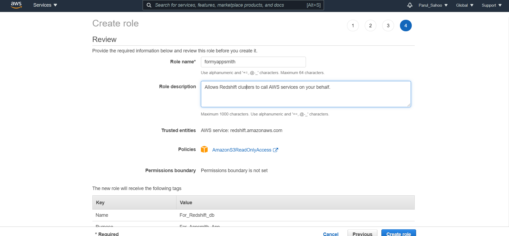


Choose the role name of the role that you just created. Copy the Role ARN value to your clipboard—this value is the Amazon Resource Name (ARN) for the role that you just created. You use that value when you use the COPY command to load data from Amazon S3. Now that you have created the new role, your next step is to attach it to a Redshift cluster.


## Creating A Redshift Cluster

**The cluster that you are about to create is live (and not running in a sandbox). You incur the standard Amazon Redshift usage fees for the cluster until you delete it. If you complete the tutorial described here in one sitting and delete the cluster when you are finished, the total charges are minimal.**

Visit the services panel and select `Amazon Redshift`. Then, choose the AWS Region where you want to create the cluster, at upper right corner. I have chosen 'Asia Pacific (Mumbai)ap-south-1'. Click on `Create cluster`. The Create cluster page appears. 

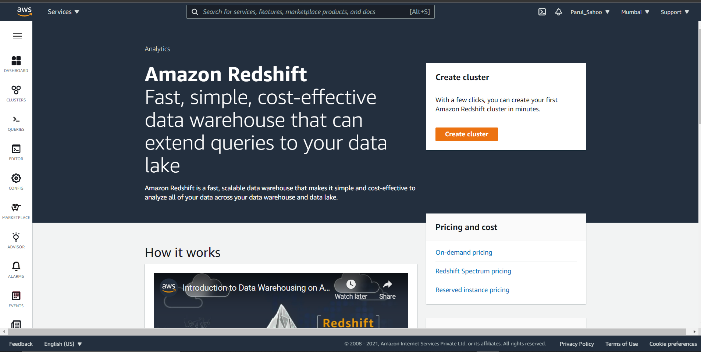

In the Cluster configuration section, specify values for Cluster identifier, Node type, Nodes, and how you plan to use the cluster. I have chosen 'appsmith-cluster-1' as Cluster identifier. Make sure to choose free trial option for "What are you planning to use this cluster for?". 

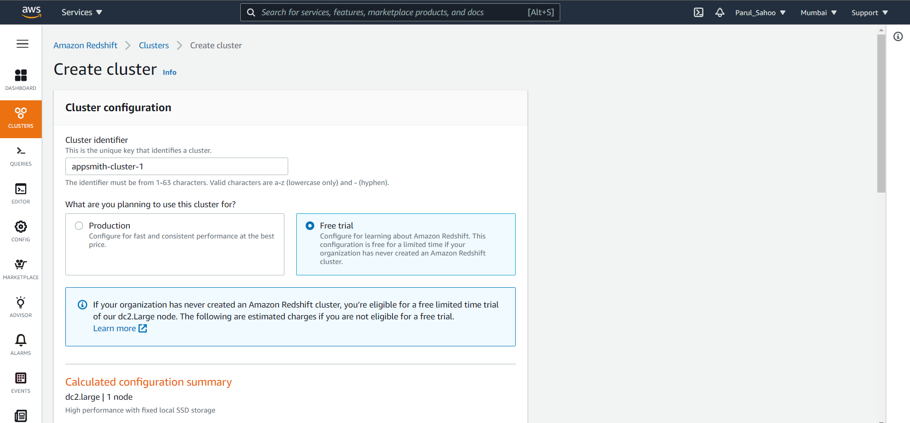

Then for Database configurations select a username and password for 'Admin user' and remember them(do keep in mind the constratints mentioned in the instructions below while creating assigning username and password).

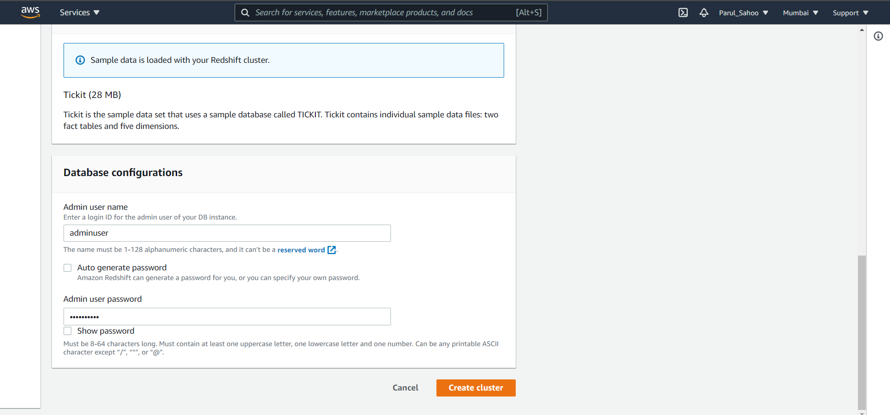


Choose `Create cluster`. It will take a while to create the cluster. When the cluster is created select the cluster and click on `Actions` then under the 'permissions' section click on `Manage IAM roles`. when the management screen appears in the 'Available IAM roles' dropbox select the IAM role that you have created earlier then click on `Associate IAM role` then click on `Save Changes`. 


In the Database configurations sections you can see the database name: dev and database port: 5439.


Then click on the `Actions` button again and under 'Manage cluster' select `Manage publicly accessible settings`. By default public accessibility is disabled enable it to access it from the Appsmith application. Once this is done the next step is to insert data into the database.


## Inserting Data In The Database

To insert and query the data in the database we need to create an IAM user to grant access to the query editor then use the query editor.
To create an IAM user we need to select `IAM` from the 'services' panel. Then choose `Users` from the navigation menu. CLick on `Add users`. 

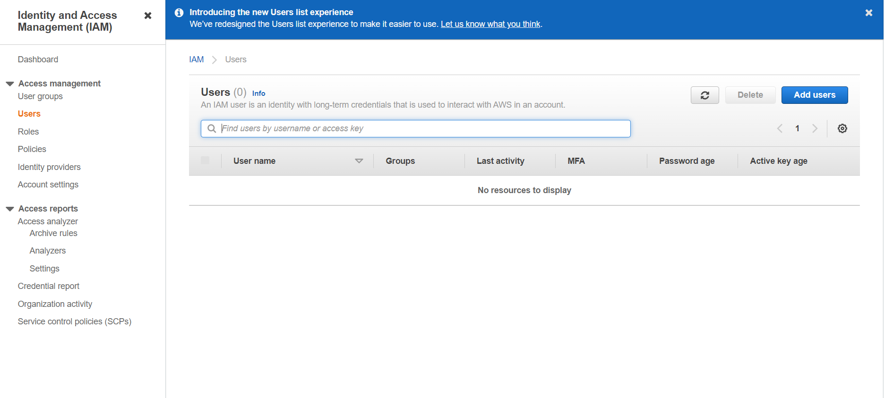

In the Add users screen give a the User a name, for instance, 'appsmith_user-1'. Then check both the AWS credential type: Access key and Password. Assign a custom password for the console. Then click on `Next: Permissions`. 

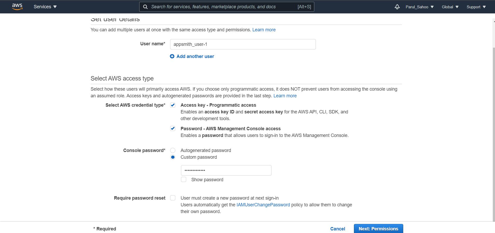

Under 'Set permissions' select `Attach existing policies directly`. For Policy names, choose `AmazonRedshiftQueryEditor` and `AmazonRedshiftReadOnlyAccess`. Click on `Next: Tags`. Add tags if you want to, it's optional here. 

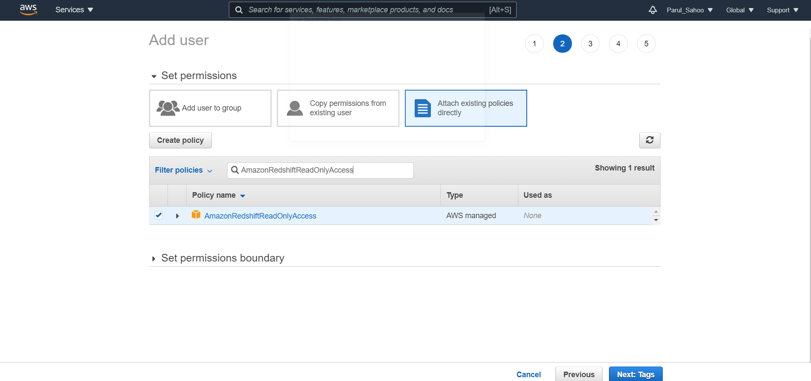

Click on `Next: Review`. Review the user details and click on `Create User`.

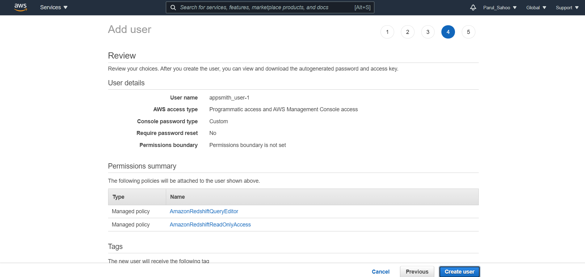


Copy the Access key ID and Secret access key or download the .csv file and store it in a safe location. Now logout of the console and login through the new IAM user's credentials. 

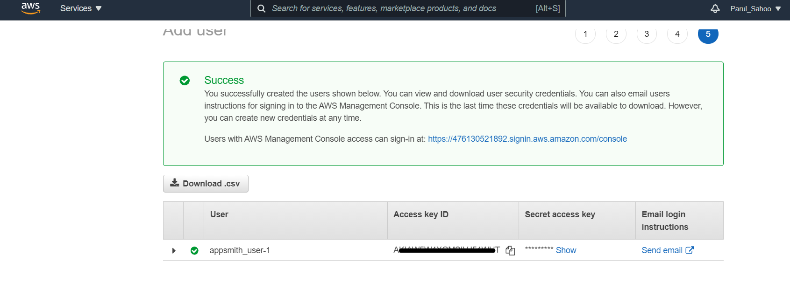

Visit the Redshift cluster page and select `Editor` from the left navigation panel. click on `Connect to database`. Then add the details asked for and click `Connect`.

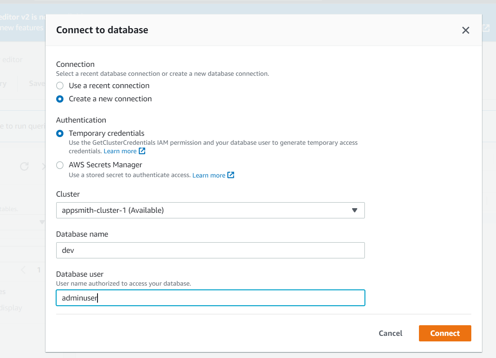

Select Public schema and run sql commands to create table and insert values.

To create table enter the following code and hit run.

```sql
create table library(
                book_name varchar (30),
                author varchar(30),
                publisher varchar(30));
```
 You can see the table library created in the left Resources section.


 To insert values into the table write the followirng code and hit run.

 ```sql
 insert into library values 
    ('The Monk who Sold His Ferrari', 'Robin Sharma', 'Jaico Publishing House'),
    ('The Immortals of Meluha', 'Amish Tripathi', 'Westland Publications'),
    ('The Inheritance of Loss', ' Kiran Desai', ' Penguin Random House India');
 ```

To display the data you can use

```sql
 select * from library; 
```


You can definitely try out inserting more values and playing with more SQL queries. For now we will more ahead with using this database as a data source in our appsmith application.


One last thing to do before hoping on to Appsmith to build our application is to configure security groups to enable connection from Appsmith by Inbound rules of security group associated to the VPC in which the our Redshift database exists. Select VPC from the services panel and scroll down to 'Security Groups'. By default the dafault VPC and default security group was attached to the Redshift database at the time of creation. Select the default security group and click on `Edit inbound rules`.

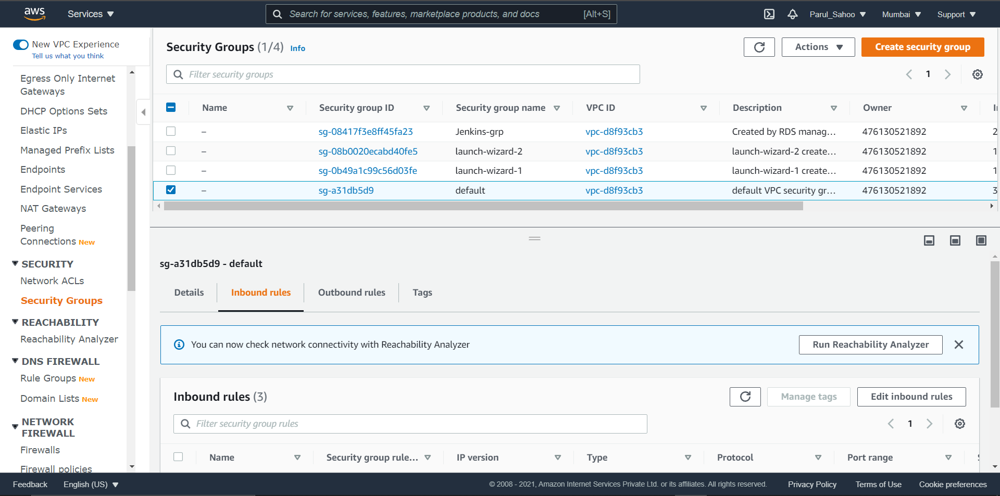


 Add inbound rules for type Redshift one for custom: Anywhere IPv4 and one for custom: My IP then click on `Save rules`. **Remember to delete the new inbound rules after you have completed your task for a long term use prefer creating a new security group.**


## Building The Application On Appsmith

Login to your Appsmith account or Sign up for a new account, if you don't already have one. The next step is to create a new application under an organisation by clicking on the `+ NEW` button on the top right corner. 

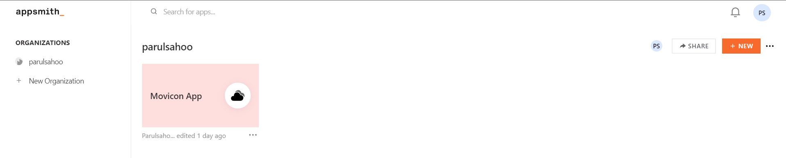

Then change the default name to a name of your choice.For Instance, I am using the name, 'Appsmith Library'. You shall now see Widgets, Datasources and Pages on the left navigation bar. we can use these compomnents in our application. We will add Redshift as our data source, by clicking on the `+` sign next to Datasources and scrolling to Databases under the '+ Create New' section. Then select `Redshift`.


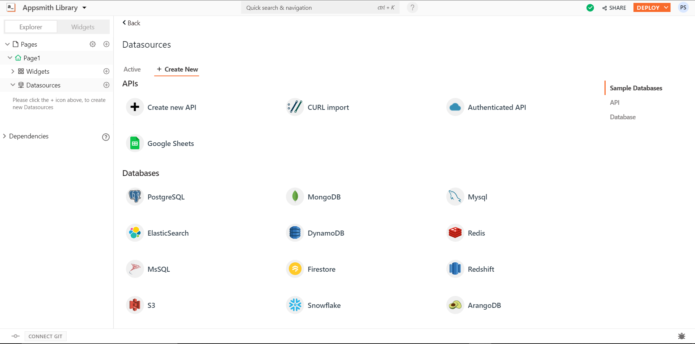

## Connecting To The Redshift Database

Firstly, give the database a name, for this tutorial I have used the name, 'appsmith_library_db'. Next under connection choose a connection mode, here we will choose `Read/Write`. Then we will mention the host address and port number, if we do not mention a port number by default Appsmith will try to connect to port 5439. The host address can be fetched from the Redshift cluster's 'General information' panel. Copy the `Endpoint` value and paste it in the Host address section of the Appsmith application(you have to trim the database name and port number from the Endpoint address). And then fill the database name you want to connect to =, in our case it is 'dev'. For Authentication we will provide the username and password on the adminuser of our database in Redshift. We can skip the SSL by selecting `No SSL` from the 'SSL Mode' dropdown list. Click on `Save`.


## Capturing And Displaying The Data

Now that you have succesfully connected to the database successfully, you can query data from it by running simple SQL queries.

```SQL
 Select * from library; 
```

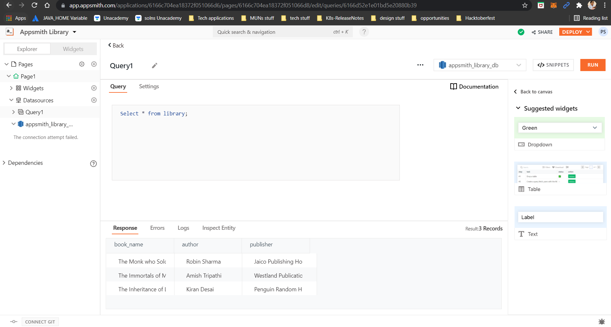


## Formatting The Fetched Data

Now we need to display the data that we have fetched in a presentable format. And this can be done using the UI widgets provided by Appsmith. We need to follow some easy steps to bind the Notion API contaning data into a table. First, expand the Page1 dropdown menu and then click on the `+` icon beside `Widgets` option. It lists down different UI widgets that can be used to build our aaplication's UI. Select the 'Table' widget then drag and drop that onto the canvas. 
Something like this is visible:


To include response from the API in this table use the moustache syntax to write JS in Appsmith.

```Javascript
{{

appsmith_library_db.map(
    (item) => {
        return (item.properties)
    })

}}
```

 Now that we have received data in the table, we can add more widgets for each attribute of the data records from the UI widgets list. You can add text widgets for all the fields in this example. To set the property of the widgets, next to the widget options add code snippets to fetch values of respective attributes from the array of data fetched refer to the guides linked below

* [Display Data](../core-concepts/displaying-data-read/)
* [Capture Data](../core-concepts/capturing-data-write/)


These were some basic operations that can be performed by using Notion as a Database on Appsmith. You can definitely try out more features by playing around with the interface.
