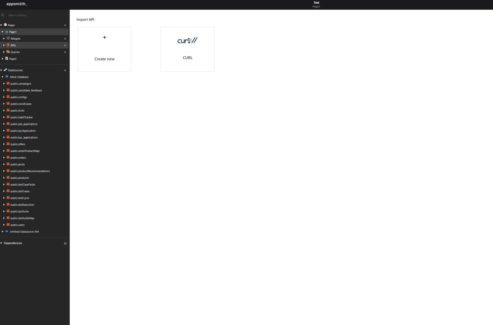

# How to upload to S3

Files from Appsmith can be directly uploaded to Amazon S3 by selecting 'Call An API' on OnFilesSelected option. As Amazon S3 supports [PutObject](https://docs.aws.amazon.com/AmazonS3/latest/API/API_PutObject.html), a Put API can be configured to upload the image directly to S3 bucket, in which the bucket has to be configured to allow all public access. This API rewrites an existing file or creates a new file if one does not exist in the bucket.

