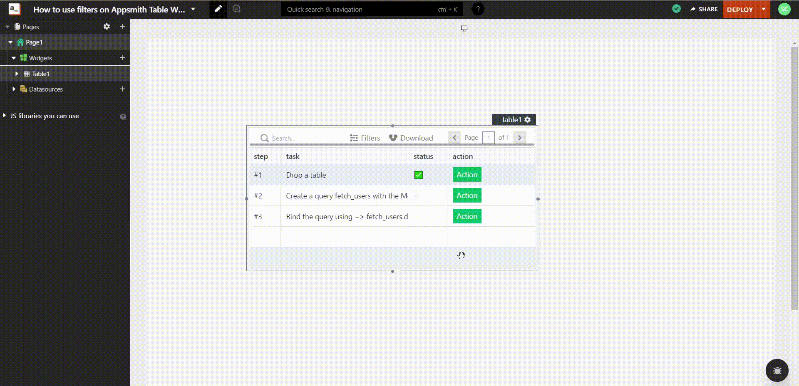

# How to use filters on Appsmith table widget

## Setting Up Appsmith

* Create a new account on [Appsmith](https://www.appsmith.com) (it’s free!), if you are already an existing login to your Appsmith account.
* Create a new application by clicking on the `Create New` button under the Appsmith dashboard.
* We’ll now see a new Appsmith app with an empty canvas and a sidebar with Widgets, APIs, and DB Queries.

## Adding Table Widget

* Click on the `+` button in the sidebar to add a new widget.
* Select the `Table` widget. Drag and drop it into the canvas.
* You can now see the Table widget in the canvas.

## Using Filters on Table Widget

* Click on the `Filters` option on the Table widget. A filters popup opens.
* Select the various filters you want to use on the Table widget.
  * Select the `Attribute` filter from the dropdown, which is the column from the table you want to filter.
  * Select the conditions you want to add to the filter from the dropdown.
  * Enter the value.
* Click on the `Apply` button to apply the filter.
* You can now see the filtered data in the Table widget.

## Removing Filters on Table Widget

* Click on the `x` button on the left side of the filter that has been added to remove the filter.
* You can now see the unfiltered data in the Table widget.

## Grouping Filters on Table Widget

* While a filter has already been added, you can also group the filters by adding a new filter.
* Click on the `Add Filter` button to add a new filter.
* Select the `AND`/`OR` Condition from the dropdown.
* Add the new filter following the same steps as above.
* Click on the `Apply` button to apply the filter.
* You can now see the filtered data in the Table widget.

