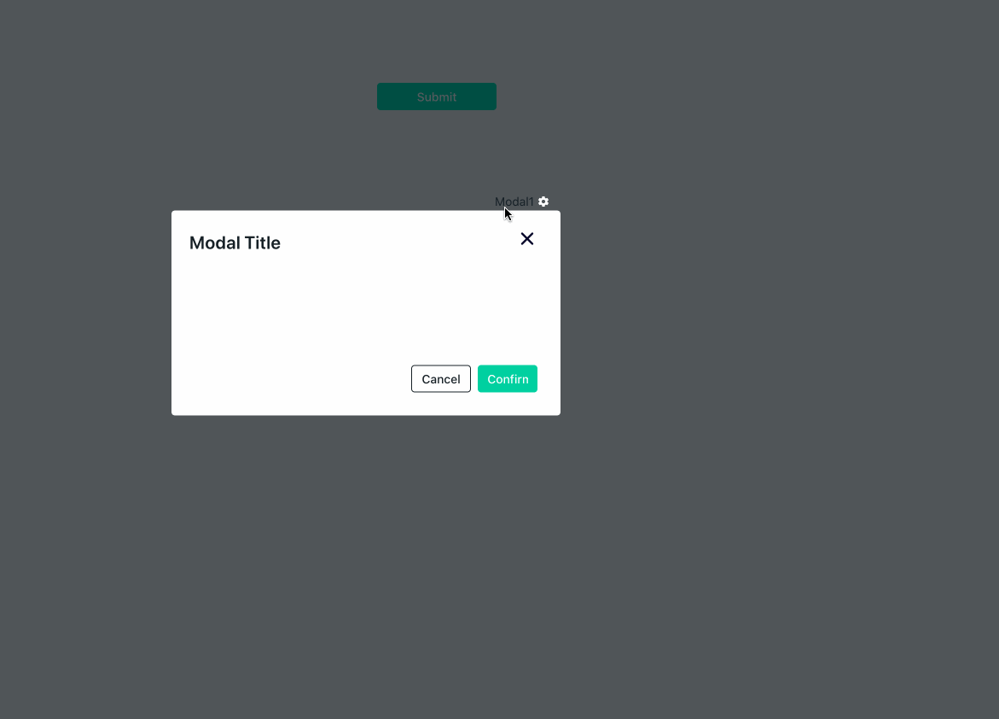

# Close Modal

This action is used to close a modal when triggered. Create a new modal and open it before calling this action



## Signature

```javascript
closeModal(modalName: string): Promise
```

### Arguments

| **Argument Name** | **Description**                |
| ----------------- | ------------------------------ |
| **Modal Name**    | Name of the modal to be closed |
